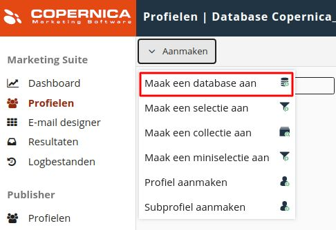
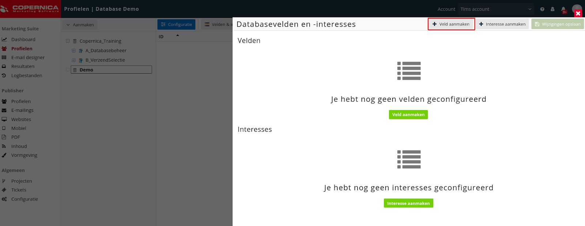
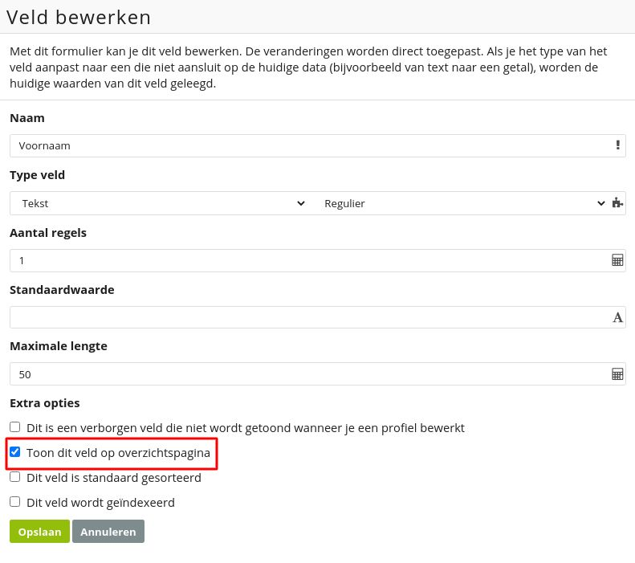

# Copernica-training: databases en velden

## Databases

[Databases](./database-profiles) zijn het centrale punt van informatie binnen Copernica. Hierin worden alle
contacten opgeslagen die je gaat mailen. Die contacten worden profielen genoemd. In
Copernica kun je databases volledig zelf configureren.

Nadat een database is aangemaakt brengen we structuur aan door middel van
databasevelden. Die velden zijn in feite de kolommen van je importbestand. Vervolgens kun
je profielen in de database importeren. Dat kan op de volgende manieren:

* Handmatig een profiel aanmaken via de interface;
* Handmatig een importbestand importeren;
* Periodiek een importbestand importeren vanaf een FTP-server;
* Realtime via de REST-API of SOAP-API;
* Via webformulieren.

### Opdracht

We beginnen met het aanmaken van een database binnen Copernica. Hiervoor download je alvast
de [trainingsbestanden](https://vicinity.picsrv.net/g/127/0/9966/946570547c4af9079f398f3af00edcd4/export-2021-05-19.zip)
en het [Publisher-template](https://vicinity.picsrv.net/g/127/0/9558/2e97da82d4b6433bba6a35dbc0b6d2a5/new_template.zip).

Unzip de bestanden op een plek waar je ze makkelijk kunt vinden en neem een kijkje in het
bestand ​ '__FundamentalDatabase.txt__'. Dit bestand bevat de data die we later gaan importeren.
Analyseer de inhoud van het bestand en merk op dat iedere kolom wordt gescheiden door
een tab. De kolommen bovenaan dit bestand vertegenwoordigen de databasevelden die
moeten worden aangemaakt.

Ga naar de ​Marketing Suite​ ​en klik op '**Profielen**​'. Maak een database aan en noem deze​ '**​Copernica_Training_[NAAM]**'​. Dat kan via
het tabblad '**Profielen**'​, '**Aanmaken**'​, '**Maak een database aan**'​. Vink '**Maak
standaardselecties aan**' vervolgens uit.

## Velden

De structuur van een database bestaat uit velden en interesses. In een veld kan bijvoorbeeld
een tekst, datum of getal worden opgeslagen. Er zijn verschillende veldtypes die vaak
worden gebruikt, waaronder:

* **Tekstveld**​: Een veld waar voornamelijk tekst in wordt opgeslagen;
* **E-mailveld**​: Een veld waar het e-mailadres van profielen in wordt opgeslagen;
* **Datumveld**​: Een veld waar een datum in wordt opgeslagen (let op: de datumnotatie
in Copernica is jaar-maand-dag);
* **Meerkeuzeveld**​: Een veld waar een keuze in wordt opgeslagen. Hierbij kan er
gekozen worden uit vooraf ingestelde waarden.

Er zijn meer veldtypes mogelijk; de bovenstaande lijst bevat enkel de meest voorkomende.

Met **interessevelden**​ breng je nog meer structuur aan in je database. Deze velden kunnen
aan- of uitgezet worden en kunnen enkel de waardes 'Ja' of 'Nee' bevatten. Binnen een
groep zijn er meerdere interesses mogelijk. Denk bijvoorbeeld aan een ​ '**Inschrijvingen**'-groep waarbij een specifiek profiel drie interesses toont: '**Nieuwsbrief**'​ (op Ja),
'**Aanbiedingen**'​ (op Nee) en ​'**Facturen**'​ (op Ja).

### Opdracht

Klik op de database en navigeer naar '**Velden & Interesses**'​, '**Veld aanmaken**'​.
Vervolgens maken we zeven velden aan. Bij het aanmaken van een veld is het belangrijk
om velden die je vaak gebruikt op de overzichtspagina te tonen. Dat doe je door een vinkje te plaatsen
bij de bijbehorende box.

Het gekozen veldtype moet altijd overeenkomen met de data die je erin wilt opslaan. Zorg er dus voor 
dat een datumveld ook daadwerkelijk een datum bevat. Let daarnaast op het gebruik van hoofdletters: ​ 
Copernica is **hoofdlettergevoelig**​.

Maak de volgende zeven velden aan en toon deze allemaal op de overzichtspagina:

1. Voornaam (tekstveld)
2. Achternaam (tekstveld)
3. E-mail (e-mailveld)
4. Geboortedatum (datumveld)
5. Telefoonnummer (telefoonnummerveld)
6. Nieuwsbrief (meerkeuzeveld). Vul de volgende standaardwaarden in: eerste regel
'Ja', tweede regel 'Nee'.
7. Test (meerkeuzeveld). Vul de volgende standaardwaarden in: eerste regel 'Ja',
tweede regel 'Nee'. We gebruiken dit veld om in één keer naar meerdere collega's
een testmail te verzenden. Dat gebeurt via een bulkmailing.

