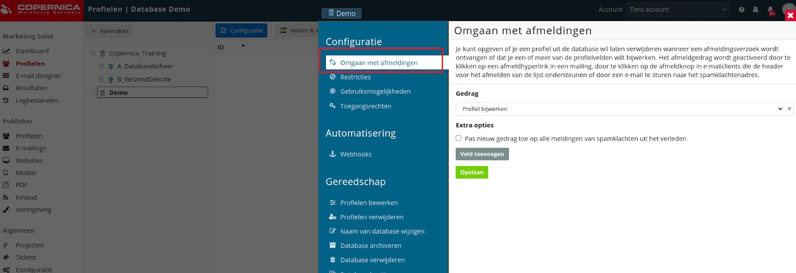
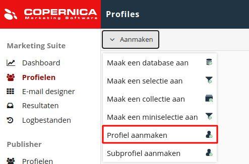
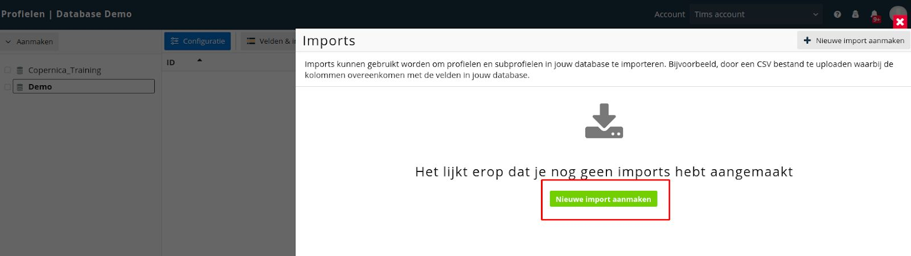
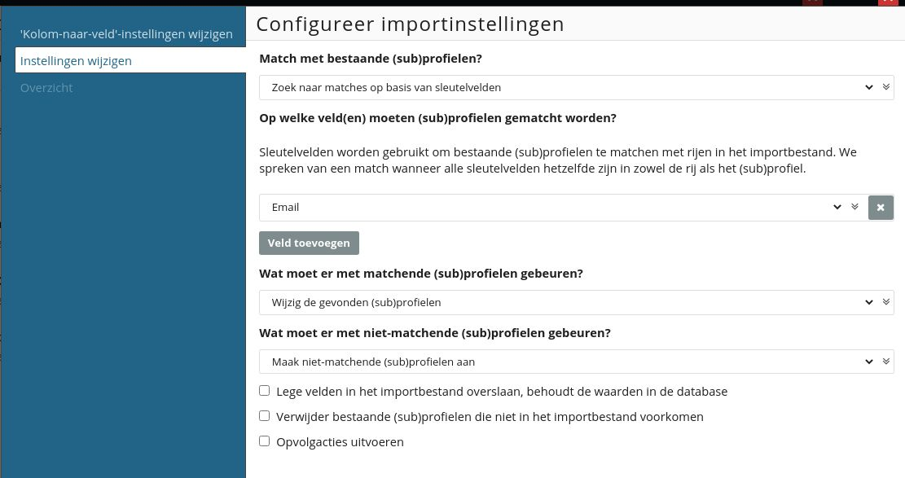

# Copernica-training: uitschrijfgedrag en profielen

## Uitschrijfgedrag

Het is wettelijk verplicht om een zichtbare en werkende uitschrijflink aan je commerciële
e-mails toe te voegen.

In Copernica kun je op een aantal manieren met uitschrijvers omgaan. Je kunt het profiel
volledig verwijderen (en daarmee alle bijbehorende data) of een waarde in het profiel
aanpassen. We raden aan om te kiezen voor de tweede optie. 

Je kunt bijvoorbeeld instellen dat een uitschrijving de waarde van het veld ​ '**Nieuwsbrief**' 
automatisch aanpast naar 'Nee'. Op deze manier worden uitschrijvers uitgesloten van de 
nieuwsbriefselectie. Ook kun je zelf instellen welk veld moet worden aangepast wanneer een
ontvanger zichzelf uitschrijft. 

Het uitschrijfgedrag kan worden getriggerd door een
unsubscribe-tag, een spamklacht of het aanklikken van de uitschrijfknop binnen een
e-mailclient. De unsubscribe-tag kan standaard worden toegevoegd aan e-mails. Het is echter ook
mogelijk om uitschrijvers via een eigen integratie te verwerken, bijvoorbeeld door middel van
een API.

### Opdracht

Stel de uitschrijfopties van de database in door op de database te klikken en te navigeren
naar ​ '**Configuratie**', '**Omgaan met afmeldingen**'​. Hier stel je in welke actie Copernica
moet ondernemen wanneer iemand op de unsubscribe-tag klikt.

Kies voor het gedrag '**Profiel bijwerken**'​ en geef aan dat het veld '**Nieuwsbrief**'​ moet
worden veranderd naar 'Nee'. Copernica schrijft het profiel in de database nu uit voor de
nieuwsbrief zodra een ontvanger op de uitschrijflink klikt of een spamklacht indient.

Daarnaast heb je de optie om uitschrijfgedrag met terugwerkende kracht uit te voeren op
profielen die ooit een spamklacht hebben ingediend. Voor deze specifieke opdracht maken
we geen gebruik van die functie.

## Profielen

Een profiel kan alle data bevatten die jij zelf wilt opslaan; je hebt in Copernica totale vrijheid
om databases naar eigen inzicht in te richten. 

Toch voegt Copernica zelf ook informatie toe aan profielen. Denk hierbij aan nuttige data over kliks, 
impressies en fouten in de ontvangen mailings. In de meeste gevallen bestaat een profiel uit een 
persoon (B2C) of een bedrijf (B2B).

### Opdracht

Voeg een nieuw profiel toe via '**Aanmaken**'​, '**Profiel aanmaken**' en vul je eigen gegevens
in. Zet de velden '**Nieuwsbrief**' en ​'**Test**' op 'Ja'. **Let op**: de datumnotatie is jaar-maand-dag
(JJJJ-MM-DD).

Je wilt natuurlijk niet alle profielen met de hand hoeven aanmaken. Daarom doen we dit door
middel van een import. Klik hiervoor op de database en vervolgens op '**Imports**'​, '**Nieuwe
import aanmaken**'. Upload **Fundamentaldatabase.txt** uit het 
[trainingsbestand](https://vicinity.picsrv.net/g/127/0/9966/946570547c4af9079f398f3af00edcd4/export-2021-05-19.zip) 
zoals aangegeven in de onderstaande afbeelding. Klik vervolgens op '**Import aanmaken**​'.

In het volgende scherm zie je dat alle velden automatisch gekoppeld zijn aan de eerder
aangemaakte velden. Als dat niet zo is, dan kun je deze eenvoudig zelf koppelen. Zodra
alles goed staat klik je op volgende.

Vervolgens krijg je de mogelijkheid om ​sleutelvelden​ te configureren. Een sleutelveld wordt
gebruikt om bestaande profielen uit de database te matchen met regels uit de import. Dit
zorgt ervoor dat profielen niet dubbel in de database voorkomen en dat bestaande profielen
kunnen worden bijgewerkt.

Klik op​ '**Match met bestaande subprofielen**' ​en zorg dat deze staat op '**Zoek naar
matches op basis van sleutelvelden**'. Stel vervolgens in dat het veld '**E-mail**'​ het
sleutelveld is. De onderstaande afbeelding laat de correcte instellingen zien.

Klik op volgende en start de import. Je kunt het venster sluiten zodra de import gestart is.
Deze gaat op de achtergrond verder.
