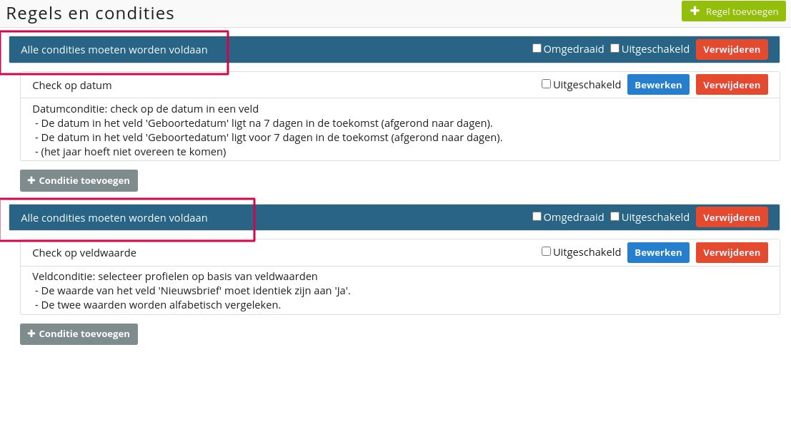
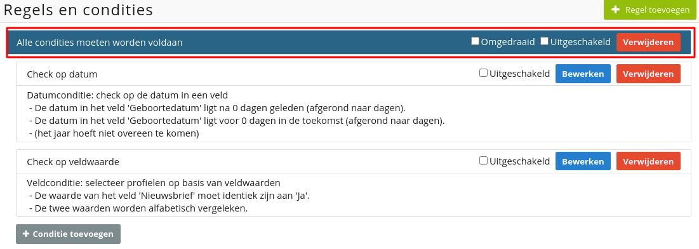
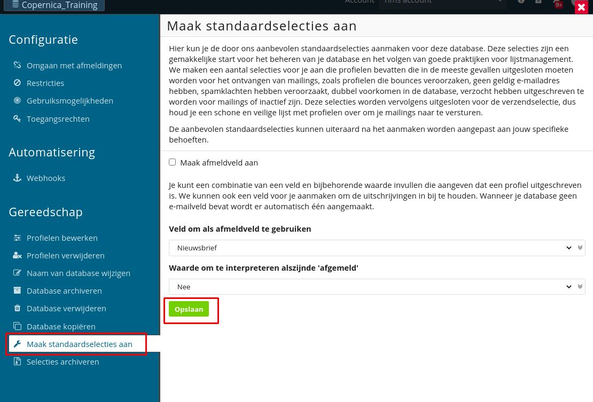
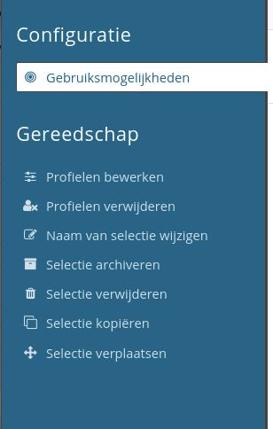

# Selecties

Een selectie is een segment van profielen uit de database gebaseerd op één of meerdere
condities. Je gebruikt selecties om bepaalde profielen te filteren uit een database,
bijvoorbeeld op basis van uitschrijving. Selecties zijn ook bruikbaar als bestemming voor
mailings of als hulpmiddel bij het maken van analyses.

## Selectiecondities

Selectiecondities zijn zeer uiteenlopend. Zo kun je bijvoorbeeld een selectie maken van alle
profielen waarvan het nieuwsbriefveld de waarde 'Ja' bevat of filteren op vrouwelijke
profielen van 30 jaar en jonger.

Daarnaast kun je selectiecondities instellen op basis van e-mailresultaten. Een voorbeeld
daarvan is het selecteren van alle profielen die in de afgelopen maand één van jouw e-mails
geopend hebben. Het combineren van selectiecondities is ook mogelijk.

Selecties worden ingesteld op basis van of-condities of en-condities. We behandelen deze hieronder.

### Of-condities
Een of-conditie geeft aan dat een profiel OF aan alle voorwaarden OF aan één voorwaarde
moet voldoen om voor selectie in aanmerking te komen. 

**Voorbeeld**: een profiel moet voldoen aan een specifieke geboortedatum OF moet ingeschreven 
staan voor de nieuwsbrief.

### En-condities
Een en-conditie geeft aan dat een profiel aan alle voorwaarden moet voldoen die onder de
blauwe balk zichtbaar zijn. 

**Voorbeeld**: een profiel moet voldoen aan een specifieke
geboortedatum EN moet ingeschreven staan voor de nieuwsbrief.

## De opbouw van selecties

Er zijn drie momenten waarop selecties worden opgebouwd:

* Op het moment dat een selectie wordt aangemaakt of aangepast;
* Op nachtelijke basis;
* Wanneer een mailing wordt ingepland (als de selectie in de afgelopen 3 uur niet is opgebouwd).

## Het scheiden van selecties

Selecties kunnen worden opgesplitst in twee hoofdcategorieën: (1) selecties die dienen als
databasemanagement en (2) selecties die dienen als verzendlijst.

Het versturen van e-mails naar niet-bestaande e-mailadressen of ontvangers die berichten ongeopend laten heeft een 
negatieve invloed op je [verzendreputatie](./send-reputation). Selecties die gericht zijn op databasemanagement dienen 
daarom gefilterd te worden uit je verzendlijst.

## Selectiestructuur

Je bent in Copernica vrij om zelf een selectiestructuur te bepalen. Om je daarbij te helpen
bieden we echter ook een standaard-selectiestructuur aan. Deze wordt door een groot deel
van onze gebruikers gehanteerd.

De standaard-selectiestructuur filtert automatisch foute, dubbele en inactieve
e-mailadressen uit de verzendselectie. Ook uitschrijvingen worden daarbij meegenomen.
Die structuur draagt bij aan de succesvolle aflevering van e-mails ([deliverability](https://www.copernica.com/nl/blog/post/deliverability-101-deel-1-de-invloed-van-lijstmanagement-op-deliverability)).

### Opdracht

Maak standaardselecties aan door te klikken op de database en te
navigeren naar '**Configuratie**', '**Maak standaardselecties aan**'.

Vink '**Maak het afmeldingsveld aan**' uit en selecteer hier het veld '**Nieuwsbrief**' met als
afmeldingswaarde 'Nee'. Klik vervolgens op '**Aanmaken**'. 

* **Let op:** selecties die je wilt mailen moeten altijd bij '**B_Verzendselectie**' worden
ondergebracht.

_A_Nieuwsbrief_

Maak een nieuwsbriefselectie aan met de naam '**A_Nieuwsbrief**'. Navigeer hiervoor naar 
'**Aanmaken**' en klik vervolgens op '**Maak een selectie aan**'. Breng de selectie onder 
bij '**B_Verzendselectie**' en check hierbij op veldwaarde '**Nieuwsbrief**' = 'Ja'.

_B_Verjaardag_

Maak vervolgens onder '**B_Verzendselectie**' een verjaardagsselectie aan met de naam '**B_Verjaardag**'​. 
We gebruiken hiervoor een dynamische datum. 

Afhankelijk van het doel van de verjaardagscampagne kun je spelen met de datum. Als je een 
gebruiker op voorhand iets relevants wilt aanbieden (bijvoorbeeld slingers, taart of een 
verjaardagsoutfit), dan zou je een week van tevoren al een mail kunnen versturen.

Voor deze opdracht maken we een nieuwe selectie aan en kiezen we voor een '**Check op
datum**'. Geef als datum aan: '**Geboortedatum**' = '0' dagen geleden en '0' dagen in de
toekomst. Rond hierbij af op dagen en geef aan dat de vergelijking tussen dag en maand
identiek moet zijn. Het jaar nemen we hier niet in mee omdat we dan alleen personen
zouden selecteren die vandaag geboren zijn.

_C_Test_

Maak tot slot een selectie aan met testprofielen zodat je naar die profielen een testmail kunt
versturen. **Hint**: je hebt hier al een veld voor.

## Child- en parent-selecties

De inhoud van een zogeheten child-selectie (bijvoorbeeld '**D_Uitschrijvingen**')
is afhankelijk van de parent-selectie (in dit geval '**A_DatabaseManagement**').
Wanneer een profiel niet voorkomt in de parent-selectie wordt deze ook niet
opgenomen in de child-selectie.

Zou het aanmaken van selecties 'plat' gebeuren (bijvoorbeeld wanneer
er geen child-selecties onder een parent-selectie worden ondergebracht), dan zou je
voor iedere selectie de bounces en uitschrijvingen moeten uitfilteren.

## Foutieve selecties

Het kan gebeuren dat je een foutieve selectie aanmaakt of dat deze onder een verkeerde
parent-selectie is ondergebracht. Als je een foutieve selectie aanklikt en vervolgens navigeert
naar '**Configuratie**', dan is het mogelijk om de selectie te verplaatsen, archiveren, kopiëren
of verwijderen.

