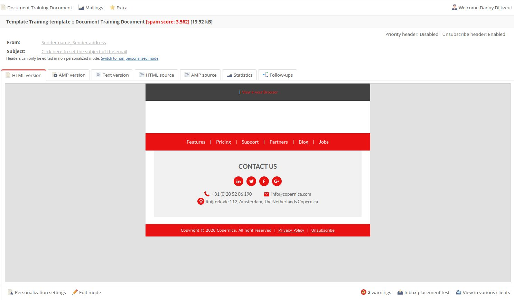

# Copernica-training: mailings, HTML-templates & contentcreatie

## Mailings

Zoals eerder genoemd staat de Publisher-mailomgeving los van de Marketing Suite.
In Marketing Suite wordt er gebruik gemaakt van een Drag-and-drop Editor waarmee je
gemakkelijk e-mails kunt opmaken.

In de Publisher werk je met HTML-templates. Daarmee is het mogelijk om aanpassingen te
doen aan de e-mailcontent, maar de stijl van de mail is vooraf vastgelegd in de
HTML-broncode.

## HTML-templates in de Publisher

De Publisher maakt gebruik van een template-/documentstructuur. Templates zijn
opgebouwd uit HTML- en CSS-code die aangeeft waar bepaalde content moet komen te
staan. Hierdoor kan een template aan een document worden toegevoegd zonder dat er
aanpassingen aan de HTML-code nodig zijn.

Een template bevat de globale opmaak van de mail en de elementen die vaststaan.
Denk daarbij bijvoorbeeld aan logo's of een uitschrijflink. Daarnaast bevat een template
blanco-elementen die later kunnen worden ingevuld.

Wanneer je een mailing wilt samenstellen maak je op basis van een template een document
aan. Vervolgens kun je de blanco-elementen vullen met tekst, afbeeldingen, video's en
meer. Een document is dus niets meer dan een template gevuld met content.

Templates worden doorgaans gemaakt door webdesigners of programmeurs die handig zijn
met HTML en CSS. Zij bepalen dus ook de opmaak van de mailing. Zodra een template
gebouwd is kan een marketeer deze van de benodigde content voorzien. Voor die tweede
stap is geen kennis van HTML vereist. HTML-templates kunnen ook direct in Copernica
geïmporteerd worden.

## Contentcreatie

Om je template van content te voorzien maak je eerst een document aan. Vervolgens voeg
je content toe door middel van contentblokken. Een contentblok komt voort uit een stukje
HTML-code die de locatie van content binnen een template bepaalt.

### Contentblokken

De Publisher maakt gebruik van drie verschillende contentblokken:

* Tekstblokken
* Imageblokken
* Loopblokken

De toepassing van tekst- en imageblokken spreekt voor zich. Het gebruik van loopblokken
vereist nadere uitleg.

Je gebruikt een loopblok wanneer je een specifiek onderdeel van een e-mail wilt
hergebruiken. De mate waarin dit gebeurt wordt bepaald door de hoeveelheid iteraties
(herhalingen) die je invult. Door gebruik te maken van loopblokken kun je contentblokken
eenvoudig toevoegen of weglaten afhankelijk van de content die beschikbaar is.

Je kunt contentblokken ook conditioneel maken. Daarmee kun je aangeven dat een
specifiek blok alleen getoond moet worden aan bepaalde profielen. Die profielen kunnen
worden geselecteerd op basis van een specifieke waarde in een databaseveld.

### Opdracht

Het [trainingsbestand](https://vicinity.picsrv.net/g/127/0/9966/946570547c4af9079f398f3af00edcd4/export-2021-05-19.zip) 
bevat een ZIP-bestand met daarin een [Publisher-template](https://vicinity.picsrv.net/g/127/0/9558/2e97da82d4b6433bba6a35dbc0b6d2a5/new_template.zip). 
Download de template, navigeer naar de Publisher en klik vervolgens op '**E-mailings**'​. Importeer de template
**TrainingTemplate.zip**​ en ververs de pagina.

Maak onder de template een nieuw document aan. Dat doe je door op de template te klikken
en vervolgens te klikken op '**Document**', '**Nieuw document aanmaken**'. Geef het
document een naam en klik op opslaan.

Je hebt nu de mogelijkheid om content toe te voegen aan het document. Als je het template
op de juiste manier hebt ingeladen ziet het document er als volgt uit:

#### Standaardbestemmingen

Voordat we beginnen met de e-mailopmaak is het belangrijk dat we een standaardbestemming​ aanwijzen in 
de database. Alle testmails zullen naar dit adres worden verzonden. Daarnaast is een standaardbestemming nuttig 
voor het testen van personalisatie.

Zodra je op een document klikt bevind je je in de '**Voorbeeldweergave**'​. Daarin wordt de
mailing op dezelfde manier weergegeven als wanneer deze op de standaardbestemming
geopend zou zijn.

Kies een profiel uit de database en stel deze in als '**Standaardbestemming**'​. Vervolgens
klik je op '**Gebruik dit profiel**'​.

#### Bewerkmodus

Ga terug naar het document en klik onderin op '**Bewerkmodus**'​. De e-mailcontent pas je in
deze modus aan. Om terug te gaan naar de voorbeeldweergave klik je simpelweg op '**Voorbeeldweergave**'.
