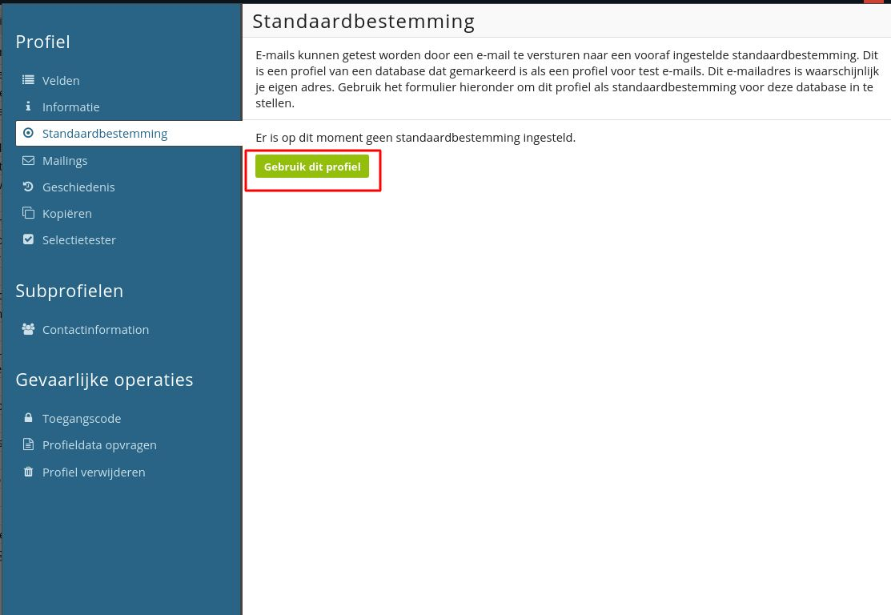

# Copernica-training: mailings, HTML-templates & contentcreatie

## Mailings

In Copernica kun je kiezen tussen het gebruiken van de drag-and-drop-editor of werken met een HTML-template. In een HTML-template kan alleen de content aangepast worden, de stijl van de mail staat vast in de HTML-broncode. In deze training behandelen we het werken met een drag-and-drop-template. Zie hier een [video](https://www.youtube.com/watch?v=n2AHLxqrRe0&feature=youtu.be) voor het opmaken van een HTML-template. 

## Basics

E-mails opmaken en beheren doe je in de E-mail-editor. Hier heb je de mogelijkheid om zowel drag-and-drop- als HTML-templates en HTML-documenten op te maken en te versturen.

Een drag-and-drop-template bestaat uit drie niveaus: lijnen, structuren en containers. Je maakt een nieuwe lijn aan door onderin een bestaande lijn op het plusteken te klikken. Structuren en containers kun je middels het drag-and-drop-systeem toevoegen, aanpassen of verwijderen. 

**Opdracht**
Maak een nieuwe drag-and-drop-template aan door te klikken op _Aanmaken - drag-and-drop-template aanmaken_.

Voeg eerst headers toe (onderwerp, afzendernaam en -adres) anders kun je de template niet opslaan. Je kunt hier ook een verborgen preheader toevoegen. Dit is een introtekst die op mobiele apparaten naast of onder het onderwerp worden getoond.

#### Standaardbestemmingen

Voordat we gaan beginnen met het opmaken van onze e-mail is het belangrijk dat we een standaardbestemming aanwijzen in de database. Een standaardbestemming wordt gebruikt om voorbeeldpersonalisatie te tonen en om testmails naar toe te sturen. Als je in een template op de voorvertoning klikt, dan zie je de mail op basis van de standaardbestemming.

Kies een profiel in de database en maak hiervan de **‘Standaardbestemming’** om testmails naar toe te sturen en om personalisatie te zien. Dit doe je door naar een profiel te gaan en te klikken op **‘Standaardbestemming’ - ‘Gebruik dit profiel’.**

Navigeer vervolgens terug naar de template. 
