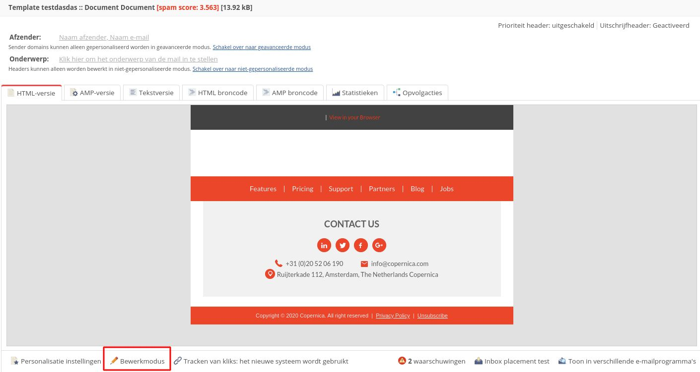
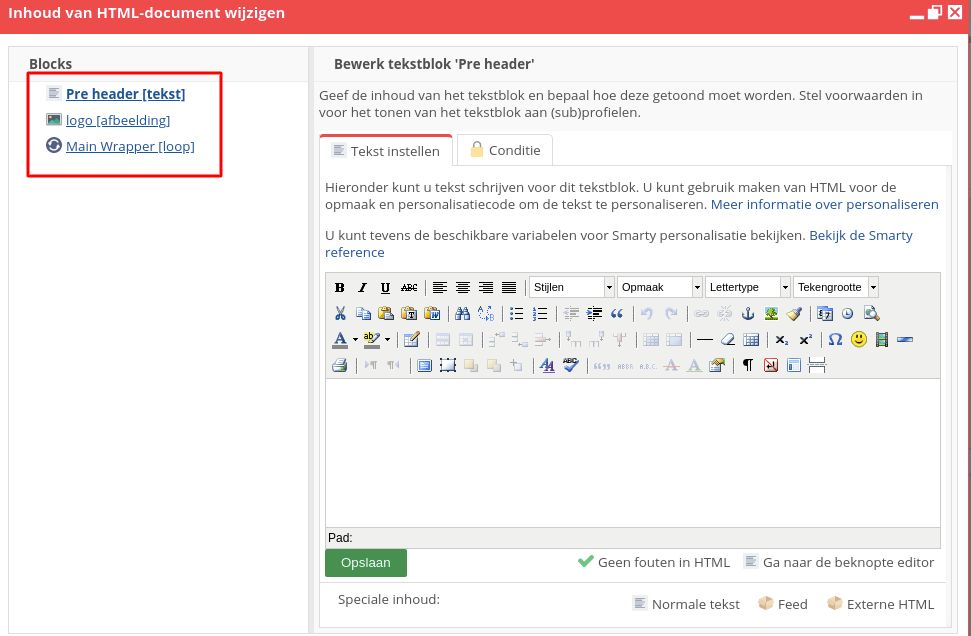
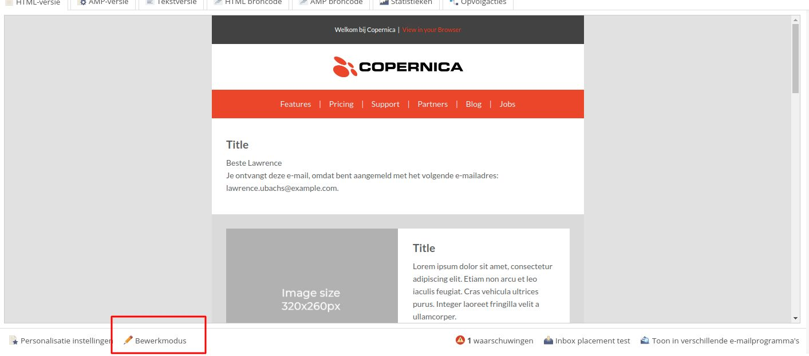

# Copernica-training: personalisatie

## Personalisatie

Copernica geeft je de mogelijkheid om e-mails te personaliseren. Je doet dit door middel van
Smarty-code. Die code wordt vervangen door gepersonaliseerde data zodra de e-mail
verzonden wordt.

Er zijn verschillende manieren waarop je e-mails kunt personaliseren. Denk bijvoorbeeld aan
een persoonlijke aanhef met de voor- en achternaam van de ontvanger. Personalisatie stelt
je ook in staat om gebruikers specifieke content te tonen op basis van interesses. Daarnaast
kan Smarty-code worden ingezet om externe content (zoals een verlaten winkelwagen of
productfeed) in te laden.

Je kunt personalisatie in Copernica herkennen aan de {accolades}. Bij het verzenden van
een e-mail toont de code {**$profile.Voornaam**} bijvoorbeeld de voornaam van het
desbetreffende profiel.

### Opdracht

Bewerk de content van het aangemaakte document door middel van contentblokken. Om de
blokken te tonen klik je onderin op '**Bewerkmodus**'.



Klik op het bovenste blok. Vervolgens krijg je aan de linkerkant een menu te zien. Hierin is
het eerste blok de pre-header. 

De pre-header is een tekstblok dat zich boven de template
bevindt. Op mobiel is deze tekst samen met het onderwerp als eerste zichtbaar.



Voeg een pre-headertekst toe. Klik vervolgens op het imageblok daaronder en plaats een
afbeelding. Je bent vrij om de afbeelding uit het 
[trainingsbestand](https://vicinity.picsrv.net/g/127/0/9966/946570547c4af9079f398f3af00edcd4/export-2021-05-19.zip) 
te gebruiken of een eigen afbeelding toe te voegen. 

Plaats vervolgens in de tweede tab een bijbehorende link. Klik nu op het '**Main Wrapper loopblok**'. 
Dit blok bevat alle elementen die binnen het template gebruikt kunnen worden. 

Zoals eerder genoemd maakt een loopblok het mogelijk om specifieke contentblokken te herhalen of te 
verbergen. Dat doe je door te werken met iteraties (herhalingen). Wanneer je de iteratie van een blok 
op '1' zet komt het blok ook één keer in de template voor. Het instellen van '0' iteraties zorgt ervoor 
dat een blok niet getoond wordt.

Klik op het '**Text section loopblok**' en zet het blok aan door de iteratie op '1' te zetten. Je
ziet nu dat het loopblok openklapt. Daarbij krijg je de mogelijkheid om een tekstblok in te vullen. 
Voorzie het titelblok van een titel. Plak vervolgens de onderstaande tekst in het contentblok:

```
Beste {if $profile.Voornaam != ""}{$profile.Voornaam}{else}relatie{/if}

Je ontvangt deze e-mail omdat je bent aangemeld met het volgende e-mailadres:
{$profile.Email}.
```

In dit geval verwijst {**$profile.Voornaam**} naar de waarde van het veld ​'Voornaam'​ in de
database waarnaar de mailing wordt verstuurd. Mocht het voornaamveld in een andere
database aangeduid worden als 'Firstname', dan zou je voor die database de code
**{$profile.Firstname}​** moeten gebruiken.

De bovenstaande code maakt ook gebruik van een if/else-statement. Die code
zorgt ervoor dat, indien het voornaamveld van een profiel niet is ingevuld, de aanhef 'Beste
relatie' wordt.

Klik het venster weg en bekijk het document in de '**Voorbeeldweergave**'. Check hierbij of
de personalisatie goed werkt. Mocht dit niet het geval zijn, ga dan een paar stappen terug
naar [standaardbestemmingen​](./copernica-training-part-5).



Wanneer je het eerste loopblok goed ingesteld hebt kun je weer terugnavigeren naar de 
'**Bewerkmodus**'. Probeer het document nu zelf verder in te vullen door te experimenteren 
met verschillende loopblokken.

Ben je tevreden met de content? Dan is het tijd om de uitschrijflink aan te maken. Copernica
heeft bij '**Uitschrijfopties**' vooraf ingesteld welk databaseveld gewijzigd moet worden zodra
een ontvanger op de uitschrijflink klikt.

Als je gebruik wilt maken van de standaard-uitschrijflink dan voeg je de tekst **{unsubscribe}**
toe aan de broncode van het document. Dit doe je door in het document te navigeren naar
'**HTML broncode**'. 

In het onderste gedeelte van het HTML-document vind je de uitschrijflink. Je kunt deze herkennen 
aan de volgende code: 

```
​<a href="">Unsubscribe</a>.
```

Om de uitschrijflink te activeren vul je tussen de aanhalingstekens {**unsubscribe**} in.
Vervolgens wordt er voor iedere ontvanger een persoonlijke uitschrijflink gemaakt. De
correcte HTML-code ziet er als volgt uit:

```
<a href="{unsubscribe}">Unsubscribe</a>
```

De uitschrijflink leidt standaard naar een pagina met de tekst 'U bent uitgeschreven'.
Het is ook mogelijk om te verwijzen naar een eigen URL. Dat doe je door middel van de
onderstaande code:

```
{unsubscribe redirect= 'http://www.eendomein.nl/eigenlandingspagina.html'}
```
