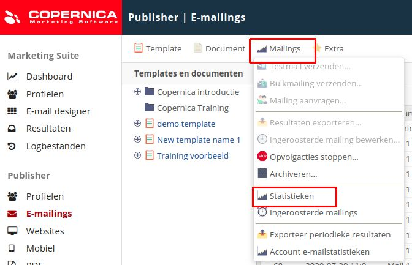
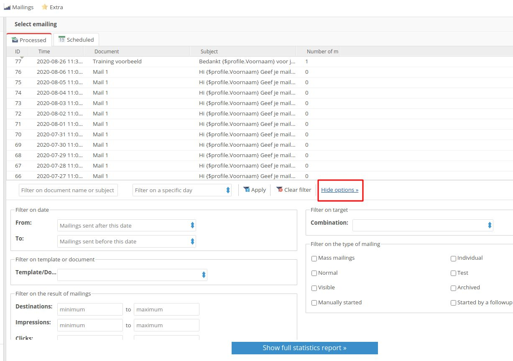

# Copernica-training: verzending en statistieken

## Verzending

Klaar om een e-mail te verzenden? Onthoud daarbij de volgende punten:

* Wanneer je een mailing inplant worden selecties net voor het versturen opnieuw
opgebouwd. Bij een directe verzending is dit niet het geval;
* De meest recente versie van het document wordt altijd verzonden;
* Verstuur altijd een testmail om er zeker van te zijn dat de opmaak en personalisatie
goed werken. Gebruik hiervoor je standaardbestemming of testselectie.

### Opdracht

Voordat je een bulkmailing verstuurt is het belangrijk om eerst te testen of de e-mail in orde
is en succesvol wordt afgeleverd. Het is vervelend als je een mailing naar een groot aantal
mensen verstuurt en er later achter komt dat er iets niet klopt.

Wanneer je een document wilt testen selecteer je deze en klik je onder '**Mailings**'​ op
'**Testmail verzenden**'. De testmail wordt verzonden naar de standaardbestemming. Deze
heb je een paar stappen terug ingesteld om de gepersonaliseerde weergave van het
document te kunnen bekijken.

Je kunt een bulkmailing verzenden door bij '**E-mailings**'​ het gewenste document te
selecteren. Vervolgens klik je onder '**Mailings**'​ op '**Bulkmailing verzenden**'​. Hier kun je de
bestemming, naam en beschrijving van de mailing instellen. Vervolgens controleert de
wizard of de mailing klopt, waarna je deze kunt versturen.

De mailing is nu ingeroosterd en is zichtbaar onder '**Mailings**'​, '**Ingeroosterde mailings**'.

### Opdracht

Zet een verjaardagscampagne op waarbij er één week voor de verjaardag van een profiel
een e-mail wordt verzonden. Denk hierbij aan het volgende:

1. Maak een profiel aan dat over één week jarig is (je kunt ook een bestaand profiel
aanpassen);
2. Creëer een verjaardagsselectie met profielen die over precies één week
jarig zijn;
3. Stel een eenvoudige verjaardagsmail op in de [Publisher-template](https://vicinity.picsrv.net/g/127/0/9558/2e97da82d4b6433bba6a35dbc0b6d2a5/new_template.zip);
4. Verzend de e-mail dagelijks naar de verjaardagsselectie.

Heb je de mail verzonden naar een profiel? Bekijk dan de statistieken door te navigeren naar
'**E-mailings**'​, '**Mailings**',​ '**Statistieken**'.

## Statistieken

Copernica houdt statistieken bij van verzonden mailings. Daarmee kun je zowel het aantal
impressies (geopende mails), kliks, unieke kliks en fouten als de doorklikratio van
verzonden e-mails inzien. 

In het geval van een foutmelding is de oorzaak hiervan ook inzichtelijk. Om fouten te 
voorkomen zul je mogelijk aanpassingen moeten doen op het gebied van databasemanagement.

## Statistieken in Publisher

Om in de Publisher statistieken van verzonden mailings te bekijken navigeer je naar
'**E-mailings**', '**Mailings**', '**Statistieken**'​.

Vervolgens heb je de mogelijkheid om filters toe te voegen. Je kunt bijvoorbeeld alle
mailings bekijken vanaf of tot een bepaalde datum. Het filteren op basis van e-mailresultaten 
of bulkmailings is ook mogelijk. Navigeer hiervoor naar '**Meer filteropties toevoegen**'.

Statistieken kunnen op e-mail- of accountniveau worden geëxporteerd. Daarbij is het
mogelijk om een periodieke export in te plannen, bijvoorbeeld voor het maken van een
dashboard. Ook kun je resultaten realtime exporteren via de REST of SOAP API.
