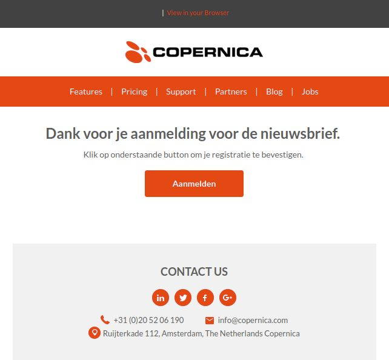

# Copernica-training: opvolgacties

Met opvolgacties kan je automatische e-mailcampagnes op zetten in Copernica. 
Een opvolgactie bestaat uit een aanleiding, eventueel een wachttijd en/of conditie 
en een actie die vervolgens uitgevoerd wordt. Een aanleiding kan bijvoorbeeld 
een klik op een link zijn in een verzonden e-mail, de wachttijd geeft vervolgens 
aan hoeveel tijd er tussen de aanleiding en het uitvoeren van de actie moet zitten. 
De actie bestaat bijvoorbeeld uit het verzenden van een e-mail of een waarde aanpassen in de database. 

Met andere woorden:
- Aanleiding - Start de opvolgactie;
- (Optioneel) conditie die moet worden voldaan voordat aanleiding start;
- (Optioneel) Wachttijd - Tijd die tussen de start van de opvolgactie en de uitvoer van de actie zit;
- (Optioneel) conditie die moet worden voldaan voordat actie start;
- Actie - De actie die wordt uitgevoerd.

Naast de wachttijd heb je de mogelijkheid om blokken of condities toe te voegen 
die waar of niet waar moeten zijn voordat de actie wordt uitgevoerd. 
Je kunt bijvoorbeeld controleren of een veldwaarde van een bestemming overeenkomt met een bepaalde waarde. 
De actie wordt dan alleen uitgevoerd als dat klopt.

## Opvolgacties op een e-mail

In Marketing Suite worden opvolgacties ingesteld in de​ ​'**Opvolgactie Manager**'​. 
In deze editor heb je de mogelijkheid om een trigger, een check en een actie toe te voegen aan een flow. 

In de drag-and-drop-editor kun je opvolgacties aanpassen via: **‘Opvolgacties’** in de toolbar. 
Je kunt bijvoorbeeld een actie laten uitvoeren als een ontvanger op een bepaalde link in de mail heeft geklikt. 

## Opvolgacties op een database

Naast opvolgacties op een e-mail kun je binnen Copernica ook opvolgacties instellen op een
database. De aanleiding is dan bijvoorbeeld het aanmaken of wijzigen van een (sub)profiel. 
De actie is bijvoorbeeld het verzenden van een opgemaakte e-mail. 

Klik op een database en vervolgens op _Opvolgacties_

## Opdracht: Welkomstcampagne met dubbele opt-in

We raden je aan om te werken met een dubbele opt-in. Dit houdt in dat een profiel zijn inschrijving bevestigt. 
geeft voor het ontvangen van bijvoorbeeld de nieuwsbrief. 
Het toevoegen van een dubbele opt-in zorgt structureel voor betere e-mailresultaten. 

Voeg een databaseveld toe voor de dubbele opt-in, noem dit **Dubbel_Optin**, 
dit is een meerkeuze veld met de opties: 

* 'Nee'
* 'Ja'

Voeg vervolgens een opvolgactie toe op de database. Deze bestaat uit:

- De aanleiding / trigger - Profiel aangemaakt
- Conditie bestemming checken- Het veld _Nieuwsbrief_ is gelijk aan Ja
- De actie - Verzend een e-mail (voor nu kun je de trainingsmail selecteren).

Klik vervolgens op Opvolgactie aanpassen om de flow live te zetten. 
Als er nu in de database een nieuw profiel wordt aangemaakt waarbij de waarde van het veld Nieuwsbrief gelijk is aan Ja,
dan wordt de e-mail verzonden. Een voorbeeld van zo’n e-mail is bijvoorbeeld:

Maak hiervoor een **“event handler”** aan op het blok **‘Verzend e-mail’** met als event-type Link klik. 
Voeg een blok **‘check geklikte link’** toe waarbij je instelt dat de actie alleen af moet gaan 
als een ontvanger klikt op een link die ‘bevestiging’ bevat. 
Voeg een ‘match’ link toe en selecteer het bestemming aanpassen blok. 
Kies bij aanpassen het veld ‘Dubbel_optin’ en vul als waarde ‘Ja’ in. 

De opvolgactie ziet er dan als volgt uit:

Het veld Dubbele-optin moet worden toegevoegd als conditie aan de Nieuwsbriefselectie, 
zodat alleen contactpersonen die de aanmelding bevestigd hebben mailings ontvangen.

