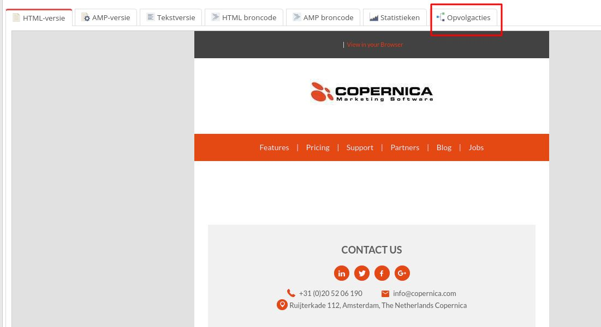
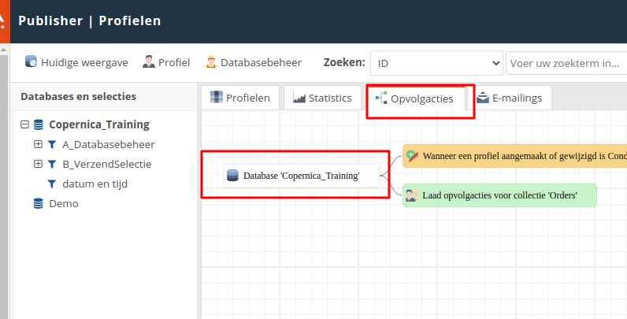

# Opvolgacties

Opvolgacties geven je de mogelijkheid om automatische e-mailcampagnes op te zetten. Een opvolgactie 
bestaat uit een aanleiding, een eventuele wachttijd en/of conditie en een actie die wordt uitgevoerd.

Een aanleiding kan bijvoorbeeld een klik op een link in een verzonden e-mail zijn.
Vervolgens geeft de wachttijd aan hoeveel tijd er tussen de aanleiding en het uitvoeren van
de actie moet zitten. Een actie kan bestaan uit het verzenden van een e-mail of het
aanpassen van een waarde in de database.

Het is ook mogelijk om condities toe te voegen aan een opvolgactie. Daarmee kun je
controleren of een veld voldoet aan een bepaalde waarde. Wanneer dit het geval is wordt de
actie uitgevoerd.

De volgorde van opvolgacties ziet er als volgt uit:

* Een **aanleiding**​ die de opvolgactie start;
* Een ​**conditie**​ waaraan moet worden voldaan voordat de aanleiding plaatsvindt (optioneel);
* Een **​wachttijd**​ die het tijdsbestek tussen de start van de opvolgactie en de uitvoering
van de actie bepaalt;
* Een **​conditie**​ waaraan moet worden voldaan voordat de actie plaatsvindt (optioneel);
* Een ​**actie**​ die wordt uitgevoerd.

## Opvolgacties op een e-mail (Marketing Suite)

In de Marketing Suite worden opvolgacties ingesteld in de​ ​'**Follow-up Manager**'​. Hierin heb
je de mogelijkheid om een trigger, check en actie toe te voegen.

Je kunt opvolgacties in de Drag-and-drop Editor aanpassen door te navigeren naar
'**Gereedschap**', '**Opvolgacties**'​.

## Opvolgacties op een e-mail (Publisher)

In de Publisher worden opvolgacties op het document ingesteld. Selecteer hiervoor het
document waarvoor je de opvolgactie wilt instellen en klik in het menu boven de e-mail op
'**Opvolgacties**'​.

Vervolgens vul je drie elementen in:

* Aanleiding;
* Wachttijd;
* Actie.

## Opvolgacties op een database

Naast opvolgacties op een e-mail kun je binnen Copernica ook opvolgacties instellen op een
database. Daarbij is de aanleiding bijvoorbeeld het aanmaken of wijzigen van een
(sub)profiel. Een potentiële actie is het verzenden van een opgemaakte e-mail.

## Opdracht: Welkomstcampagne met dubbele opt-in

We raden je aan om te werken met een dubbele opt-in. Daarbij geeft een
ontvanger twee keer toestemming voor het ontvangen van e-mails (bijvoorbeeld de
nieuwsbrief). Het toevoegen van een dubbele opt-in zorgt structureel voor betere
e-mailresultaten.

Voeg een databaseveld toe en noem deze ​'**Dubbel_Optin**'​. Voeg het veld toe aan de
nieuwsbriefselectie zodat alleen contactpersonen die zich hebben aangemeld de mailings
zullen ontvangen. Maak daarbij gebruik van een meerkeuzeveld met de volgende opties:

* 'Nee'
* 'Ja'

Voeg vervolgens een opvolgactie toe aan de database. Deze bestaat uit:

* Aanleiding: profiel aangemaakt;
* Wachttijd​: 0 minuten;
* Conditie​: het veld ​ '**Nieuwsbrief**'​ is gelijk aan 'Ja';
* Actie: verzend een e-mail (voor nu selecteer je de trainingsmail).

Er wordt nu een e-mail verzonden zodra er in de database een nieuw profiel wordt
aangemaakt waarbij de waarde van het nieuwsbriefveld op 'Ja' staat. In de onderstaande
afbeelding zie je een voorbeeld.

Vervolgens willen we dat de waarde van het veld '**Dubbel_Optin**'​ verandert naar 'Ja' zodra
de ontvanger zich aanmeldt. Daarvoor maken we in het document de volgende opvolgactie
aan:

* Aanleiding​: klik op een link die de tekst 'dubbel opt-in' bevat
* Wachttijd: 0 minuten
* Conditie: ​'**Nieuwsbrief**'​ is gelijk aan 'Ja'
* Actie​: wijzig het veld ​'**Dubbel_Optin**'​ naar 'Ja'.
