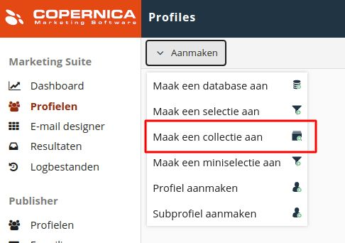
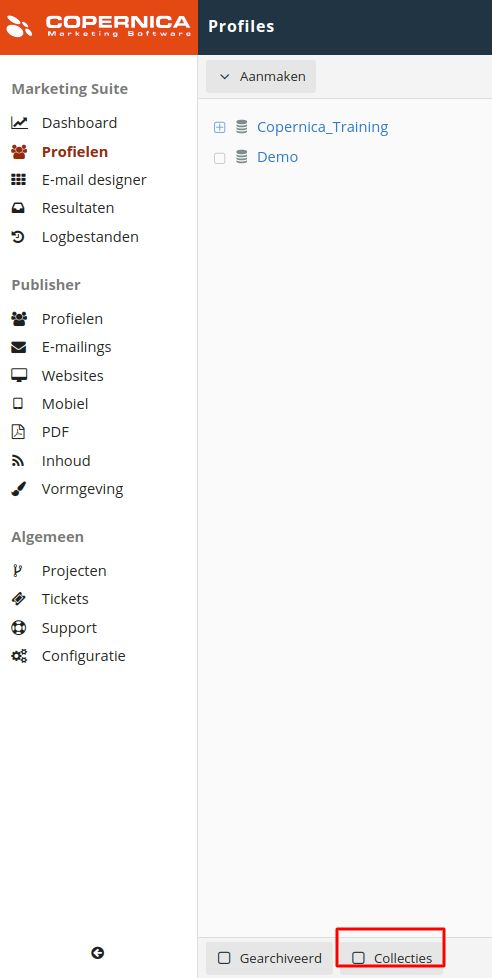
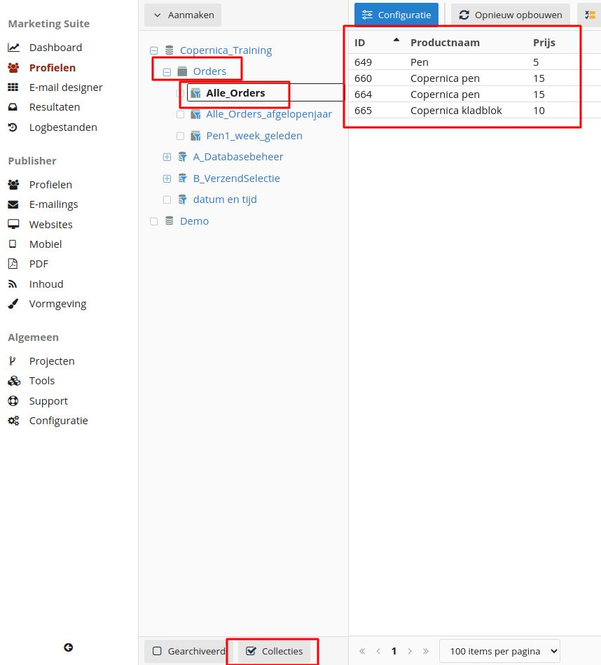
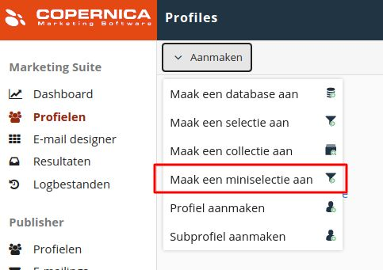

# Copernica-training: collecties en miniselecties

## Collecties

Copernica geeft je de mogelijkheid om een extra laag aan je database toe te voegen. Die
laag is gekoppeld aan een profiel en bevat daarover meer informatie. Denk bijvoorbeeld aan het productaantal, de
aankoophistorie, bekeken producten, naam, prijs of categorie.

Databases die onder een profiel vallen worden '**collecties**' genoemd. De data binnen een collectie noemen we
'**subprofielen**'.

Net als bij een database worden collecties opgebouwd uit velden naar keuze. Een collectie
wordt vervolgens gevuld met subprofielen die (net als bij reguliere profielen) informatie over
kenmerken bevatten.

### Opdracht

Maak een collectie aan en noem deze '**Orders**'. Voeg vervolgens de volgende velden toe:

* Productnaam;
* Prijs;
* Hoeveelheid;
* Aanschafdatum​ (Datum+tijdveld);
* Status​ (Meerkeuzeveld);
    * complete;
    * basket;
    * ordered;
* Artikelnummer.

Importeer vervolgens het bestand [AdvancedOrders.txt](https://vicinity.picsrv.net/g/127/0/9966/946570547c4af9079f398f3af00edcd4/export-2021-05-19.zip). Merk op dat het bestand dezelfde velden bevat als zojuist toegevoegd. Verbind de kolommen met de juiste velden en
importeer de data in de database. **Let op**: gebruik sleutelvelden ('**E-mail**' en '**Aanschafdatum**') 
om de data te importeren.

Je kunt collecties inzien door onderin de pagina te
klikken op '**Collecties**'. Subprofielen zijn zichtbaar in het profiel.

## Miniselecties

Een selectie selecteert profielen binnen een database op basis van kenmerken (condities).
Een ​miniselectie ​doet hetzelfde, maar dan met subprofielen binnen een collectie. Het is
bijvoorbeeld mogelijk om een miniselectie aan te maken die alle orders bevat die als
'complete' zijn aangeduid.

Om alle subprofielen in een miniselectie te bekijken navigeer je onderin de Marketing Suite
naar '**Collecties**'​. Vervolgens klik je op de collectie waar de miniselectie op gebaseerd is. In
het onderstaande voorbeeld zien we de profielen die onder de miniselectie '**Alle_Orders**'
vallen.

Het is ook mogelijk om profielen te selecteren waarvan de subprofielen voldoen
aan de condities van een miniselectie. In dat geval maak je een selectie aan die controleert
op de inhoud van een miniselectie. Daarbij stel je als conditie in dat profielen 'tenminste 1
subprofiel' hebben dat voldoet aan de condities van de miniselectie.

Je kunt bijvoorbeeld een selectie maken van alle profielen die ooit een order hebben
geplaatst (en dus minimaal 1 subprofiel hebben in de collectie ​'**Orders**'​). Wil je een selectie
maken van profielen die nog nooit een order hebben geplaatst? Creëer dan een conditie
waarbij profielen juist 0 subprofielen in de collectie ​'**Orders**'​ mogen hebben.

### Opdracht

We gaan de collectie '**Orders**' uit de vorige opdracht gebruiken om een selectie te maken
van alle klanten die ooit een aankoop hebben gedaan. Maak hiervoor een miniselectie aan
door te navigeren naar '**Profielen**', '**Aanmaken**', '**Maak een miniselectie aan**'​.

Selecteer de collectie '**Orders**'​ en noem de miniselectie '**Alle_Orders**' . Klik vervolgens op
'**Miniselectie aanmaken**'​.

De volgende stap is het toevoegen van regels en condities. Dat doe je op dezelfde manier als bij reguliere
selecties. In dit geval gebruik je een ​'**Check op veldwaarde**'​ waarbij de status van de
orders 'complete' moet zijn. Daarmee hebben we alle afgeronde orders geselecteerd.

Maak vervolgens een selectie aan met de naam '**Alle_klanten**'. Stel daarbij in dat er gecheckt moet
worden op de inhoud van een miniselectie. Zet het minimum aantal subprofielen op
'1' en het maximale aantal subprofielen op '99999'. Zo selecteer je alleen profielen die 
ooit een order hebben geplaatst.

### Eindopdracht

Selecties en miniselecties geven je de mogelijkheid om je database te segmenteren op
basis van websitegedrag, ordergegevens of andere data. Dit ga je nu zelf toepassen.

Maak een selectie aan waar alleen profielen onder vallen die ooit een order hebben geplaatst. 
Profielen die in de afgelopen 6 maanden een order hebben geplaatst sluit je daarbij uit. 

Stel vervolgens een e-mail op waarin je de uitgesloten groep motiveert om opnieuw een
aankoop te doen.
