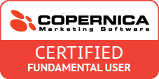
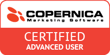

Iedere maand organiseren wij meerdere trainingen voor onze gebruikers.
We bieden twee trainingen aan: de fundamental training en de advanced
training. De fundamental training gaat in op de basiskennis van
Copernica (database, versturen van een e-mail etc.) terwijl de advanced
training ingaat op geavanceerde e-mailmarketingcampagnes die je met
Copernica (automatisch) kan versturen. Alle trainingen worden gegeven
door geselecteerde Copernica-experts. Na afloop van de trainingen kan
jij jezelf ook [certificeren](#certificering-fundamental-training).

We bieden je twee trainingsvormen aan:

-   [Trainingen op het hoofdkantoor van Copernica](#training-op-hoofdkantoor-van-copernica)
-   [Trainingen in de vorm van een webinar](#training-via-een-webinar)

Aanmelden doe je via het [aanmeldformulier voor de
trainingen](http://training.copernica.com/aanmelden_training)

Om deel te nemen aan de training is toegang tot de software met een
eigen persoonlijke gebruikersnaam en wachtwoord vereist. Heb je nog geen
toegang gekregen? Vraag dan eerst de beheerder van het hoofdaccount een
[gebruikersaccount voor je aan te maken](./manage-users-and-their-roles.md).
Deze heb je nodig om jezelf te kunnen aanmelden.

### Training op hoofdkantoor van Copernica

Twee keer per maand geeft Copernica je de mogelijkheid om op het
hoofdkantoor te Amsterdam je in één dag te trainen en te certificeren
als Fundamental en Advanced gebruiker:

-   's ochtends tussen 10:00 uur en 12:30 uur vindt de [Fundamental Training](#inhoud-fundamental-training) plaats
-   's middags tussen 13:00 uur en 16:00 uur vervolgt de dag zich in de [Advanced Training](#advanced-training).

Neem je deel aan beide trainingen, dan zorgen wij voor een lunch. Het is
ook mogelijk om je voor een van beide trainingen in te schrijven. De
trainingen vinden plaats op de tweede dinsdag en de vierde donderdag van
de maand. Zie de [evenementenkalender](./events.md)
voor de data van de trainingen.

Aanmelden doe je via het [aanmeldformulier voor de
trainingen](http://training.copernica.com/aanmelden_training)

### Training via een webinar

Lukt het je niet om bij een van de trainingen op locatie aan te sluiten,
dan bieden we je de mogelijkheid om aan te sluiten bij de trainingen die
worden gegeven met behulp van een webinar. Omdat deze trainingen met
name zijn bedoeld voor onze internationale gebruikers, maken we je er op
attent dat zowel de [Fundamental Training](#inhoud-fundamental-training) als de
[Advanced Training](#advanced-training) in het Engels worden gegeven.
Zie de [evenementenkalender](./events.md) voor de data van de trainingen.

Aanmelden doe je via het [aanmeldformulier voor de
trainingen](http://training.copernica.com/aanmelden_training)

### Inhoud Fundamental training

De Fundamental Training gaat in op de basis van Copernica. Zo leer je
hoe je een platte database opzet, selecties aanmaakt en hoe je een
simpele nieuwsbrief verstuurt. Ben je net gestart met Copernica en heb
je nog geen ervaring met Marketing Automation-pakketten? Dan is de
Fundamental Training voldoende voor je.

### Certificering Fundamental Training

Aan de hand van een officiële test kun je jouw Copernica-kennis toetsen.
Bij het behalen van de test ontvang je een certificaat en mag je jezelf
Certified Fundamental User noemen. Het examen voor een Fundamental
certificaat kun je direct afleggen via je dashboard door [in te loggen
op copernica.com](https://www.copernica.com/nl/dashboard).

### Data van de Fundamental training

Zie de [evenementenkalender](./events.md) voor de data van de trainingen.

### Aanmelden

Aanmelden doe je via het [aanmeldformulier voor de Fundamental
training](http://training.copernica.com/aanmelden_training).

Om deel te nemen aan de training is toegang tot de software vereist. Heb
je nog geen toegang gekregen? Vraag dan eerst de beheerder van het
hoofdaccount een [gebruikersaccount voor je aan te
maken](./manage-users-and-their-roles.md).

### Advanced training

Voor Copernica gebruikers die willen voortbouwen op de kennis van de
Fundamental training en alles willen halen uit de functies van Copernica
Marketing Software is er de Advanced training. Een Fundamental
certificering is een vereiste om aan de Advanced training deel te kunnen
nemen. De training vindt plaats op het Copernica hoofdkantoor te
Amsterdam van 13:00 uur tot 16:00 uur, met mogelijkheid tot
certificering.

### Certificering Advanced Training

Aan het eind van de training kan je direct een examen afnemen. Behaal je
het examen, dan ontvang je het certificaat voor Certified Advanced User.

### Data van de Advanced training

Zie de [evenementenkalender](./events.md) voor de data van de trainingen.

### Aanmelden

Aanmelden doe je via het [aanmeldformulier voor de Advanced
training](http://training.copernica.com/aanmelden_training).

Om deel te nemen aan de training is toegang tot de software vereist. Heb
je nog geen toegang gekregen? Vraag dan eerst de beheerder van het
hoofdaccount een [gebruikersaccount voor je aan te
maken](./manage-users-and-their-roles.md).
