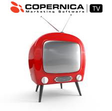

Opname van CopernicaTV van 21 November 2013: Marketing automation - The
United way met Edoardo Abis - Nike.

In deze aflevering:

Nike en Manchester United deelden een visie om winnend voetbal te delen
met de rest van de wereld. Copernica heeft ze geholopen dit balletje aan
het rollen te krijgen.

In deze uitzending delen Nike en Manchester United Soccer Schools hun
ervaringen met het verspreiden van voetbal, op de United manier.

Voor deze twee iconische merken zorgt Intelligende marketing
automatisering voor groei. En groei, daar draait Manchester United
Soccer Schools om. Niet alleen leren de deelnemers aan de voetbalkampen
beter te voetballen, ook leren ze zich beter staande te houden in het
leven.
