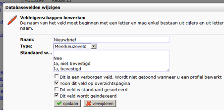
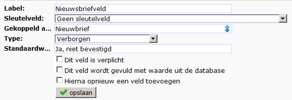
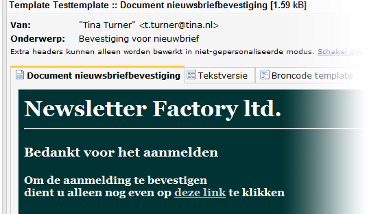

# Publisher Tutorial: Dubbele opt-in voor nieuwe profielen

Je mag van de Wet niet door rood rijden en alleen commerciele e-mails
versturen aan personen die zich hiervoor hebben aangemeld. Zulks een
aanmelding noemt men in de wereld van de internet marketing ook wel
opt-in (en een uitschrijving opt-out). Een dubbel opt-in gaat nog even
verder en geeft je de garantie dat aanmelders zichzelf daadwerkelijk
hebben aangemeld en met een bestaand e-mailadres.

Let op: Deze tutorial laat alleen zien hoe je dit kunt doen vanuit Publisher. 
Je kunt in Marketing Suite hetzelfde bereiken met [followups](./followups), 
maar deze zullen anders werken.

Hoe werkt dubbele optin?
------------------------

Een nieuwe abonnee wil graag een periodieke nieuwsbrief ontvangen.
Wanneer deze persoon zijn e-mailadres achterlaat, ontvangt hij (of zij)
een mail met hierin een link om de inschrijving te bevestigen (te
voltooien). Pas wanneer op de hyperlink in de e-mail is geklikt, is deze
persoon daadwerkelijk aangemeld.

De dubbele optin heeft een aantal belangrijke voordelen ten aanzien van
zijn enkele zusje:

-   De persoon die zich inschrijft is altijd dezelfde persoon als de
    persoon die de nieuwbrief ontvangt.
-   Het e-mailadres waarnaar je de nieuwsbrief verstuurt is altijd een
    werkende
-   Dit lijdt tot significant minder fouten bij het versturen van
    e-mails
-   Dit verbetert uiteindelijk de deliverability.
-   De database blijft schoon en bestaat louter uit mensen die
    daadwerkelijk een nieuwsbrief willen ontvangen

### De dubbele optin werkt als volgt:

1.  Een nieuwe abonnee meldt zich aan via een inschrijfformulier.
2.  Wanneer het formulier is verzonden, wordt er een automatische mail
    verstuurd naar het e-mailadres met hierin de bevestigingslink.
    Hiervoor gebruik je een opvolgactie.
3.  Zodra deze link is aangeklikt is de aanmelding voltooid.
4.  Optioneel kan er nog een extra bevestiging achterna gestuurd worden,
    met hierin informatie over de afmeldprocedure, en als je slim bent
    ook nog wat verwijzingen naar interessante artikelen / producten op
    jouw website.

### Voor het maken van een dubbele optin dien je over het volgende te beschikken

Een database met hierin een meerkeuzeveld opgenomen voor
nieuwsbriefvoorkeur en uiteraard een veld waarin het e-mailadres zal
worden opgeslagen.

-   Drie verschillende webpagina’s:
    -   Een om het inschrijfformulier op te plaatsen. (1)
    -   Een vervolgpagina van het formulier, waarop u vermeldt dat een
        bevestigingsmail onderweg is. (2)
    -   Een pagina waarop je vermeldt dat de inschrijving voltooid is.
        (3)
-   Een e-maildocument met hierin de bevestigingslink.

Stap 1. Het prepareren van de database
--------------------------------------

In de database dienen twee velden aanwezig te zijn: een veld om het
e-mailadres in op te slaan en een veld om de nieuwsbriefvoorkeur van de
abonnee op te slaan.

Het veld voor e-mailadres dient uiteraard een veld van het type
[e-mailveld](./database-and-collection-field-types.md)
te zijn (zodat het systeem weet dat dit veld de adressen bevat).

Van het veld voor nieuwbriefvoorkeur maak je een meerkeuzeveld met de
volgende opties voorgedefinieerd:

-   [lege optie]
-   Nee
-   Ja, niet bevestigd
-   Ja, bevestigd

Stap 2. Reserveer een drietal webpagina’s
-----------------------------------------

Zorg dat de drie webpagina’s klaar zijn voor gebruik (zodat je hier
direct het formulier op kan plaatsen en naartoe kunt linken.

Stap 3. De fabricatie van het formulier
---------------------------------------

Dit wordt een aanmeldformulier met hierin **twee velden** opgenomen.

1.  Een **tekstveld** die is gekoppeld aan het e-mailadres in de
    database
2.  Een **onzichtbaar veld** die gekoppeld is aan het veld met de
    nieuwbriefvoorkeur. De standaardwaarde van dit onzichtbare veld zet
    je op ‘Ja, niet bevestigd’

Let op, omdat er straks een automatische e-mail moet worden verstuurd
naar de invuller, gebruikt je bij de formulierinstellingen ‘inloggen als
profiel uit de database [database]

Plaats het webformulier op webpagina 1, en zorg dat de vervolgpagina van
het webform een webpagina is waarop je vermeldt dat een bevestigingsmail
is verstuurd naar {\$emailadres}.

Stap 4. Koppel een opvolgactie aan het webformulier
---------------------------------------------------

Wanneer het formulier is ingevuld en verzonden, moet er een
bevestingsmail worden verstuurd naar het zojuist ingevulde e-mailadres.
Dit kan met een formulieropvolgactie.

Ga naar *webformulier \>***opvolgacties** en creëer een opvolgactie
waarbij een opgemaakte e-mail wordt verstuurd aan het profiel. Selecteer
het e-maildocument met hierin (straks) de bevestigingslink.

Stap 5. Het e-maildocument met bevestigingslink
-----------------------------------------------

Creëer een nieuw e-maildocument (of bewerk een bestaande). De
belangrijkste voorwaarde is dat dit document een hyperlink heeft die
verwijst naar de webpagina waarop je vermeldt dat de inschrijving
voltooid is.

**Aan deze hyperlink gaan we een documentopvolgactie koppelen:**

Ga naar het *document menu \>***opvolgacties**

Maak een opvolgactie waarbij een klik op een specifieke link (de
bevestigingslink)  tot gevolg heeft dat een waarde in de database
verandert. Deze nieuwe waarde wordt ‘Ja, bevestigd’ voor het
nieuwsbriefvoorkeurveld.

Sla de opvolgactie op. Wanneer de kersverse abonnee op bevestigen klikt,
wordt de waarde in het veld ‘Nieuwsbriefvoorkeur’ veranderd naar*Ja,
bevestigd*.

Maak een nieuwsbriefselectie
----------------------------

Maak tot slot in de database een
[nieuwsbriefselectie](./create-a-mailing-list.md)
(Selectietype: *Check op veldwaarde*) aan waarin alleen mensen worden
opgenomen waarbij de waarde in het nieuwbriefveld gelijk is aan ‘Ja,
bevestigd’. Aan deze selectie verstuur je voortaan de nieuwsbrief.

## Meer informatie

- [Followups](./followups)
- [Selecties/Collecties](./selections-introduction)
