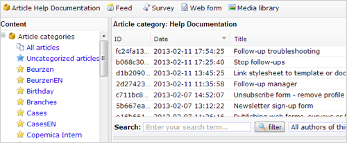

# Een nieuwe artikel rubriek aanmaken

Om een nieuw artikel aan te maken, dien je allereerst te beschikken over
een rubriek waarin het artikel moet worden opgenomen. Je kan
bijvoorbeeld een rubriek *Nieuwsbrief* aanmaken. Een artikel dat je
uiteindelijk in je nieuwsbrief wil publiceren, plaats je in de deze
rubriek.

-   Hetzelfde artikel kan in meerdere rubrieken worden opgenomen.
-   Niet-gerubriceerde artikelen kunnen niet worden opgenomen in een
    feed.

### Nieuwe rubriek aanmaken

-   Ga in het **Artikel menu** naar **Nieuwe rubriek**
-   Voer de naam in voor de nieuwe rubriek
-   Kies de taal van de artikelen in deze rubriek en klik op **opslaan**

De nieuwe rubriek is nu terug te vinden in het linkeroverzicht met
*Artikel rubrieken*.

Volgende stap: [artikelen toevoegen aan de
rubriek](artikelen-toevoegen-aan-de-rubriek)

**Niet-gerubriceerd artikel plaatsen in rubriek**

-   Klik in het linker overzicht op* Alle artikelen*
-   Selecteer het artikel in de lijst
-   Klik in de onderste werkbalk op *Rubrieken instellen…*
-   Selecteer 1 of meerdere rubrieken waarin het artikel geplaatst moet
    worden.

**Nieuw artikel aanmaken onder rubriek**

-   Klik in het linker overzicht op de rubriek waaraan je het artikel
    wil toevoegen
-   Klik in het menu *Artikel* op *Artikel toevoegen*.

**Nieuw artikel aanmaken zonder rubriek**

-   Klik in het linker overzicht op *Artikelen zonder rubriek*
-   Klik in het menu Artikel op *Artikel toevoegen*.
