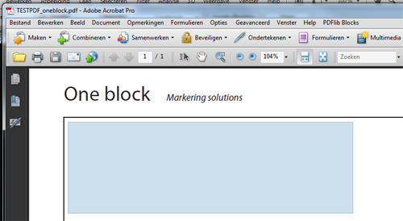
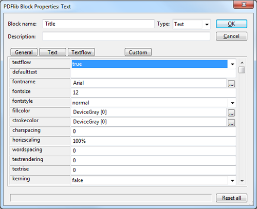

# PDF-blokken maken in Acrobat Pro

De blokken waarmee je in Copernica (gepersonaliseerde) content toevoegt
aan PDF bestanden, maak je niet in Copernica, maar in Acrobat Pro. Je
hebt hiervoor de gratis PDF-lib plugin nodig.

Voor het opstellen van gepersonaliseerde PDF-bestanden dien je te
beschikken over Adobe acrobat PRO en de [gratis plugin van
PDFlib](http://www.pdflib.com/download/pdflib-family/block-plugin-50/).

Zodra je de plugin hebt geinstalleerd, zal Acrobat zijn uitgerust een
extra menu met de naam **PDFlib blocks**

Klik in het menu op**PDFlib block tool** om de tool te activeren. Trek
een blok daar waar je het ongeveer in het document wilt hebben. De
grootte en positie van het blok kan je later nog aanpassen.

Het dialoogvenster voor de blok opties zal zich openbaren...

Belangrijke instellingen
------------------------

-   **Block name** - de naam van het blok. Deze naam wordt ook in
    Copernica getoond bij het blok. Geef dus een duidelijke naam aan het
    blok.
-   **Type** - kies het type blok dat je wilt gebruiken. Selecteer
    **Text**voor het toevoegen van textuele content. Selecteer
    **Image**voor het toevoegen van een afbeelding.
-   Er is ook een optie **PDF**, deze kan je negeren.

Font en typografie wijzigen
---------------------------

Je kunt de weergave van de tekst in tekstblokken naar eigen smaak
aanpassen. Klik op de knop **Text** om bijvoorbeeld het gebruikte
lettertype, grootte en interlinie aan te passen.

**Let op:** als de text meerdere regels beslaat, zorg er dan voor dat de
instelling **Text flow** op **'true'** staat. \
 **Let op 2:** alle fonts die je wilt gebruiken, dien je apart te
uploaden naar Copernica.

Blokken kopieren
----------------

Je kan in Acrobat de blokken eenvoudig kopieren middels de welbekende
CTRL+C en CTRL+V. Macgebruikers hebben een toets met een plaatje van een
appel, waarmee hetzelfde bewerkstelligd kan worden.

Een gekopieerd blok heeft dezelfde instellingen als het origineel.

Meerdere blokken
----------------

Je kan oneindig veel blokken toevoegen, op alle pagina's in het
PDF-document.
