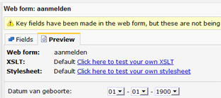

# Maak en gebruik een nieuwe stylesheet

Vanuit het onderdeel *Stijl* kan je nieuwe stylesheets maken voor
gebruik in Copernica. Het stylesheet is generiek en bevat **tabbladen**
voor het bewerken van een stylesheet voor algemeen gebruik, voor RSS,
Atom, enquêtes en webformulieren. Dit alles dus in **één enkel
bestand**.

Je kan de stylesheets laten baseren op voorbeeldcode, of starten met een
leeg bestand. Het voorbeeldbestand is voorzien van uitgebreide
becommentariering over de CSS classes en regels, en hoe deze kunnen
worden aangepast.

De stylesheet testen met je formulier, enquête of feed
------------------------------------------------------

In het onderdeel **Content** kan je een eigen stylesheet testen met je
formulier, enquête of feed. Klik hiervoor op het item waarvoor je de
stylesheet wilt gebruiken, en klik vervolgens op het tabblad
**Voorvertoning**. Selecteer de gewenste stylesheet. Deze zal direct
toegepast worden op het het formulier, de enquête of feed.

De stylesheet koppelen aan een template of document
---------------------------------------------------

Een stylsheet koppel je aan een document, template, webtemplate of web
pagina. Je kan geen stylesheets koppelen aan losse webformulieren,
feeds, en enquêtes.

Om je stylesheet te gebruiken met je document of template, dien je deze
hieraan te koppelen. Deze functie vind je in het *document*menu en in
het *template*menu.

Wanneer je de stylsheet gebruikt binnen het onderdeel **Emailings**, kan
je bij het koppelen het beste kiezen voor de optie om stijlblokken te
[converteren naar inline
attributen](./automatically-convert-block-style-elements-to-inline-style-attributes.md "CSS omzetten naar inline ").

Nadat je de stylesheet hebt gekoppeld, wordt direct boven het
betreffende document een nieuw tabblad **Stijl** toegevoegd. Vanuit dit
tabblad kan je de stylesheet direct verder bewerken.\
\
Formulieren, enquêtes en feeds zullen automatisch getoond met de style
die je hebt gekoppeld aan je document of template. \
\
Een template of document kan maar van een stylesheet tegelijkertijd
gebruik maken. 
