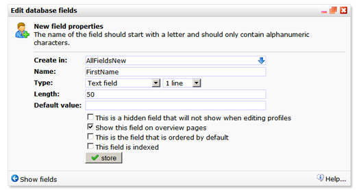

Je databases en collecties in Copernica zijn opgebouwd met
databasevelden. Er zijn verschillende veldtypes beschikbaar, ieder
geschikt voor het opslaan van een specifiek soort gegevens. Er zijn
datumvelden voor het opslaan van datums, numerieke velden, waarin alleen
numerieke waarden kunnen worden opgeslagen, et cetera.

Je kunt velden toevoegen en bewerken in*Profielen \> Databasebeheer \>
**Databasevelden wijzigen***.

Tevens kan je direct bij het importeren van profielen en subprofielen
nieuwe databasevelden aanmaken en bestaande velden aanpassen.

Dit artikel gaat over de verschillende database-veldtypen die je kunt
opnemen in je database of collectie.

Typen velden
------------

Binnen Copernica kan gebruik worden gemaakt van verschillende types
velden voor het opslaan van gegevens.

\#\#\#
**Numerieke velden**

Dit veld kan alleen numerieke waarden [0-9] bevatten. Gebruik dit
veldtype om informatie zoals leeftijd of gewicht op te slaan. Numerieke
velden moeten altijd ten minste één cijfer bevatten (een leeg veld kan
niet worden opgeslagen). Tip: maak de standaardwaarde een 0 (nul).

**Let op:** numerieke velden kunnen geen decimalen bevatten (,34). Als u
toch decimalen wilt opslaan (bijvoorbeeld voor het opslaan van prijzen),
gebruikt dan in plaats van een numeriek veld een tekstveld. SOAP API
gebruikers kunnen eventueel het veldtype 'float' gebruiken om getallen
met decimalen op te slaan.

### **Tekstveld**

Tekstvelden zijn velden voor tekstuele inhoud en kunnen alle soorten
tekens bevatten, inclusief cijfers en speciale tekens. Een tekstveld kan
tot 5 regels (multiline) hoog zijn. De standaardlengte van een tekstveld
is 50 tekens. Je kunt dit aantal indien gewenst verhogen tot 255. Als je
meer dan 255 karakters in een databaseveld kwijt wilt, gebruikt dan een
‘groot veld’ (zie hieronder).

Beperkt de standaardlengte van database velden tot wat nodig is. Dit
komt ten goede van de performance van de database.

**Let op:** het aantal rijen wordt alleen gebruikt in de ‘Profiel
bewerken’-dialoog en in het profieloverzicht. Het heeft geen invloed op
de weergave van webformulieren.

### **Grote velden**

Grote velden zijn in principe hetzelfde als tekstvelden, op een klein
verschil na: ze kunnen tot 16 miljoen tekens bevatten (genoeg om een
bestseller te slaan).

Het is beter om geen selecties te maken op grote velden. Grote velden
zijn de enige velden die niet kunnen worden geïndexeerd.

### **Datumveld**

Datumvelden worden (uiteraard) gebruikt voor het opslaan van
datumgegevens. Een datumveld moet een geldig opgemaakte datum bevatten
(yyyy-mm-dd). Een datumveld wordt automatisch gevuld met nullen indien
deze niet leeg mag zijn (0000-00-00).\
 **\
 Voorbeeld datumnotatie**: 1980-09-03

### **Datum + tijdveld**

Datum + tijdvelden zijn normale datumvelden, maar uitgebreid met uren,
minuten en seconden (uu:mm:ss).\
 **\
 Voorbeeld:** 1980-09-03 08:56:36

### **E-mailveld**

Dit veld wordt door de applicatie gebruikt voor het versturen van
mailings, testmailings, enzovoort.\
 E-mailvelden kunnen in principe alleen legitieme e-mailadressen
bevatten. Dat wil zeggen: het e-mailadres is correct opgemaakt
([naam@bedrijf.nl](<mailto:naam@bedrijf.nl>) , a.bcdfg@bedrijf.co.uk).

**Als er in een database of collectie geen e-mailveld is aangewezen,
kunnen er ook geen e-mailings worden verstuurd naar deze database of
collectie.**

Bij het bewerken van profielen zal de ingevoerde waarde worden
gevalideerd of het een goed geformatteerd e-mailadres is. Zo niet, dan
zal een waarschuwing worden gegeven. Deze waarschuwing kan indien
gewenst worden genegeerd. Tevens wordt gecontroleerd of het e-mailadres
daadwerkelijk bestaat. Wanneer een e-mailadres volgens onze controle
mogelijk niet bestaat, ontvang je hierover een melding. Let op: de
controle is niet waterdicht. Het e-mailadres kan tijdens de controle
bijvoorbeeld tijdelijk onbereikbaar zijn. Je moet het daarom zien als
een hulpmiddeltje.

Wanneer er sprake is van een veel voorkomende tikfout in het gedeelte na
het apenstaartje, kan de applicatie deze direct voor u repareren.

**Let op**\
 Een database kan één e-mailveld bevatten dat wordt gebruikt voor het
verzenden van mailings. Het maken van een tweede e-mailveld zal
automatisch het eerste e-mailveld omzetten naar een tekstveld. Mailings
worden dus verstuurd naar het e-mailadres in het nieuwe e-mailveld (dit
kan je natuurlijk altijd weer naar de oude situatie veranderen).

### **Telefoonveld**

Een telefoonveld kan worden gespecificeerd voor fax, mobiele en
'andere'. Wanneer je een database gebruikt om faxen te verzenden, zal
het nummer in het 'fax'-veld worden gebruikt voor het versturen van
fax-mailings. Het veld GSM wordt gebruikt voor mobiele campagnes. Je
kunt 'andere' voor de resterende telefoonnummers selecteren. Net als bij
e-mailadres velden, kan een database slechts één veld voor mobiele
nummers en één veld voor faxnummers bevatten. Het creëren van een tweede
GSMveld of faxveld zal het oorspronkelijke veld veranderen naar een
tekstveld.

### **Meerkeuzeveld**

Een meerkeuzeveld wordt bij het bewerken van profielen en op diverse
andere plaatsen in de applicatie getoond als een uitklapmenu. Hierin
zijn dan alleen de vooraf ingevoerde waarden beschikbaar. Typ de opties
in het veld 'waarde'. De bovenste waarde wordt automatisch de
standaardwaarde voor nieuwe profielen. Als je een andere standaardwaarde
wil gebruiken, kan je gebruik maken van een asterisk (\*). In het
volgende voorbeeld, is de stad Haarlem de standaardwaarde:

-   Amsterdam
-   Rotterdam
-   Den Haag
-   Haarlem \*

Deze asterisk wordt niet getoond in webformulieren of tijdens het
bewerken van profielen.

**Lege optie:**Een meerkeuzeveld kan een lege optie krijgen. Gebruik
hiervoor gewoon een lege regel (enter).

Let wel, een meerkeuzeveld wordt niet automatisch getoond als een
drop-down box als het wordt gebruikt in webformulieren. Dit kan
onafhankelijk worden ingesteld bij het webformulier zelf.

### Landcode veld

Dit veld accepteert alleen landcodes volgens de ISO 3166 standaard. De
landcode voor Nederland is NL en die van België BE. Voor een volledige
lijst met landencodes kan je terecht op de website van ISO.org.

[Bekijk alle
landcodes](http://www.iso.org/iso/country_codes/iso_3166_code_lists/country_names_and_code_elements.htm)

**Extra opties**
----------------

### **Dit veld is een verborgen veld dat niet zal laten zien bij het bewerken van profielen**

-   Verborgen velden zijn niet zichtbaar in het ‘Profiel bewerken’
    dialoogvenster.

Gebruik deze optie om wachtwoorden op te slaan of voor velden die alleen
mogen worden bewerkt door profielen (via webformulieren).

**Opmerking**: Deze optie heeft geen invloed op de weergave van het veld
in webformulieren. Dit wordt apart ingesteld bij het webformulier zelf.

**Opmerking** 2: De gegevens uit een verborgen veld kunnen gewoon
geïmporteerd en geëxporteerd worden, zoals alle andere velden.

### **Toon dit veld op overzichtspagina's**

Selecteer deze optie om het veld weer te geven op de profiel
overzichtspagina.

### **Dit veld wordt gesorteerd**

Het veld zal worden gebruikt voor het alfanumeriek sorteren van de
profielen. Deze optie kan slechts bij één veld tegelijkertijd worden
geactiveerd. De waarde van dit veld wordt als label getoond in het
eerste tabblad op de overzichtspagina van het profiel. In onderstaande
afbeelding is het veld ‘Company’ gesorteerd.

**Het veld Company is gesorteerd.**

-   De naam van het bedrijf wordt nu getoond in het profiel tabblad.
-   De profielen zijn alfanumeriek gesorteerd in de lijst met profielen.

### **Dit veld wordt geïndexeerd**

Gebruik deze optie voor velden die je vaak gebruikt voor het zoeken van
profielen. Het indexeren van deze velden versnelt het zoeken binnen je
database en het opbouwen van selecties en miniselecties. Indexeer niet
te veel velden. Je kan maximaal 64 velden indexeren. Velden van het type
‘Groot veld’ kunnen niet worden geïndexeerd.
