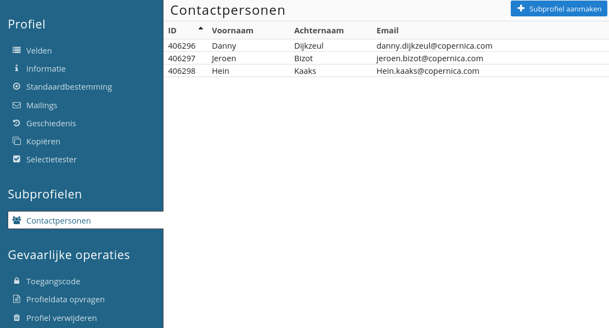
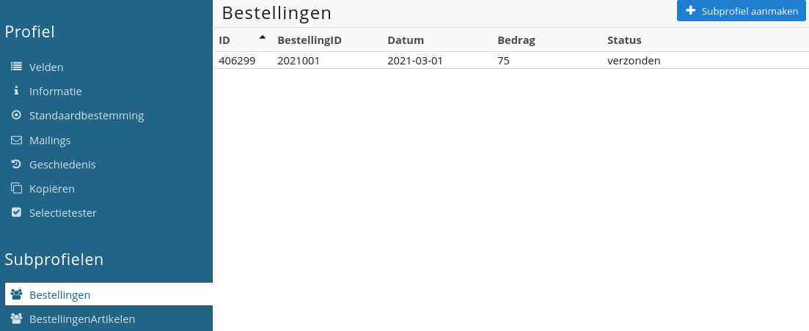
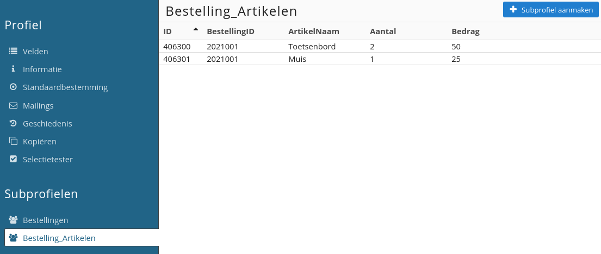
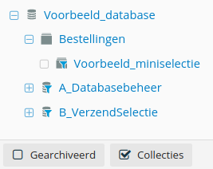

# Collecties & miniselecties
Een **collectie** is een mini-database die onder een reguliere database valt. Een collectie wordt gevuld met **subprofielen** die gekoppeld zijn aan een profiel. Net als in het geval van profielen bevatten subprofielen velden als naam, aantal, prijs en categorie. Collectievelden kun je zelf beheren.

Je bent vrij in het aantal collecties dat je kunt toevoegen. Zo kun je bijvoorbeeld een collectie aanmaken voor bestellingen, verlaten winkelwagens of contactpersonen binnen een profiel. Wanneer je een collectie voor bestellingen aanmaakt bevat deze de bijbehorende bestellingen per profiel.

**Voorbeeld - Database met bedrijven, collectie met werknemers**  

In bovenstaand voorbeeld is gebruik gemaakt van een database waarin de bedrijfsgegevens staan. Om de contactpersonen per bedrijf op te kunnen slaan, is de collectie 'Contactpersonen' aangemaakt. In deze collectie kunnen meerdere contactpersonen als subprofiel aan het bedrijf gekoppeld worden.  

**Voorbeeld - Database met klanten, collectie met bestellingen en bestelde artikelen**  

In bovenstaand voorbeeld zie je twee collecties binnen een profiel, namelijk **Bestellingen** en **BestellingenArtikelen**. In 'Bestellingen' worden de algemene gegevens van een bestelling bijgehouden zoals het ID, de datum, het bedrag en de status. 

In 'BestellingenArtikelen' worden de artikelen gespecificeerd die bij een bestelling horen. Naast de naam van het artikel, het bestelde aantal en het bedrag wordt het ID van de bestelling bijgehouden. Hiermee is het mogelijk om de artikelen te koppelen aan de bestelling. Door middel van [loadsubprofile](./loadprofile-and-loadsubprofile) kun je deze gegevens in je e-mail tonen.

## Aanmaken van een collectie
Je maakt een collectie aan door onder ‘**Profielen**’ te kiezen voor ‘**Aanmaken -> Een collectie aanmaken**’. Hierbij selecteer je eerst de database waaronder de collectie moet vallen en voorzie je de collectie van een naam. Vervolgens voeg je velden toe door in de menubalk te kiezen voor '**Velden**'.

## Collecties weergeven
Collecties worden niet standaard weergegeven in de boomstructuur onder '**Profielen**'. Wanneer je collecties of miniselecties in wilt zien kun je in de onderste balk de optie '**Collecties**' aanzetten. Deze zijn vervolgens zichtbaar in de boomstructuur.

## Wat zijn miniselecties?
Een selectie selecteert profielen binnen een database op basis van veldwaarden. Een miniselectie doet hetzelfde, maar dan op basis van de gegevens van subprofielen uit een collectie. Je kunt hiermee bijvoorbeeld alle orders (subprofielen) selecteren die na een bepaalde datum zijn aangemaakt.

Vervolgens kun je een reguliere selectie aanmaken van profielen waarbij de subprofielen voldoen aan de condities van een miniselectie. Je kunt hierbij gebruik maken van de conditie '**Check op inhoud miniselectie**'. Hiermee geef je aan hoeveel subprofielen binnen het profiel aan je gestelde (miniselectie)condities moeten voldoen.

Je kunt bijvoorbeeld een selectie maken van profielen die ooit een bestelling hebben geplaatst (profielen met minimaal één subprofiel in de miniselectie 'Bestellingen'). Ook kun je een selectie maken van profielen die nog nooit een bestelling hebben geplaatst (profielen met 0 subprofielen in de miniselectie 'Bestellingen').

## Aanmaken van een miniselectie
Om een miniselectie aan te maken kies je onder '**Profielen**' voor '**Aanmaken -> Een miniselectie aanmaken**'. Hier geef je aan onder welke collectie de miniselectie moet worden aangemaakt. Vervolgens geef je de miniselectie een naam en een eventuele beschrijving.

Om een miniselectie aan te passen navigeer je naar de miniselectie en kies je in de menubalk voor de optie '**Regels**'.
