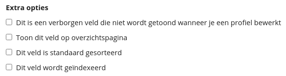
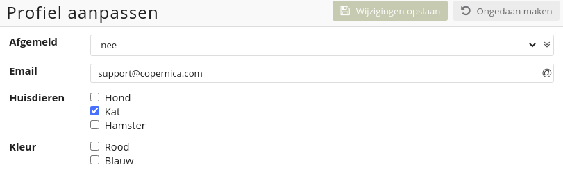

# Databasevelden
Een database bestaat doorgaans uit meerdere velden. Je kunt deze velden aanmaken of bewerken door binnen een database te kiezen voor de menuoptie ‘**Velden & interesses**’. De volgende veldtypen zijn beschikbaar:

* **Tekst:** Geschikt voor elk karaktertype met een limiet van 255 karakters. Wanneer je meer karakters wilt invullen gebruik je de optie 'Grote tekst'. We raden het gebruik van deze optie echter af omdat deze velden niet kunnen worden geïndexeerd.

* **Numeriek:** Dit veld mag alleen getallen bevatten en mag niet leeg zijn (gebruik bijvoorbeeld standaardwaarde '0').

* **E-mail:** In dit veldtype sla je een e-mailadres op. Het e-mailveld is het enige veldtype dat je kunt instellen als bestemming voor het versturen van e-mails. De software controleert hierbij of ingevoerde e-mailadressen de juiste syntax hebben. Je kunt per database maar één e-mailveld gebruiken.

* **Datum:** Geschikt voor het invullen van een datum. Hierbij is de notatie jaar-maand-dag. Voorbeeld: 2021-12-31.

* **Datum + tijd:** Geschikt voor het invullen van een datum (jaar-maand-dag) en tijd (uren-minuten-seconden). Voorbeeld: 2021-12-31 12:49:59.

* **Telefoon:** Geschikt voor zowel reguliere- als mobiele telefoonnummers. Wanneer je in Copernica gebruik wilt maken van de SMS-module selecteer je '**Mobiel**'. Dit is het enige veldtype dat je kunt instellen als bestemming voor het versturen van SMS-berichten. Ook kun je per database maar één telefoonveld gebruiken. Daarbij wordt er gekeken of de ingevoerde waarde een telefoonnummer-syntax heeft.

* **Meerkeuze:** Dit veld kan alleen waarden bevatten die als opties zijn opgegeven. Wanneer je een standaardwaarde wilt opgeven kun je dit doen door een asterisk (*) achter de desbetreffende optie te zetten.

* **Verwijzing:** Geschikt voor het verwijzen naar een andere database door middel van een ID. Meer informatie over dit veldtype vind je hier.

## Extra veldopties

Wanneer je een veld bewerkt of toevoegt kun je per veld een aantal extra opties selecteren. De opties zijn als volgt:

* **Verborgen veld:** Verborgen velden zijn niet zichtbaar wanneer je een profiel bewerkt vanuit de interface. Gebruik deze optie als je niet wilt dat het profiel handmatig aanpasbaar is. Via een import of API-call is dat nog wel mogelijk.

* **Dit veld is standaard gesorteerd:** Met deze optie kun je aangeven op basis van welk veld het overzicht gesorteerd moet zijn. Standaard gebeurt dit op basis van het profiel-ID. Je kunt deze optie eenmalig per database aanvinken.

* **Toon dit veld op de overzichtspagina:** De overzichtspagina is het raster dat je ziet bij het aanklikken van een database. Door gebruik te maken van deze optie kun je kiezen welke velden direct in het overzicht zichtbaar moeten zijn. De overige velden worden zichtbaar wanneer je op het profiel klikt.

* **Dit veld wordt geïndexeerd:** Binnen je database is het mogelijk om 64 velden te indexeren [link naar indexeren]. Wanneer een veld geïndexeerd is werkt het zoeken naar profielen en het opbouwen van selecties op basis van dit veld sneller. Je kunt deze optie aanzetten bij de meest gebruikte velden binnen je database. Let op: tekstvelden die gebruik maken van de optie 'Groot veld' kunnen niet worden geïndexeerd.

## Volgorde van databasevelden wijzigen
Databasevelden worden weergegeven op volgorde van creatie. Nieuwe velden worden dus altijd onder oudere velden getoond. Wanneer je deze volgorde wilt aanpassen navigeer je naar '**Velden & Interesses**'.

## Databaseveld verwijderen
Een databaseveld is eenvoudig te verwijderen door naar '**Velden & Interesses**' te navigeren. Vervolgens kies je achter het gekozen veld voor '**Verwijderen**'.

## Interesses
Naast databasevelden kun je ook gebruik maken van interessevelden. Een interesseveld kan enkel aan- of uitgezet worden. Denk hierbij aan een groep 'Huisdieren' met drie verschillende interesses: ‘Hond’ (uitgevinkt), ‘Kat’ (aangevinkt) en ‘Hamster’ (uitgevinkt). 

*Voorbeeld van een profiel met interessevelden*
