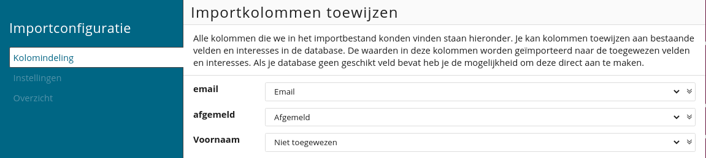
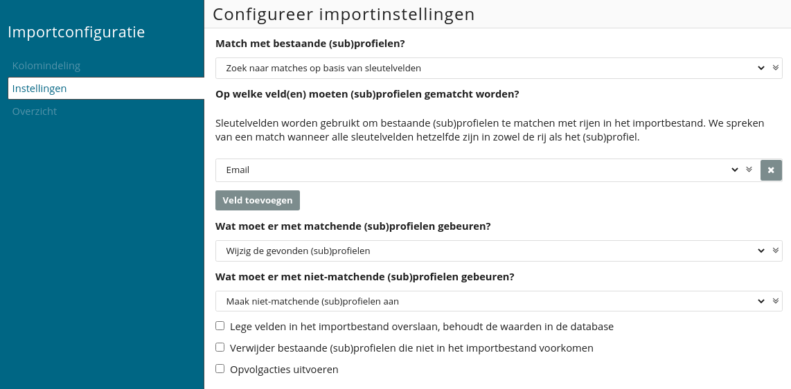
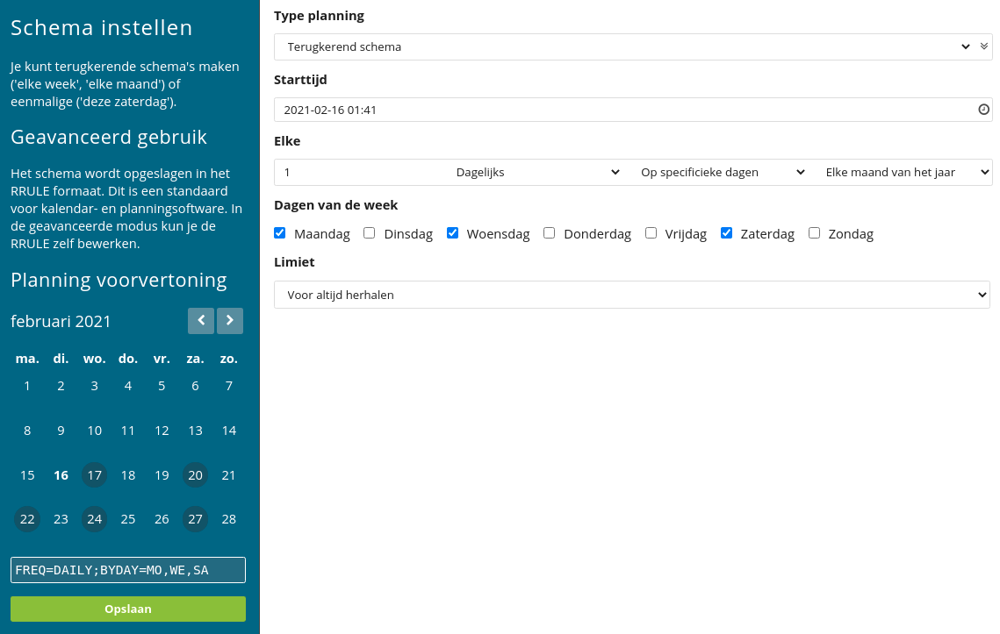

# Importeren van profielgegevens

Er zijn verschillende manieren waarop je nieuwe profielen binnen je database kunt toevoegen of wijzigen. Zo kun je profielen met de hand, via de [API](./apis), via [webformulieren](./webforms) of door middel van een import toevoegen, wijzigen of verwijderen. 

De importfunctie in Copernica ondersteunt CSV- en TXT-bestanden. Je kunt deze bestandsformaten exporteren vanuit tekstverwerkingsprogramma's of spreadsheetprogramma’s als Excel.

## Importbestand voorbereiden
Naast het feit dat een importbestand uit CSV- of TXT-bestanden moet bestaan dienen de bijbehorende kolommen door een tab, komma of puntkomma gescheiden te zijn. Ook dient de bovenste regel de veldnamen te bevatten die je wilt importeren en moet het bestand voorzien zijn van UTF-8 encoding.

Wanneer je gebruik maakt van scheiding door middel van een komma of puntkomma raden we aan om veldwaardes van enkele (') of dubbele (") aanhalingstekens te voorzien. Zo worden komma’s of puntkomma’s niet als scheidingsteken beschouwd. Als je gebruik maakt van een apostrof in een waarde, zal je deze moeten escapen met een backslash. Onderstaand zie je hiervan een voorbeeld:

    Voornaam,Achternaam,Email,Stad,Telefoonnummer
    Jan,de Jong,jan.dejong@voorbeeld.nl,Amersfoort,0612456631
    Pier,de Visser,piet_de_visser@voorbeeld.nl,\'s Hertogenbosch,0612224444
    Roos,Schippers,roos.schippers@voorbeeld.nl,Groningen,0612222444

## Import aanmaken
Je kunt een import enkel instellen op de database. Hiervoor navigeer je in de gekozen database naar '**Profielen -> Imports**'. Daar vind je een lijst met lopende of recent afgeronde imports die je kunt bewerken of verwijderen. 

Je kunt een nieuwe import aanmaken via de optie '**Nieuwe import aanmaken**'. Daarbij kun je het type import selecteren. Je hebt de keuze uit: 

Het uploaden van een bestand;
Het ophalen van een bestand vanuit een externe locatie;
Het ophalen van een bestand vanuit een externe locatie door middel van een privésleutel.

Je haalt bestanden op vanuit een externe locatie wanneer je een import periodiek wilt herhalen (bijvoorbeeld iedere ochtend). Daarbij kun je ook gebruik maken van een (S)FTP-locatie. Vervolgens geef je aan welk scheidingsteken er in het importbestand gebruikt wordt.

## Importkolommen toewijzen
Nadat je een bestand hebt geüpload of opgehaald vanuit een externe locatie kun je de velden uit het importbestand koppelen aan de velden in je database. De kolomnamen van het importbestand zijn aan de linkerzijde zichtbaar onder ‘**Kolomindeling**’.

Wanneer de naam van de kolom gelijk is aan de veldnaam in je database wordt deze automatisch gekoppeld. Wanneer een kolom een naam bevat die onbekend is heb je de mogelijkheid om het veld te koppelen aan een bestaand veld. Ook is het mogelijk om hiervoor een nieuw veld aan te maken.

## Importinstellingen configureren
De importinstellingen staan standaard op '**Geen matches zoeken, altijd nieuwe (sub)profielen aanmaken**'. Hierbij worden (sub)profielen altijd aangemaakt ongeacht of het (sub)profiel al in de database aanwezig is. Wanneer het bijwerken van bestaande profielen en het aanmaken van nieuwe profielen de voorkeur heeft maak je gebruik van de optie '**Zoek naar matches op basis van sleutelvelden**'. 

Sleutelvelden worden gebruikt om te zoeken binnen databaseprofielen. Daarbij wordt het gekozen veld uit het importbestand vergeleken met het veld in de database. Wanneer deze overeenkomt wordt het profiel bijgewerkt. 

Wanneer er geen uniek kenmerk in het profiel aanwezig is kun je ook meerdere velden als sleutelveld instellen. Vervolgens kun je aangeven of de aangetroffen (sub)profielen bijgewerkt of verwijderd moeten worden. Ook kun je onder '**Wat moet er met niet-matchende (sub)profielen gebeuren?**' aangeven of de ontbrekende (sub)profielen wel of niet moeten worden aangemaakt.

In de meeste gevallen wordt het e-mailveld als sleutelveld gekozen. Dat geldt ook voor het bovenstaande voorbeeld. Wanneer 'jan.dejong@voorbeeld.nl' in de database wordt aangetroffen worden de bijbehorende profielwaardes bijgewerkt met de gegevens uit het importbestand. Wanneer het profiel niet in de database aanwezig is wordt het profiel in zijn geheel aangemaakt.

## Periodieke import
Je kunt ook gebruik maken van periodieke imports. Daarbij geef je de URL op van bestanden die op een externe locatie zijn opgeslagen. Het importbestand wordt vervolgens periodiek vanuit die locatie gedownload en geïmporteerd. Dat kan via het FTP-protocol of via beveiligde varianten als SFTP of FTPS.

Het enige verschil tussen de instellingen van een eenmalige- en een periodieke import is dat je in het tweede geval een schema kunt configureren. Dat schema bepaalt de momenten waarop de import wordt uitgevoerd, bijvoorbeeld op dagelijkse- of wekelijkse basis.

## Interesses importeren
Het is ook mogelijk om interesses te importeren bij je profielgegevens. Interesses zijn anders dan je standaard velden, je kunt interesses enkel aan- of uitzetten. Interesses kunnen de waarde Yes/No of true/false bevatten. Een importbestand met interessevelden zal er als volgt uit komen te zien: 

    Voornaam,Achternaam,Email,interest.huisdiervoeding,interest.huisdierspeeltjes
    Jan,de Jong,jan.dejong@voorbeeld.nl,Yes,No
    Pier,de Visser,piet_de_visser@voorbeeld.nl,false,true
    Roos,Schippers,roos.schippers@voorbeeld.nl,Yes,Yes

## Subprofielen importeren
Naast het importeren van profielgegevens is het mogelijk om gegevens uit een collectie (subprofielen) te importeren. Daarbij voorzie je de kolomnaam in het importbestand van een punt om aan te geven dat deze voor collectievelden wordt gebruikt. De collectienaam komt voor de punt te staan. Het collectieveld wordt achter de punt geplaatst.

**Voorbeeld**
Stel dat je eigenaar bent van een dierenwinkel. Je klanten zijn in een database opgenomen in de vorm van profielen. Daarnaast houd je in een collectie bij welke huisdieren een klant bezit. In dit geval zou het importbestand er als volgt uit kunnen zien:

    Email,Huisdieren.Naam,Huisdieren.Type
    Jan.bakker@voorbeeld.nl,Max,Hond
    Jan.bakker@voorbeeld.nl,Minoes,Kat
    Theo.devries@voorbeeld.nl,Casper,Kat

In het bovenstaande voorbeeld is ‘Jan Bakker’ twee keer opgenomen. Hij heeft namelijk twee huisdieren waarvan je elk huisdier als eigen subprofiel wilt toevoegen aan de collectie ‘Huisdieren’. Op die manier wordt profieldata twee keer meegegeven en kunnen beide velden worden toegevoegd als sleutelveld.

**Let op:** wanneer je een import gebruikt om subprofielen aan te maken of bij te werken dien je altijd een sleutelveld toe te voegen aan de database. Wanneer een sleutelveld ontbreekt is het voor het systeem onduidelijk welke subprofielen moeten worden toegevoegd. In het bovenstaande voorbeeld selecteer je het veld ‘E-mail’. In de collectie stel je ‘Naam’ en ‘Type’ in als sleutelvelden.

## Import terugdraaien
**Het is niet mogelijk om zelf een import terug te draaien.** Controleer dus altijd goed of alle instellingen juist staan voordat je de import start. Mocht de import toch verkeerd zijn gegaan dan kun je via [support@copernica.com](support@copernica.com) een back-up laten herstellen. Hiervoor worden extra kosten van € 125 in rekening gebracht.
