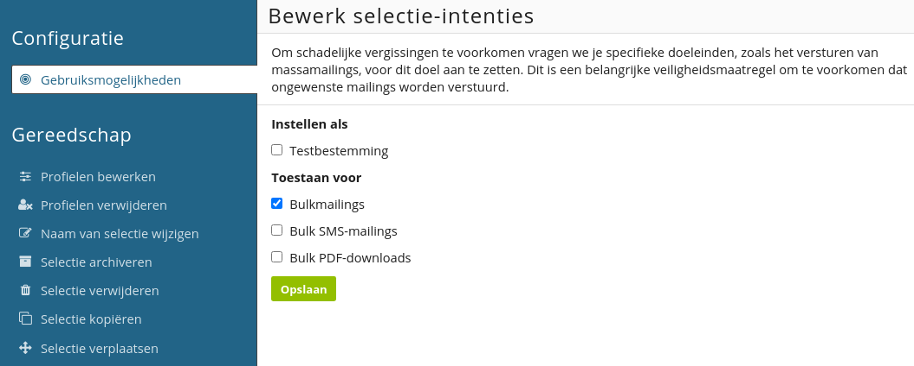

# Gebruikersmogelijkheden
Wanneer je een nieuwe database, selectie, collectie of miniselectie hebt aangemaakt is het niet meteen mogelijk om deze als e-mailbestemming te gebruiken. Daarmee wordt voorkomen dat mailings verstuurd worden aan de verkeerde doelgroep (bijvoorbeeld inactieve profielen of bounces).

Je kunt de nieuwe bestemming alsnog mailen door toestemming te verlenen. 
Dat kan door in de menubalk te navigeren naar ‘**Configuratie -> Gebruikersmogelijkheden**’. 

**Testbestemming**  
Hiermee geef je aan dat de bestemming gebruikt mag worden voor het versturen van testmails.

**Bulkmailings**  
Hiermee geef je aan dat de bestemming gebruikt mag worden voor het versturen van bulkmailings.

**Bulk SMS-mailings**  
Hiermee geef je aan dat de bestemming gebruikt mag worden voor het versturen van bulk SMS-mailings.

**Bulk PDF-downloads**  
Hiermee geef je aan dat de bestemming gebruikt mag worden voor het downloaden van PDF bestanden in bulk. Dit is mogelijk onder de PDF-module van Publisher.
