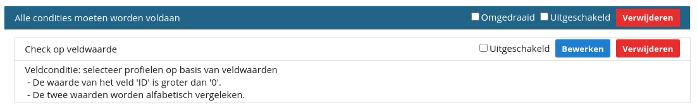
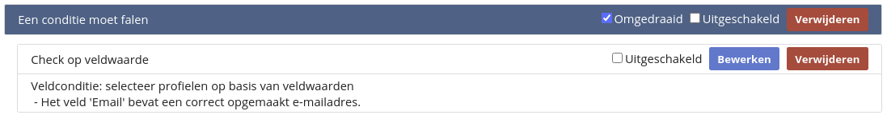
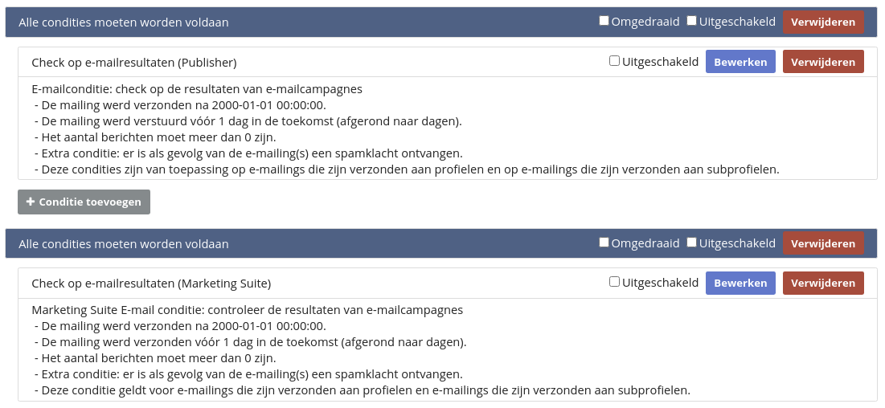
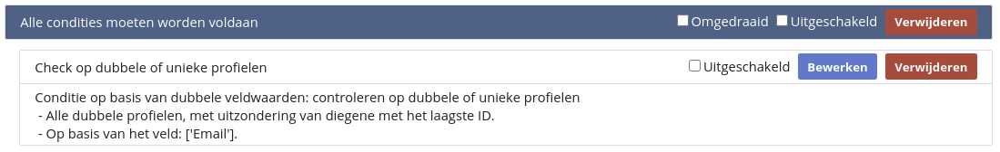
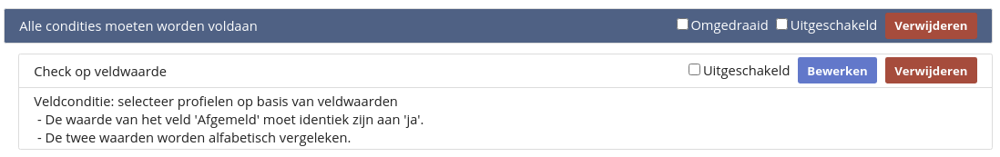
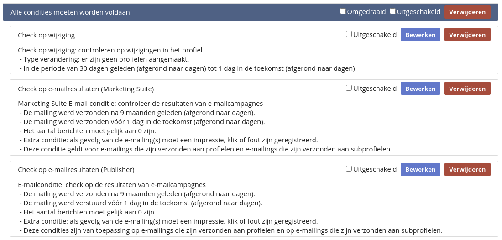
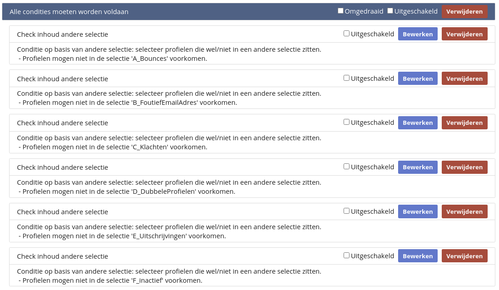

# Databasebeheer en standaardselecties 
Een goede verzendlijst verbetert de resultaten van e-mailmarketingcampagnes. Het versturen van e-mails naar niet-bestaande e-mailadressen of personen die de mails niet openen heeft een negatieve invloed op je verzendreputatie. Daardoor kunnen er meer e-mails in de spamfolder belanden.

Je bent binnen Copernica vrij om zelf een [selectiestructuur](./database-selections-introduction) te bepalen. Om je daarbij te helpen bieden we echter ook een standaardstructuur aan. De standaardstructuur filtert de profielen die je mails niet kunnen of willen ontvangen uit de verzendselectie. Denk daarbij aan bounces, klachten, dubbele profielen, uitschrijvers, inactieven of profielen met een foutieve e-mailsyntax.

Je kunt de standaardselectie aanmaken door binnen je gekozen database te navigeren naar '**Configureren -> Standaardselecties aanmaken**'. Ook kun je deze instellen bij het aanmaken van een nieuwe database.

De standaardstructuur is onderverdeeld in twee hoofdselecties: **A_Databasebeheer** en **B_Verzendselectie**. 

## A_Databasebeheer
In de eerste hoofdselectie (A_Databasebeheer) selecteren we alle beschikbare profielen. Hiermee kun je in de onderliggende selecties bepaalde profielen uitsluiten van de uiteindelijke verzendselectie.

We maken hierbij gebruik van een conditie op basis van een ‘**Check op veldwaarde**’ en geven aan dat het veld ‘ID’ groter moet zijn dan 0. Zo voldoen alle profielen binnen de database aan de gestelde conditie.

### A_Bounces
Deze selectie bevat alle profielen waarbij er in het verleden foutmeldingen zijn ontstaan bij het afleveren van een bericht. Deze fouten noemen we bounces. 

We maken onderscheid tussen hardbounces (permanente fouten, bijvoorbeeld wanneer het e-mailadres niet bestaat) en softbounces (tijdelijke fouten, bijvoorbeeld wanneer de mailbox van de ontvanger vol zit). **Let op:** deze selectie is reactief. Bounces moeten geregistreerd zijn op mails die vanuit Copernica verstuurd zijn.

Een hardbounce wordt in Copernica aangemerkt als een fout die bij een volgende verzending mogelijk weer optreedt. Bij een softbounce bestaat de kans dat de e-mail bij een nieuwe verzending wel wordt afgeleverd.  

De bounceselectie bevat zes regels met elk twee condities:  

- Conditie 1 kijkt naar het soort- en het aantal fouten;
- Conditie 2 zorgt dat profielen niet onterecht binnen de selectie vallen.

**Regel 1**  
Deze regel controleert of er sinds 2000-01-01 meer dan 2 hardbounces zijn voorgekomen op basis van Publisher-mailings. Profielen worden niet geselecteerd als ze in de afgelopen week gemaild zijn zonder dat daar een fout bij is opgetreden. Dat zorgt ervoor dat een profiel met een tijdelijke of onterechte foutmelding niet meteen in de selectie wordt opgenomen.

**Regel 2**  
Deze regel controleert of er sinds 2000-01-01 meer dan 2 hardbounces zijn voorgekomen op basis van Marketing Suite-mailings. Profielen worden niet geselecteerd als ze in de afgelopen week gemaild zijn zonder dat daar een fout bij is opgetreden.

**Regel 3**  
Deze regel controleert of er sinds 2000-01-01 meer dan 3 softbounces zijn voorgekomen op basis van Publisher-mailings. Profielen worden niet geselecteerd als ze in de afgelopen 30 dagen gemaild zijn zonder dat daar een fout bij is opgetreden.

**Regel 4**  
Deze regel controleert of er sinds 2000-01-01 meer dan 3 softbounces zijn voorgekomen op basis van Marketing Suite-mailings. Profielen worden niet geselecteerd als ze in de afgelopen 30 dagen gemaild zijn zonder dat daar een fout bij is opgetreden.

**Regel 5**  
Deze regel controleert of er sinds 2000-01-01 meer dan 9 willekeurige fouten zijn voorgekomen op basis van Publisher-mailings. Dat is nodig omdat sommige mailboxproviders foutmeldingen terugsturen zonder de juiste foutmelding te vermelden. Om die reden worden niet alle fouten als soft- of hardbounce geclassificeerd. Profielen worden niet geselecteerd als ze in de afgelopen 30 dagen gemaild zijn zonder dat daar een fout bij is opgetreden.

**Regel 6**  
Deze regel controleert of er sinds 2000-01-01 meer dan 9 willekeurige fouten zijn voorgekomen op basis van Marketing Suite-mailings. Profielen worden niet geselecteerd als ze in de afgelopen 30 dagen gemaild zijn zonder dat daar een fout bij is opgetreden.

### B_FoutiefEmailAdres
Deze selectie bevat alle profielen waarbij het e-mailveld geen geldig e-mailadres bevat, bijvoorbeeld wanneer het e-mailveld leeg is of geen ‘@’ bevat. Er wordt hierbij enkel gekeken naar de syntax van het e-mailadres. De vraag of het e-mailadres ook daadwerkelijk bestaat wordt niet meegenomen.

Foutieve e-mailadressen worden geïdentificeerd op basis van een ‘**Check op veldwaarde**’. Daarbij wordt bepaald of het e-mailveld een correct opgemaakt e-mailadres bevat. Vervolgens wordt de regel ‘omgedraaid’: enkel profielen met een foutieve waarde komen in de selectie terecht.

### C_Klachten
Deze selectie bevat alle profielen waarbij er een spamklacht geregistreerd is. Zo’n klacht wordt geregistreerd zodra een ontvanger in zijn e-mailclient op de spamknop klikt. **Let op:** niet alle ontvangende mailservers versturen deze terugkoppeling naar de verzender.

De selectie bestaat uit twee regels met ieder één conditie:

- De eerste conditie bepaalt of er meer dan 0 spamklachten zijn geregistreerd op basis van Publisher-mailings;
- De tweede conditie bepaalt of er meer dan 0 spamklachten zijn geregistreerd op basis van Marketing Suite-mailings.

### D_DubbeleProfielen
Wanneer er twee profielen met hetzelfde e-mailadres zijn toegevoegd kun je met deze selectie aangeven dat enkel het originele profiel in de verzendselectie moet worden opgenomen. Hierbij wordt er gebruik gemaakt van een ‘**Check op dubbele of unieke profielen**’. Dubbele profielen worden eerst op basis van het e-mailveld geselecteerd. Vervolgens worden profielen met het laagste ID uitgezonderd.

Wil je juist het meest recente profiel in de verzendselectie opnemen? Stel de conditie dan in op filtratie van het hoogste ID.

### E_Uitschrijvingen
Deze selectie bevat alle profielen die zich hebben uitgeschreven voor de nieuwsbrief. Hierbij selecteer je een zelfgekozen opt-outveld of genereer je deze bij het aanmaken van standaardselecties.

In het onderstaande voorbeeld bepalen we of het veld '**Afgemeld**' gelijk is aan '**Ja**'. Andere benamingen zijn ook mogelijk: denk bijvoorbeeld aan het veld ‘**Newsletter**’ met de waarde ‘**Unsubscribed**’.

### F_Inactief
Deze selectie bevat alle profielen die inactief zijn. Dat houdt in dat deze profielen je e-mails niet openen of niet klikken op de bijbehorende links.

Zoals eerder genoemd heeft het verzenden van e-mails naar inactieve profielen een negatieve invloed op je verzendreputatie. Daarnaast kan het ertoe leiden dat e-mails niet in de inbox worden geplaatst bij ontvangers die je e-mails wel regelmatig openen.

Deze selectie bestaat uit één regel met drie condities:

- De eerste conditie controleert of het profiel niet in de afgelopen 30 dagen is aangemaakt. Zo vallen nieuwe profielen niet direct binnen de selectie;
- De tweede conditie bepaalt of het profiel in de afgelopen 9 maanden een klik, impressie of fout geregistreerd heeft op basis van Marketing Suite-mailings. Het aantal berichten moet daarbij gelijk zijn aan 0. Zo geef je aan dat het profiel op 0 mailings een klik, impressie of foutmelding geregistreerd heeft. Je wilt namelijk alle profielen selecteren die gedurende deze periode geen activiteit hebben vertoond;
- De derde conditie is identiek aan de tweede conditie, maar dan op basis van Publisher-mailings.

Denk goed na of de bovenstaande condities aangepast moeten worden aan jouw omstandigheden. E-mailvolume en verzendreputatie verschillen namelijk per verzender. Deze bepalen op hun beurt ook wanneer profielen precies als inactief moet worden beschouwd.

## B_Verzendselectie
In deze selectie worden alle selecties uitgesloten die onder A_Databasebeheer vallen. Dit zorgt ervoor dat verzendselecties alleen profielen bevatten die vrij zijn van bounces, foutieve e-mailadressen, klachten, dubbele e-mailadressen, uitschrijvingen en inactiviteit.

Deze selectie bevat één regel met zes condities. De optie ‘**Check inhoud andere selectie**’ vormt hiervan de basis. Wil je naar een specifieke doelgroep versturen? Maak dan onder B_Verzendselectie een subselectie aan.

