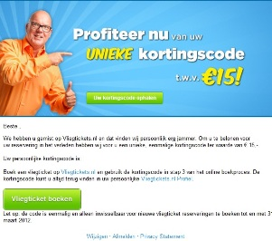

Vrijwel iedereen heeft tegenwoordig
een [database](./schone-en-actuele-database-onderhouden-een-stappenplan.md "Een schone database") voor
diverse marketingdoeleinden. Sommige organisaties beschikken zelfs over
centrale datawarehouses of marketingdatabases met daarin de meest
uitgebreide klantprofielen. Wij merken echter dat de meeste organisaties
nog veel te weinig doen met deze rijkdom aan data. De communicatie is
vaak nog veel te algemeen in plaats van klantgericht en persoonlijk.
Kortom, duik eens in je data, ontdek en leer.

Waar haal je die data vandaan?
------------------------------

Gebruik niet alleen de informatie die je van je klanten krijgt bij een
nieuwsbriefaanmelding of het invullen van een aankoopformulier. Vul je
profielen binnen de database aan met alle relevante data die het profiel
'completer' en 'waardevoller' maken. Die data maakt je profielen ook
meer geschikt voor customer lifecycle campagnes en andere vormen
van [event driven
marketing](./event-driven-e-mailcampagnes-gebruik-jij-ze-al.md "Event driven marketing").
Denk bijvoorbeeld aan het koppelen van transactiegegevens, callcenter
gegevens, social media, klachtenregistratie, data die voortkomt uit
loyaliteit- spaarprogramma's, website clickstream data etc.

Het is noodzakelijk deze data op de juiste wijze te koppelen aan het
klantprofiel. Zorg voor slimme 'connectors' om je klantprofiel te
verbinden aan de data uit externe systemen zoals bijvoorbeeld je
webwinkel platform of CRM-systeem. Dit kan tegenwoordig prima binnen
e-mailmarketingsystemen door de uitgebreide API-services en
multi-dimensionele database opbouw.

Gebruik je data om je klanten te leren kennen
---------------------------------------------

Door middel van de beschikbare data creëer je niet alleen ontzettend
veel mogelijkheden voor een contactstrategie met je verschillende
doelgroepen. Dit geeft ook een geweldige kans om 'insights' te vergaren.
Wat dacht je van de volgende analyses:

-   Segmentatie (wat is de gemiddelde leeftijd, klantwaarde, regio,
    productvoorkeur van je doelgroep?)
-   Indeling van klanten op basis van e-mail opens en klikgedrag over
    een langere periode (12 maanden)
-   Actief versus niet actief: wie converteert er wel en wie niet?
-   Vullingsgraad van diverse gegevens, van hoeveel procent is de
    geboortedatum bekend? Moet je hier een extra campagne voor opzetten
    of besluit je de gegevens te verwijderen uit je database? Zo behoud
    je ook het overzicht binnen je database.
-   Kwaliteit, dit heeft betrekking op het valideren van de diverse
    gegevens. De kwaliteit van het e-mailadres wordt snel duidelijk na
    de verzending (bounces). Maar overige gegevens zijn lastiger te
    achterhalen. Denk hierbij aan postcode en huisnummer-controle via de
    postcodetabel, controle op telefoonnummer-syntax etc.

Deze inzichten helpen je de kwaliteit en bruikbaarheid van de data en
database(s) op een zo hoog mogelijk niveau te brengen. Daarnaast kan je
met deze data interessante en relevante e-mailcampagnes opzetten.

Data inzetten voor event driven campagnes
-----------------------------------------

Structurele data gedreven e-mailcampagnes zorgen voor een hogere
response, versterking van de loyaliteit en meer omzet.
De winbackcampagne of reactivatiemailing is een goed voorbeeld van de
optimale inzet van data en inzichten verworven uit analyses van je
klantprofielen. Hoe (her)activeer je een ingeslapen doelgroep?
Normaliter is de doelstelling van deze e-mails vrij duidelijk; zorgen
dat klanten en prospects een aankoop verrichten. Er zijn echter
behoorlijk wat varianten mogelijk binnen deze campagne, dit hangt maar
net af welke definitie er wordt gekoppeld aan 'niet actief'. Is dit:
geen recente aankoop (6 of 12 maanden), geen activiteit (open of klik)
binnen de laatste 10 e-mailcampagnes, geen inlog / accountgebruik op de
website of het niet inwisselen van punten in het geval van een
spaarprogramma.
Uiteraard is het mogelijk om diverse varianten van de
reactivatiemailing te realiseren op basis van meerdere definities en
bijbehorende doelstellingen. De content en daarmee het aanbod is
cruciaal voor het (her)activeren van je inactieve doelgroep.

Een voorbeeld van een goede reactivatiemailing is de 15 euro korting
voor klanten
van [Vliegtickets.nl](http://www.vliegtickets.nl/ "Website van Vliegtickets.nl").
Deze stuurt de webwinkel naar klanten die geen recente boeking hebben
geplaatst.
Via de webwinkel wordt bijgehouden of een klant geboekt heeft of niet.
Door deze data te koppelen aan het klantprofiel in de database van het
e-mailmarketingsysteem, kunnen er segmenten opgesteld worden met daarin
de 'inactieve' klanten. Wanneer een klant toch binnen de vooropgestelde
inactieve periode een order plaatst komt hij ook niet terug in dat
segment en zal hij ook geen reactivatiemailing ontvangen.
Maar de winback-campagne of reactivatiemailing is slechts één voorbeeld
van een slimme inzet van je beschikbare data. Je kan tal van
verschillende e-mailcampagnes opzetten waarbij je slim gebruik maakt van
je verzamelde data. Denk aan verjaardagscampagnes, loyaliteitsacties,
tipmailtrajecten, welkom en abandoned cart campagnes.etcetera. Deze
e-mailcampagnes zijn een stuk winstgevender en efficiënter dan je
standaard
bulkmail/[nieuwsbrief](./opmaak-van-html-nieuwsbrief-enkele-belangrijke-richtlijnen.md "HTML nieuwsbrief maken") waarbij
je nauwelijks data uit je klantprofielen gebruikt.
Dus neem eens een kijkje in die database, wat heb je aan data van
klanten beschikbaar en wat kan je ermee? In de meeste gevallen kan je
veel meer met je database, die pot met goud, dan je zelf voor ogen had.
*Geschreven door Hans Meijer
van [CloseContact](https://www.copernica.com/nl/partners/profile/1240656 "CloseContact"),
registered partner van Copernica*
*Dit artikel is eerder verschenen
op [Marketingfacts](http://www.marketingfacts.nl/berichten/20120203_database_marketing_je_eigen_pot_met_goud/ "Database marketing: je eigen pot met goud");
Database marketing: je eigen pot met goud?*
