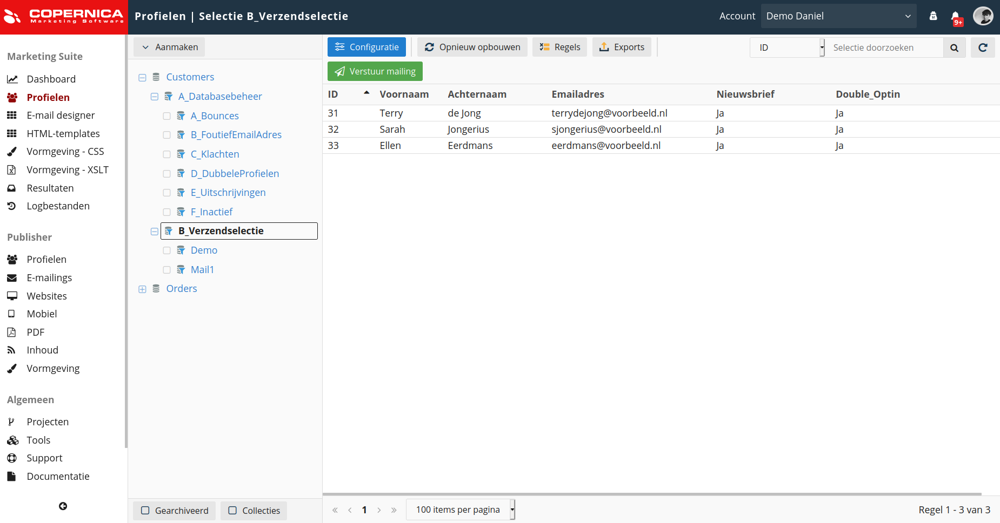

# Database en profielen
Databases zijn het centrale punt van informatie binnen Copernica. In een database worden alle contacten opgeslagen die jij als gebruiker gaat mailen. Deze contacten worden 'profielen' genoemd. Bij Copernica zit je niet vast aan standaardverzendlijsten. In plaats daarvan kun je een database configureren naar je eigen voorkeuren. 

Je vindt het database-overzicht onder ‘**Profielen**’. Door op de naam van een database te klikken krijg je de profielen te zien die onder de desbetreffende database vallen.

## Aanmaken van een database

Je maakt een database aan door onder ‘**Profielen**’ te kiezen voor ‘**Aanmaken -> Een database aanmaken**’. Vervolgens kun je de database van een naam en omschrijving voorzien. 

We raden je aan om één centrale database te gebruiken. Het is niet mogelijk om data uit verschillende databases te combineren. Iedere database bevat zijn eigen data en structuur.

## Aanmaken van databasevelden
Een database bestaat doorgaans uit meerdere velden. Hierin kun je informatie toevoegen aan een bijbehorend profiel. Denk hierbij aan een voornaam, achternaam of e-mailadres. Je voegt een databaseveld toe door in de menubalk van de database te navigeren naar '**Velden & interesses**'.

Meer informatie over veldopties vind je op de uitgebreide documentatiepagina over [databasevelden](./database-fields).

## Aanmaken van een profiel
Zodra je databasevelden hebt toegevoegd krijg je de mogelijkheid om profielen aan te maken. Je kunt een profiel handmatig toevoegen door te kiezen voor '**Aanmaken -> Profiel aanmaken**'. Hier vul je de gegevens van het profiel in. Vervolgens klik je op ‘**Profiel aanmaken**’.

Wanneer je meerdere profielen tegelijk wilt aanmaken kun je een bestand [importeren](./database-import) of gebruik maken van de [API](./apis).
