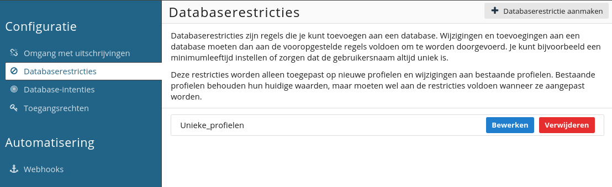

# Restricties
Restricties zijn regels die je kunt toevoegen aan een database of collectie. Wanneer een restrictie wordt ingesteld zorgt deze ervoor dat wijzigingen en toevoegingen aan een database aan vooropgestelde regels moeten voldoen. Denk daarbij bijvoorbeeld aan een minimumleeftijd of een unieke gebruikersnaam.

Restricties worden alleen toegepast op nieuwe (sub)profielen en wijzigingen aan bestaande (sub)profielen. Bestaande (sub)profielen behouden hun huidige waarden maar dienen wel aan restricties te voldoen zodra ze worden aangepast.

Je kunt restricties toevoegen door in de menubalk van een database of collectie te navigeren naar '**Configuratie**'. Vervolgens kies je voor '**Restricties**'.

