# Selecties
Een selectie is een segment van profielen op basis van een of meerdere overlappende kenmerken. Je gebruikt selecties om je database te filteren. Op deze manier bouw je eenvoudig specifieke doelgroepen op waarnaar je e-mails kunt versturen.

Selecties geven je de mogelijkheid om met meerdere lagen te werken. Selecties die onder een andere selectie vallen noemen we ‘subselecties’. Een subselectie segmenteert alleen profielen die ook in de bovenliggende selectie zijn opgenomen.

## Voorbeeld van een selectiestructuur
[Aanbevolen selectiestructuur](https://www.youtube.com/watch?v=P_qrNZTJTW0)

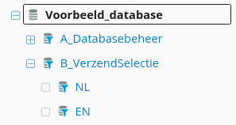

In het bovenstaande voorbeeld zie je een structuur waarbij er onder een hoofdselectie (B_VerzendSelectie) twee subselecties (EN en NL) zijn aangemaakt. Door middel van deze structuur kun je de Engelstalige nieuwsbrief versturen naar de ‘EN’-selectie en de Nederlandstalige nieuwsbrief naar de ‘NL’-selectie.

Naast (sub)selecties bestaan er ook [miniselecties](./database-collections). Dat zijn segmenten binnen [collecties](./database-collections).

## Aanmaken van een selectie
[Selecties](https://www.youtube.com/watch?v=StAXMnHgSFI)

Om een selectie aan te maken selecteer je een database en kies je voor '**Aanmaken -> Een selectie aanmaken**'. Vervolgens geef je de selectie een naam en bepaal je of deze direct onder de database (reguliere selectie) of onder een andere selectie (subselectie) moet vallen. 

Om een selectie aan te passen navigeer je naar de selectie. Vervolgens klik je in de toolbar op ‘**Regels**’.

## Regels en condities
[Condities](https://www.youtube.com/watch?v=fJUf1SafdNw)

Zoals eerder genoemd moeten profielen bepaalde eigenschappen vertonen om in een selectie opgenomen te worden. In Copernica stel je die voorwaarden in door middel van selectieregels en condities. 

Je kunt filteren op basis van verschillende dimensies, bijvoorbeeld op basis van geboortedatum (iedereen die vandaag jarig is) of kliks (iedereen die op een specifieke URL in een e-mail heeft geklikt).

Regels en condities verschillen van elkaar. Een conditie is onderdeel van een regel; een regel kan dus meerdere condities bevatten. Om aan een regel te voldoen moet een profiel aan alle condities binnen die regel voldoen (EN-conditie). Om in een selectie te komen moet een profiel aan minimaal één van de ingestelde regels voldoen (OF-conditie).

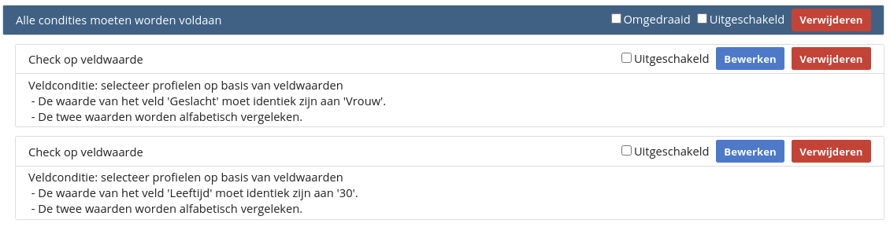

In het bovenstaande voorbeeld dient het profiel zowel de waarde ‘Vrouw’ als de leeftijd ‘30’ te bevatten.

Wanneer profielen in een selectie moeten voldoen aan één of meerdere voorwaarden gebruik je meerdere regels met verschillende condities.

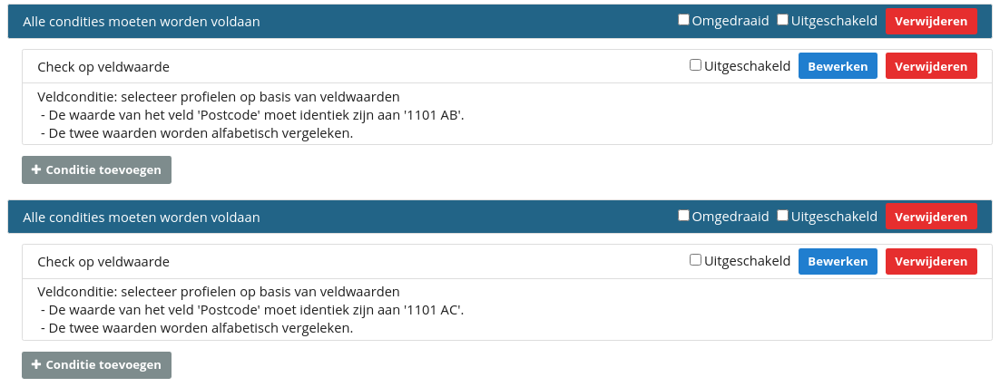

In het bovenstaande voorbeeld komen profielen met zowel de postcode '1101 AB' als de postcode '1101 AC' in de selectie terug.

## Conditie-opties
Er zijn een aantal manieren waarop je kunt bepalen hoe profielen worden toegevoegd aan selecties. De filters die je hiervoor gebruikt worden in Copernica selectiecondities genoemd. Hierbij zijn er verschillende opties mogelijk. Dat zijn:

### Check op veldwaarde
Dit is de meest gebruikte conditie. Hiermee vergelijk je een veld uit het profiel met een bepaalde waarde. Daarbij kun je gebruik maken van verschillende vergelijkingscondities, waaronder ‘is gelijk aan’, ‘is ongelijk aan’, ‘bevat de tekst’ en ‘is groter dan’. 

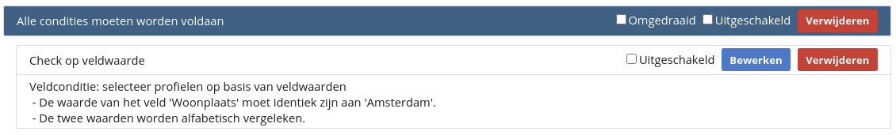

*Voorbeeld: Selecteer alle profielen waarbij het veld 'Woonplaats' gelijk is aan 'Amsterdam'.*

### Check op interessegebied
Met deze conditie kun je aangeven of een bepaalde interesse wel of niet in het profiel aanwezig moet zijn. 

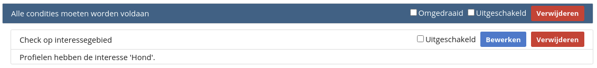

*Voorbeeld: Selecteer alle profielen met de interesse 'Hond'.*

### Check op datum
Met deze conditie bepaal je of een veld uit het profiel binnen een specifieke tijdsperiode valt. Je kunt hierbij kiezen voor een vaste- of variabele datum. Wil je alle profielen selecteren die de datum 1 januari bevatten? Dan kies je voor de vaste datum (in dit geval '2021-01-01'). Wil je alle profielen selecteren die later dan een week geleden zijn aangemaakt? Dan kies je voor de variabele datum. 

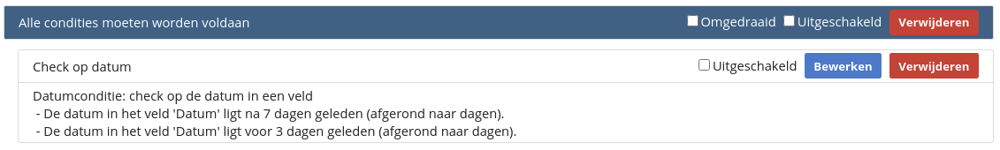

*Voorbeeld: Selecteer alle profielen waarbij het veld ‘Geboortedatum’ tussen zeven en drie dagen geleden ligt.*

### Check op wijziging
Met deze conditie bepaal je of er gedurende een bepaalde periode wijzigingen aan een profiel zijn uitgevoerd. Denk hierbij aan het aanmaken van een profiel of een wijziging aan een specifiek veld. 

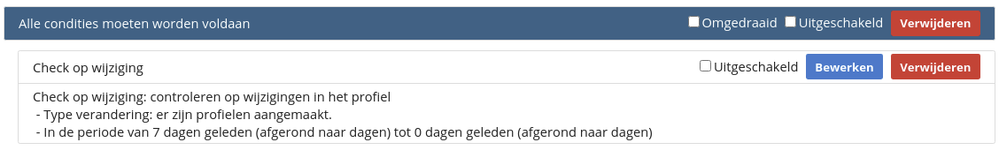

*Voorbeeld: Selecteer alle profielen die tussen vandaag en één week geleden zijn aangemaakt.*

### Check op resultaten e-mail/SMS/enquêtes
Met deze conditie kun je profielen selecteren op basis van e-mailresultaten. Dat resultaat kan gerelateerd zijn aan een e-mailcampagne, SMS-campagne of enquête. Denk bijvoorbeeld aan het selecteren van ontvangers die in een specifieke e-mail op een hyperlink hebben geklikt. 

Profielen die aan de bovenstaande conditie voldoen worden opgenomen in een selectie. We maken daarbij onderscheid tussen resultaten op basis van Publisher-mailings en resultaten op basis van Marketing Suite-mailings. 

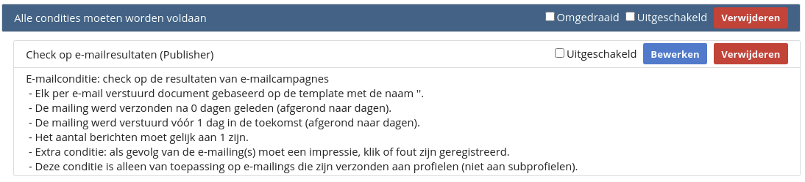

*Voorbeeld: Selecteer alle profielen waarbij een impressie, klik of foutmelding is geregistreerd in een mailing die later dan 7 dagen geleden verstuurd is.*

### Check op inhoud van andere selectie
Met deze conditie kun je controleren of een profiel wel of niet aanwezig is in een andere selectie. Hiermee kun je bepaalde profielen in- of uitsluiten van je doelgroep. 

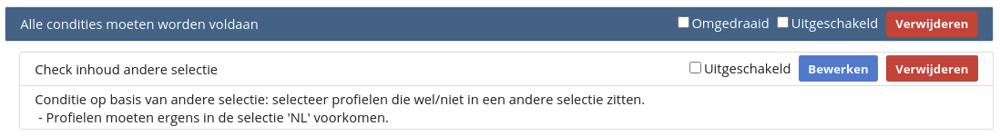

*Voorbeeld: Selecteer alle profielen die niet aanwezig zijn in de selectie 'E_Uitschrijvingen'.*

### Check op inhoud van miniselectie
Met deze conditie kun je controleren of de profielen subprofielen bevatten die aan de condities van je miniselectie voldoen. Je kunt met de ‘minimum’ en ‘maximum’-opties aangeven hoeveel subprofielen moeten voldoen aan de miniselectie.

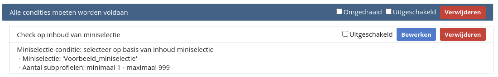

*Voorbeeld: Je hebt een miniselectie 'RecentGekocht' aangemaakt in je collectie 'Orders'. Daarbij kijk je of een order later dan 7 dagen geleden geplaatst is. Door middel van de conditie 'Check op inhoud van miniselectie' kun je vervolgens alle profielen selecteren waarbij minimaal 1 subprofiel voldoet aan de miniselectie 'RecentGekocht'.* 

### Check op dubbele of unieke profielen
Met deze conditie bepaal je of profielen meerdere keren voorkomen in de database. Je kunt hierbij aangeven of je enkel de unieke of de dubbele adressen in je selectie wilt opnemen. 

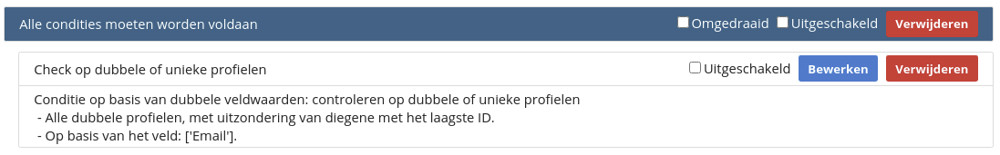

*Voorbeeld: Je wilt een selectie aanmaken waarbij je alle dubbele profielen uitsluit van de verzendselectie. Hiervoor selecteer je alle dubbele profielen behalve het profiel met het laagste ID. Dat profiel is degene die het langst in je database zit en daardoor ook de meeste informatie bevat. Dat profiel wil je dus niet uitsluiten van je verzendselectie.*

### Sorteren en/of selecteer profielen
Met deze conditie kun je een bepaald aantal of een percentage profielen uit je database selecteren. Let op: de profielen in deze selectie worden willekeurig geselecteerd. Daardoor komen er steeds verschillende profielen in voor. In verband met de opbouwvolgorde werkt deze optie niet in combinatie met de conditie ‘Check op inhoud van andere selectie’.

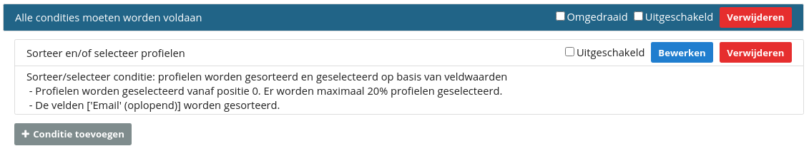

*Voorbeeld: Je wilt een e-mail versturen naar 20% van je totale doelgroep. Door gebruik te maken van deze conditie kun je aangeven dat je 20% van de profielen uit de overkoepelende database/selectie wilt selecteren.*

### Eerdere exports
Met deze conditie kun je profielen selecteren die Copernica gedurende een bepaalde periode geëxporteerd heeft.

## Selectie-opbouw
Selecties worden op vaste momenten opgebouwd (en dus niet in real-time). Wanneer je een profiel aan de database toevoegt valt deze dus niet automatisch in de onderliggende selecties. De momenten waarop selectie-opbouw plaatsvindt zijn:

- Iedere nacht;
- Vóór een ingeroosterde mailing;
- Vóór een ingeroosterde export.

Je kunt een selectie ook handmatig opbouwen. Dat doe je door in de selectie naar de menubalk te navigeren. Vervolgens klik je op 'Opnieuw opbouwen'. 

## Selectietester
[Selectietester](https://www.youtube.com/watch?v=dkEp5wppuDU)

Met de selectietester kun je eenvoudig inzien waarom een profiel wel of niet in een bepaalde selectie voorkomt. Je vindt de selectietester in het linkermenu van een profiel. 

Zodra je een selectie kiest wordt er een overzicht getoond. Daarin zie je in één oogopslag aan welke condities het profiel wel en niet voldoet. Ook de bovenliggende selecties worden daarbij meegenomen.

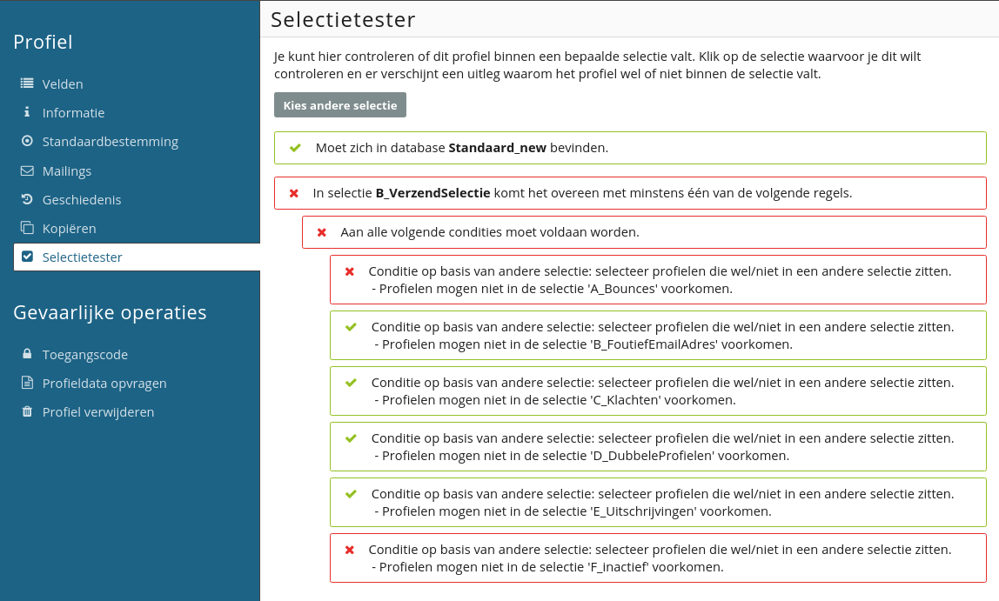
