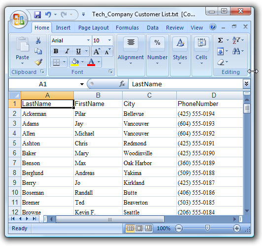

Je database vormt de basis van al je marketingcampagnes. In dit artikel
wordt uitgelegd hoe je een database aanmaakt, en hoe je vervolgens een
bestand met relaties importeert naar je nieuwe database.

Als je nog niet beschikt over een importbestand met contacten, of gewoon
eerst wilt oefenen, download dan dit bestand met fictieve gegevens.

Stap 1. Maak een database
-------------------------

Onder profielen, kies in het **Databasebeheer**menu **'Nieuwe database
aanmaken...'**

Het dialoogvenster voor een nieuwe database wordt geopend. Voer hier de
naam in voor de database (bijvoorbeeld *Contacten*, of *Leden*) en
optioneel een beschrijving.

Klik op **opslaan**.

De database wordt direct aangemaakt en toegevoegd aan het (verder lege)
linker overzicht onder *Databases en selecties*. Deze database is nog
helemaal leeg; er is geen data en er zijn nog geen databasevelden. Hier
gaan we nu verandering in brengen.

Stap twee: Gegevens importeren {#stap-twee:-gegevens-importeren}
------------------------------

Je kunt eerst je databasevelden aanmaken, maar het is gemakkelijker (en
sneller) om dit direct bij het importeren te doen.

Let op, als je e-mailadressen gaat importeren, met het doel commerciële
e-mails hiernaartoe te versturen, dienen deze personen zich te hebben
aangemeld voor deze mailing. Je mag nooit ongevraagde e-mails met een
commercieel karakter versturen.

### Het Excelbestand met gegevens

Of je gegevensbestand nou is geexporteerd vanuit een ander systeem, of
gemaakt is met een spreadsheetprogramma (zoals Excel), het heeft altijd
de volgende indeling:

Het bestand is opgebouwd uit regels en kolommen.

-   Een regel (van links naar rechts) bevat telkens de gegevens van 1
    profiel (en eventueel een subprofiel).
-   Een kolom (van boven naar beneden) bevat telkens dezelfde soort
    informatie over alle profielen die je wilt importeren. Bijvoorbeeld,
    een kolom met alle e-mailadressen en een kolom met alle voornamen.
-   De eerste regel in het importbestand bevat de namen van de kolommen.
    De kolom met e-mailadressen noem je bijvoorbeeld *Email*.

Onderstaand een schermafbeelding van een correct opgemaakt importbestand
in Excel.

### Bestand omzetten naar een tabgescheiden bestand

Het is niet mogelijk om een Excel bestand direct te uploaden naar
Copernica. Je dient het bestand eerst om te zetten naar een
tabgescheiden**txt *of*csv\* bestand.

Een tabgescheiden bestand maakt je met Excel.

-   Open het importbestand met Excel
-   Ga in Excel naar *Bestand \> Opslaan* als en kies *Tekst (tab is
    scheidingsteken) (*.txt)\*
-   Klik vervolgens op *Opslaan*

    -   In plaats van een tab, kan je desgewenst ook een komma of
        puntkomma als scheidingsteken gebruiken. Zie
        ook: [http://www.howtogeek.com/79991/convert-an-excel-spreadsheet-to-a-tab-delimited-text-file/](http://www.howtogeek.com/79991/convert-an-excel-spreadsheet-to-a-tab-delimited-text-file/)

### Importbestand uploaden naar Copernica

Je hebt je importbestand klaar. Het kan nu worden geupload en
geimporteerd naar Copernica.

-   Zorg dat je database geselecteerd is (door er in het linker
    overzicht op te klikken).
-   Kies in het menu **Huidige weergave** voor **Importeren /
    Exporteren**.
-   Kies vervolgens **importeren**.
-   Kies het bestand op je computer, en selecteer het scheidingsteken
    dat je hebt gebruikt.
-   Klik om verder te gaan naar de volgende stap.

Je belandt nu in het scherm waar je de kolommen aan de velden in je
database koppelt.

Omdat je (waarschijnlijk) nog helemaal geen databasevelden hebt, zijn ze
ook nog niet gekoppeld.

Je kan in een keer alle velden aamaken door in de gele balk op 'Maak
alle velden aan' te klikken. Je kan databasevelden ook een voor een
aanmaken (of weer loskoppelen).

-   Kolommen die je niet koppelt aan een databaseveld worden niet
    geimporteerd.
-   Nieuw aangemaakte velden worden automatisch **tekstvelden**
    (geschikt voor het opslaan van allerlei soorten informatie).
-   Klik bij het veld op eigenschappen om van het veld bijvoorbeeld een
    **numeriek** of een **datumveld** te maken.
-   Als je een kolom met e-mailadressen hebt, maak het gekoppelde
    databaseveld dan een **e-mailveld**.

Meer lezen over beschikbare veldtypes en eigenschappen.

Je kan het veldtype later altijd wijzigen.

### Geavanceerde instellingen

Voor de meeste eerste imports voldoen de standaardinstellingen. Je bent
natuurlijk vrij om een kijkje te nemen in de tabbladen **Instellingen**
en **Datumnotatie**.

Laatste stap - de import starten
--------------------------------

Nadat je de kolommen hebt gekoppeld en de databasevelden hebt aangemaakt
en van de juiste instellingen hebt voorzien, kan je beginnen met
importeren.

Klik op **start import** om de import te starten. De import zal zo
spoedig mogelijk starten. Afhankelijk van de grootte van het
importbestand en de drukte op de servers kan dit enkele minuten duren.
Je kan in de tussentijd het importvenster sluiten. Hiermee onderbreek je
het importproces niet.
