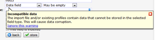

Voor het opslaan van datums\* in datumvelden maakt Copernica gebruik van
de standaard MySQL database notatie: *JJJJ-MM-UU uu:mm:ss*. Een voordeel
hiervan is dat een selectie op basis van datum en tijd een stuk sneller
en betrouwbaarder wordt. Nadeel is natuurlijk dat veel importbestanden
datums in andere formaten bevatten, zoals bijvoorbeeld de Europese
DD-MM-JJJJ. *\* Het meervoud van datum is eigenlijk data. Daar zijn wij
ons bewust van.*

Indien jouw importbestand datums bevat die een andere tijdsnotatie
hebben, zoals de Europese of de Amerikaanse, dan kan je deze datums bij
het importeren automatisch omzetten naar het databaseformaat.

Om datums te converteren ga je in het import dialoogvenster naar het
tabblad **datumnotatie**. Bekijk eerst welke datumnotatie in het import
bestand is gebruikt. Komt deze overeen met een datumnotatie hieronder in
de tabel weergegeven? Gebruik dan de omzetwijze die hieronder is
gebruikt.

  ----------------- -----------------------
  Database format   YYYY-MM-DD hh:mm:ss\
                     YYYY/MM/DD hh:mm:ss

  European          DD-MM-YYYY hh:mm:ss\
                     DD/MM/YYYY hh:mm:ss

  USA               MM/DD/YYYY hh:mm:ss\
                     MM-DD-YYYY hh:mm:ss

  Auto convert      DD-MM-YYYY hh:mm:ss\
                     MM/DD/YYYY hh:mm:ss\
                     YYYY-MM-DD hh:mm:ss\
                     YYYY/MM/DD hh:mm:ss
  ----------------- -----------------------

Enkele voorkomende scenarios
----------------------------

### Het importbestand bevat verschillende datumnotaties

Indien het importbestand in een kolom verschillende soorten
datumnotaties bevat, dan kan je overwegen de datums automatisch om te
zetten. Dit is echter wel foutgevoelig: de datum 03-09-1980 kan immers
zowel worden geïnterpreteerd als 9 maart 1980 en als 3 september 1980.

### Het importbestand bevat ongeldige datums

Indien het importbestand een kolom bevat waar ook datums in voor komen
die door de applicatie niet kunnen worden herkend als datum (zoals 1 jan
2010 of 24-100-2010), zal deze datum worden genegeerd tijdens het
importeren en als leeg veld in de database verschijnen.

### Het importbestand bevat ongeldige datums, het database datumveld mag niet leeg zijn

Als het databaseveld een ‘datum(+tijd)veld, mag niet leeg zijn’ betreft,
dan krijgt het profiel- of subprofielveld in de database automatisch de
waarde 0000-00-00 of 0000-00-00 00:00:00

### Ik wil ongeldige datums toch importeren

Dit kan niet in een datumveld. Als je de datums toch wilt importeren,
sla deze dan op in een normaal tekstveld in plaats van een datumveld.

### Ik heb datumvelden die wel geldig zijn, maar kunnen niet worden omgezet

Als je de datums exporteert vanuit een ander systeem, kijk dan of er een
mogelijkheid bestaat de datums met de systeemnotatie te exporteren
(JJJJ-MM-DD).

Indien je de data alleen in een spreadsheet programma hebt, zoals Excel
of Calc, dan kan je met behulp van dit programma de datums omzetten naar
een datumnotatie die door de software herkend wordt.

### Veld A heeft de Europese en Veld B heeft de Amerikaanse

Je kan maar één omzetmethode per import instellen. Heb je verschillende
datumvelden met verschillende notaties, dan kan je de import in twee
delen splitsen.
