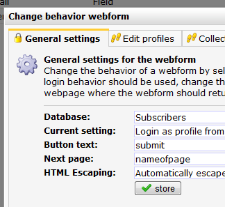

Wanneer iemand jouw webformulier heeft ingevuld en verzonden, wordt
hij/zij automatisch doorverwezen naar de voor dit formulier ingestelde
landingspagina / bedanktpagina. Deze pagina kan worden ingesteld via het
*Webformulier*menu \> **Instellingen**

Als landingspagina kan je een webpagina gebruiken die je hebt gemaakt in
het onderdeel Websites, of een extern gehoste pagina.

-   Vul voor een webpagina die je hebt gemaakt onder Websites alleen de
    naam van de webpagina in
-   Vul voor een extern gehoste webpagina de complete URL

Personaliseren van de bedanktpagina
-----------------------------------

Het is niet nodig om inlogcode toe te voegen aan de naam van de
webpagina. De bedanktpagina wordt automatisch gepersonaliseerd met
gegevens van de invuller van het webformulier.

