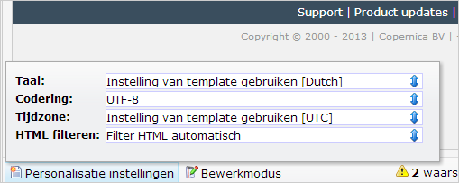

Bij ieder document en / of template kan je de
personalisatie-instellingen wijzigen. Met de personalisatie-instellingen
bepaal je ondermeer in welke taal [Smarty
personalisatie](./de-basisbeginselen-van-smarty-personalisatie.md)
wordt weergegeven. Je vindt deze instelling linksonder het geopende
template of document.

De meeste personalisatie-instellingen kan je zowel voor het *template*
als voor het *document*instellen. Het document neemt automatisch de
template instellingen over, tenzij je het op documentniveau
overschrijft.

**Taal:**selecteer in welke taal de publicatie is. De taal wordt
gebruikt voor het weergeven van sommige Smarty functies. Wanneer je
bijvoorbeeld Smarty gebruikt om een datum weer te geven, dan wordt deze
automatisch getoond in de taal die je hier hebt ingesteld.

-   Selecteer *Dutch* wanneer je een datum wilt weergeven als 16 mei,
    2013
-   Selecteer *English* als je May 16, 2013 wilt weergeven
-   Et cetera...

**Codering**: De codering is belangrijk wanneer je speciale tekens
(karakters) gebruikt in het document of template. Standaard wordt
gebruik gemaakt van *UTF-8*. Er is eigenlijk geen situatie denkbaar
waarin je van deze codering hoeft af te wijken. *UTF-8* zorgt voor een
goede weergave van Nederlands, Arabisch, Russisch, Chinees en Klingon.

**Tijdzone:**Gebruik de tijdzone die past bij de ontvangers van de
e-mail. De tijdzone wordt alleen gebruikt voor het weergeven van Smarty
datums, zoals hierboven besproken.

**HTML filteren:** Met deze instelling ingeschakeld, wordt HTML code uit
Smarty personalisatie in een document plat weergegeven. Veronderstel dat
je een e-mail voorziet van een persoonlijke aanhef. Een grappenmaker kan
in een aanmeldformulier als voornaam hebben ingevuld: \<h1\>Waldemar

Door HTML te filteren wordt de HTML \<h1\> tag in het gepersonaliseerde
document niet daadwerkelijk omgezet naar HTML, en zo voorkom je dus dat
de rest van het document in grote letters wordt weergeven (totdat een
\</h1\> wordt gevonden).

Extra personalisatie velden
---------------------------

Je kan bij het template [extra velden voor
personalisatie](./extra-velden-voor-document-personalisatie.md)
opgeven. Vanuit het personalisatie-instellingen menu kan je deze velden
van een waarde voorzien.
