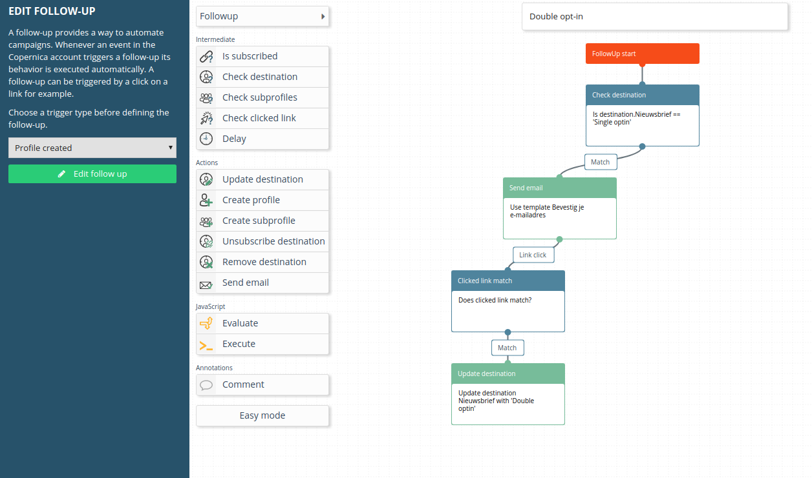
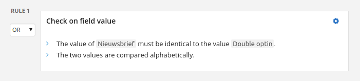

# Dubbele opt-ins in de Marketing Suite

Commerciële e-mailverzenders mogen alleen verzenden naar adressen die daartoe expliciet toestemming hebben gegeven: 
dit noemen we een opt-in. Dit houdt in dat je niet zomaar een lijst met e-mailadressen mag kopen of **scrapen** van het web. 
Wanneer een persoon zijn e-mailadres aan jou doorgeeft, bijvoorbeeld door zich aan te melden voor nieuwsbrieven en 
aanbiedingen op jouw website, geldt dat als een enkele opt-in.  

Als je echt zeker wil zijn dat dit e-mailadres jouw mailings wil ontvangen, 
is het een goede zaak om gebruik te maken van dubbele opt-ins. Op die manier 
houd je je verzendlijst schoon en zorg je voor een goede verzendreputatie. De follow-up manager 
van de Copernica Marketing Suite zorgt ervoor dat je dubbele opt-ins gemakkelijk automatisch kunt laten verlopen.  

## Opvolgactie
De situatie is als volgt: een persoon schrijft zich in voor je mailings. 
Hierna willen we een bevestigingsmail sturen waarin de gebruiker een actie moet ondernemen 
(i.e. op een link klikken) om zijn of haar aanmelding te bevestigen. Zo weten we zeker dat 
de gebruiker bewust ervoor heeft gekozen om zich aan te melden, en niet door iemand anders 
is aangemeld die niet de eigenaar is van het e-mailadres. 

In de Marketing Suite kun je een dubbele opt-in gemakkelijk instellen door middel van de follow-up manager.
Hier heb je het volgende voor nodig:

- Een database met een nieuwsbriefselectie;
- Een databaseveld 'Nieuwsbrief' met daarin de waarden 'Nee', 'Single optin' en 'Double optin';
- Een landingspagina om de gebruiker te tonen dat zijn aanmelding gelukt is;
- De opvolgactie zoals hieronder beschreven.  

De opvolgactie wordt aangeroepen wanneer een profiel wordt aangemaakt. 
Eerst wordt gecheckt of het veld ‘Nieuwsbrief’ op ‘Single optin’ staat. Als dit het geval is,
heeft de gebruiker zich aangemeld voor de nieuwsbrief en moet er dus een bevestigingsmail verzonden worden. 
Dit gebeurt dan ook. Zodra de gebruiker op de bevestigingslink in het mailtje klikt, wordt hij doorverwezen 
naar een webpagina. Het beste is om hier een landingspagina voor te maken waar de gebruiker verteld wordt dat 
hij met succes is ingeschreven. Vervolgens wordt het databaseveld ‘Nieuwsbrief’ op ‘Double optin’ gezet.

## Nieuwsbriefselectie
Om ervoor te zorgen dat de profielen die zich via een dubbele opt-in
hebben aangemeld in je nieuwsbriefselectie terecht komen, heb je de volgende selectieregel nodig:  
  

Als je de stappen in dit artikel gevolgd hebt, zou je verzendselectie vanaf 
nu alleen nog maar profielen moeten bevatten die dubbel bevestigd hebben jouw mailings te willen ontvangen. 
