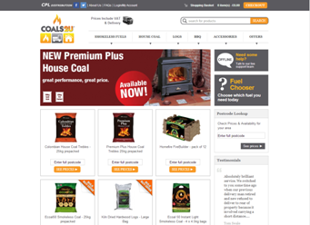

Met behulp van de verschillende Drupal-modules kan je iedere
Drupal-website eenvoudig koppelen met Copernica. De modules zorgen
ervoor dat Copernica wordt aangevuld met belangrijke informatie zoals:
koopgedrag, zoekgedrag en conversie. Dankzij deze rijkdom aan data die
je verzamelt, kan je gemakkelijk geautomatiseerde marketingcampagnes
opzetten binnen Copernica.

[Download de modules](#download-drupal-modules "Download de Drupal modules")

De kracht van de Drupal modules
-------------------------------

-   Verzend [persoonlijke e-mailings](./create-clever-emailings.md "Verzend slimme e-mailings")
    op basis van aankoopgedrag
-   Stuur [abandoned shopcart
    campagnes](./5-tips-voor-extra-omzet-via-je-verlaten-winkelwagen-e-mail.md)
    om klanten te binden wanneer ze een koopintentie vertonen
-   [Automatiseer je salesproces](./automate-your-campaigns.md)
    zoals onder andere orderbevestigigen of track & trace e-mails
-   Maak gebruik van [lead nurturing en lead
    scoring](./wat-is-lead-scoring-infographic.md)
    om zo slim in te spelen op de lifecycle van je klant
-   [React to form fills](./various-types-of-web-forms.md) and downloads on your B2B website
-   Stimuleer je verkoop met behulp van [cross- en
    upsellcampagnes](./kleertjes-com-over-het-effect-van-cross-selling-en-up-selling.md)

Voorbeelden van Drupal webshops
-------------------------------

De modules tussen Copernica en Drupal worden o.a. door de volgende
bekende webshops gebruikt:

+----------------------------------------------------------------------------+
| ### Coals2U                                                                |
+----------------------------------------------------------------------------+
|  |
+----------------------------------------------------------------------------+
| Manchester United Soccer Schools                                           |
+----------------------------------------------------------------------------+
|          |
+----------------------------------------------------------------------------+
| [Download de                                                               |
| modules](#download-drupal-modules "Download de Drupal modules")            |
+----------------------------------------------------------------------------+

Over de Drupal modules
----------------------

-   **Ontwikkeld door:**[Livelink New
    Media](http://www.livelinknewmedia.com/ "LiveLink New Media")
-   **Datum:**1 september, 2011
-   **Type licentie:**Freeware

Copernica beschikt over zes verschillende modules voor Drupal:

-   Copernica Connector
-   Copernica User
-   Copernica Webform
-   Copernica Drupal Commerce
-   Copernica Queue
-   Copernica Entity

Mocht je vragen hebben over een van deze modules, neem dan gerust
contact op met onze partner Livelink New Media
(louise.davies@livelinknewmedia.com). Je hebt een Copernica licentie
nodig om gebruik te kunnen maken van deze modules.

Download Drupal modules
-----------------------

Copernica Connector
-------------------

Deze module verzorgt de koppeling tussen Copernica en Drupal en maakt de
uitwisseling van gegevens mogelijk tussen beide systemen. Als developer
heb je via deze module toegang tot een reeks aan Drupal-functies.

**Bestandsgrootte:**12 kB \
[Download](../downloads/copernica_connector_v2.zip "Download Drupal connector integratie voor Copernica Marketing Software")

Copernica User
--------------

Een Drupal-site vereist standaard registratie van gebruikers. Deze
module maakt het mogelijk automatisch gebruikersgegevens te verzamelen
bij het aanmaken/inloggen/updaten van een Drupal-gebruiker. In
combinatie met de Copernica Drupal Commerce module biedt dit kansen voor
bijvoorbeeld plaatsgebonden communicatie of aanbiedingen op basis van
persoonlijke interesses.

**Bestandsgrootte:**3 kB\

[Download](../downloads/copernica_basic_user.zip "Download Drupal user integratie voor Copernica Marketing Software")

Copernica Webform
-----------------

Gebruik deze module om gegevens uit complexe webformulieren in Copernica
te verzamelen. Alle gegevens die je uit de ingevulde formulieren
verzamelt, zijn later te gebruiken als selectiecriteria voor je
marketingcampagnes.

**Bestandsgrootte:**13 kB\

[Download](../downloads/copernica_webform.zip "Download Drupal webform integratie voor Copernica Marketing Software")

Copernica Drupal Commerce
-------------------------

Deze integratie gebruik je in combinatie met [Drupal
Commerce](http://www.drupalcommerce.org/ "Drupal Commerce"). Met behulp
van deze module ben je in staat met Copernica gerichte
marketingcampagnes op te zetten. Bijvoorbeeld loyaliteitscampagnes of
verlaten winkelmandjes campagnes.

**Bestandsgrootte:**20 kB\

[Download](../downloads/copernica_commerce.zip "Download Copernica Drupal Commerce integratie voor Copernica Marketing Software")

Copernica Queue
---------------

Met deze module ben je in staat webwinkel items op te slaan voor je ze
opstuurt naar Copernica. Deze module werkt niet zelfstandig en wordt
door andere modules zoals Copernica Entity gebruikt. Zo kan allerlei
data naar Copernica worden gestuurd via een background request wat de
snelheid en user experience van de site niet vertraagd.

**Bestandsgrootte:**12 kB\

[Download](../downloads/copernica_queue.zip "Download Copernica Drupal queue integratie voor Copernica Marketing Software")

Copernica Entity
----------------

Deze module maakt het mogelijk om iedere Drupal entiteit naar Copernica
te sturen. Het kan data versturen op basis van een entiteit die wordt
aangemaakt of wordt geupdated. En het kan ook data verwijderen wanneer
een entiteit van je website wordt verwijderd. Velden van Drupal
entiteiten kan je koppelen aan Copernica velden en met behulp van PHP,
kan je ook aangepaste eigenschappen en gewijzigde waarden doorsturen. Om
met deze module te werken heb je ook de Copernica Queue module nodig.

**Bestandsgrootte:**21 kB\

[Download](../downloads/copernica_entity.zip "Download Copernica Drupal Entity voor Copernica Marketing Software")

*Deze Copernica modules zijn ontwikkeld door een derde partij. Copernica
is daarom niet verantwoordelijk voor de goede werking van de modules.*
