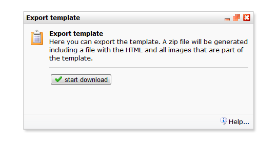

In het template menu vind je een functie om templates te exporteren of
te importeren.

**Export**: Er wordt een ZIP-archief gegenereerd dat kan worden
gedownload naar je computer. Dit ZIP archief bevat een HTML-bestand en
eventueel de naar de template geuploade bestanden en afbeeldingen.

**Import**: [Maak eerst een
ZIP-archief](http://www.pepermunt.net/software/zip-bestand-maken.html "ZIP-archief maken")
met het HTML bestand en de gebruikte afbeeldingen. Het HTML-bestand en
de afbeeldingen moeten zich in dezelfde map bevinden. Importeer het
bestand via *Template* menu *\> Template importeren/exporteren\
*
