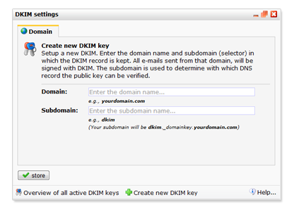
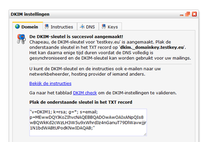
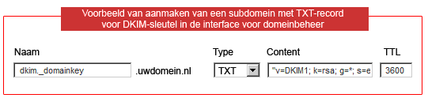

DKIM staat voor DomainKey Identified Mail, een methode van e-mail
authenticatie die ervoor zorgt dat jij voor de ontvanger herkenbaar bent
als afzender van een bericht. Onder anderen Yahoo en Gmail controleren
hierop om spam te filteren voor hun gebruikers.

Je vindt deze functie onder *E-mailings* \> *Extra* \> **DKIM**

Het versleutelen van je e-mailberichten verbetert de deliverability. Met
andere woorden, het vergroot de kans dat je berichten in de inbox van de
ontvanger terecht komt.

Domeinbeheer
------------

Het instellen van DKIM vereist toegang tot **domeinbeheer** en enige
**systeembeheerkennis**.

Jouw domein wordt niet beheerd door ons maar door een Internet Service
Provider. Indien je geen toegang hebt tot de DNS van het domein dat je
als afzenderadres gebruikt voor je emailings (@uwbedrijf.nl), of vragen
hebt over het aanmaken van TXT records op dit domein, dan kan je het
beste contact opnemen met de partij die het domein beheert, of iemand
binnen jouw organisatie die hierover gaat (bijvoorbeeld de
systeembeheerder).

**Tip:** je op [deze webpagina
(www.xwhois.nl)](<http://www.xwhois.nl/> "Domeingegevens opvragen")
 eenvoudig opvragen welke partij jouw domein beheert. Doorgaans worden
er ook contactgegevens bij vermeld.

Stel DKIM ruim op tijd in
-------------------------

Stel de DKIM in ruim 24 uur voordat je een volgende verzending gaat doen
vanaf het domein dat je gebruikt voor jouw e-mailings (@uwbedrijf.com).
Dit is de tijd die servers wereldwijd nodig hebben om de wijzigingen in
het DNS te verwerken.

Verschillende beveiligingsniveaus
---------------------------------

Sinds kort kan je met Copernica alleen nog maar keys aanmaken die 1024
bits of langer zijn. De kortere key bleek niet veilig genoeg, en onder
andere Google ondersteunt sinds een tijdje alleen nog maar keys met een
minimale lengte van 1024 bits. Let op dat keys groter dan 1024 bits niet
in alle DNS entries kunnen worden opgeslagen. Controleer dit bij je ISP.

DKIM instellen
--------------

Het versleutelen van e-mailberichten met DKIM verloopt in twee stappen.
Wanneer de sleutel is ingesteld, wordt deze automatisch meegestuurd met
e-mailings die je verstuurt met de Publisher.

Stap 1. Sleutel genereren in de Publisher
-----------------------------------------

De sleutel genereer je in de Publisher. Ga naar het onderdeel
*E-mailings*en kies bij *Extra* voor **DKIM sleutels**.

-   Kies in het venster voor '**DKIM aanmaken**'
-   Voer bij domein de domeinnaam (uwdomeinnaam.nl) in
-   Als subdomein gebruik je het gedeelte zonder .*\_domainkey* (dkim).
    Zie afbeelding\
     
-   Sla de instellingen op. De DKIM sleutel wordt direct aangemaakt.
-   Plak de sleutel in het TXT record op het subdomein dat je hiervoor
    hebt aangemaakt. Zie stap twee.\
     

Je kan het dialoogvenster sluiten. De sleutel blijft beschikbaar wanneer
je op een later tijdstip terugkeert naar dit venster.

Stap 2. Sleutel kopieren naar het TXT record
--------------------------------------------

Je hebt in stap 1 een sleutel gegenereerd. In de volgende (en laatste)
stap kopieer je de sleutel naar het TXT record op je subdomein.

-   Ga naar het domeinbeheer (controlepaneel) van het domein.
-   Maak hier onder het hoofddomein een nieuw TXT record (subdomein) aan
    met de naam die je hebt gebruikt bij het genereren van de sleutel in
    stap 1.

    Bijvoorbeeld als je bij domein *uwdomeinnaam.nl* hebt ingevuld en
    bij subdomein *dkim*, dan maak je op het domein uwdomeinnaam.nl een
    TXT record aan: *dkim.\_domainkey*.uwdomeinnaam.nl\
     

-   Plak in het TXT record de sleutel die je hebt gekopieerd vanuit de
    Publisher (zie stap 1).
-   Sla de wijzigingen op.

Klaar is Kees. Let op, wijzigingen in het DNS zijn soms pas na 24 uur
wereldwijd verwerkt. Het kan binnen die tijd dus zijn dat de applicatie
aangeeft dat de DKIM nog niet correct is. 

Stap 3. Instellen van DMARC
---------------------------

De volgende stap is het instellen van een [DMARC
record](https://www.dmarc.org "DMARC website"). DMARC controleert of een
e-mail met DKIM is gesigned en of het SPF record correct staat. Zo niet
wordt er een rapportage uitgestuurd. DMARC wordt steeds belangrijker
voor de deliverability van emailberichten.

Ga naar het domeinbeheer (controlepaneel) van het domein.

-   Maak hier onder het hoofddomein een nieuw TXT record aan met de naam
    \_dmarc.uwdomeinnaam.nl (inclusief de underscore)
-   Zet de volgende waarde in het TXT record:

    v=DMARC1;p=none

De bovenstaande regel zorgt ervoor dat alle e-mails die niet gesigned
worden met DKIM gewoon worden afgeleverd. Dit is handig als je ook
emails zonder DKIM verstuurd (bijvoorbeeld vanuit Outlook). Mocht je
alle e-mails met DKIM signen, is het ook mogelijk om te zeggen dat de
ontvangende e-mails moeten weigeren. Dit kan door de volgende waarde in
het TXT record te zetten:

    v=DMARC1;p=reject

**Let wel op dat dit dus zorgt dat alle emails zonder correcte DKIM niet
aankomen!**

DKIM en DMARC Controleren
-------------------------

Om te controleren of de DKIM en DMARC correct zijn ingesteld en
meegestuurd kan worden met jouw e-mailings, ga je naar het tabblad
**DKIM Controleren**. Houd hierbij rekening met de 24 uur die geldt voor
de wereldwijde synchronisatie van DNS servers. Binnen deze tijd kan ten
onrechte worden vastgesteld dat de DKIM niet goed is ingesteld.

Veelgestelde vragen
-------------------

### Ik heb alle stappen gevolgd, maar de DKIM is nog steeds niet correct ingesteld

-   **Oorzaak 1.** Mogelijk zijn de wijzigingen in het DNS nog niet
    wereldwijd verwerkt. Dit kan tot 24 uur duren.
-   **Oorzaak 2.**Het DNS programma van jouw hostingprovider voegt
    automatisch dubbele quotes toe aan het TXT record. Verwijder de
    dubbele quotes aan het begin en eind van de DKIM sleutel in het TXT
    record.
-   **Oorzaak 3.** Controleer op tikfouten. Komen de namen van de
    domeinen en subdomeinen overal overeen?

### Volgens mijn hosting provider zijn punten en underscores niet toegestaan in subdomeinnamen

De hosting provider heeft slechts deels gelijk: het is niet toegestaan
om een underscore te gebruiken in een **A** of **MX** record, maar over
**TXT** record bestaan niet zulke afspraken.

Op internet kun je veel soortgelijke klachten terug vinden over hosting
providers die ook 'moeilijk' doen. Wees vasthoudend en overtuig je
provider van jouw gelijk. Zoek desnoods naar extra bronnen op het
internet die de bewering van jouw hostingpartij ontkrachten.

### Er bestaat al een TXT-record met de naam dkim.\_domainkey

Kies een andere selector. Alleen het deel**.\_domainkey**is verplicht.
Gebruik bijvoorbeeld dkim2.\_domainkey
