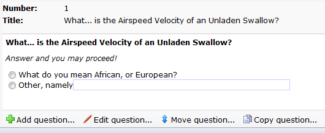

Enquêtevragen beheer je vanuit de werkbalk direct onder de geopende
vraag.

A survey question and the available options related to the question

Een vraag verwijderen
---------------------

Een enquêtevraag die je foutief hebt aangemaakt of besluit te
verwijderen, kan je verwijderen via de gelijknamige functie in het menu
Enquête.

Na verwijdering zijn de vraag en de ingevoerde antwoordmogelijkheden
niet meer terug te halen.

Een nieuwe vraag toevoegen
--------------------------

Om vragen aan een enquête toe te voegen of aan te passen, selecteer je
eerst de betreffende enquête. De opties om vragen toe te voegen of
bewerken vindt je vervolgens in het menu Enquête en onder in beeld.

In het dialoogvenster zie je de reeds bestaande enquêtevragen in een
overzicht links.\
 Rechts zie je de opties om een nieuwe vraag te formuleren. Je kan
meerdere vragen invoeren door na de invoer voor 'vraag toevoegen'
linksonder in de pop-up te kiezen.

[Meer lezen over de beschikbare soorten enquêtevragen](#)

Een vraag kopieren
------------------

Selecteer de vraag die je wilt kopieren en klik op Kopieren in de
onderste toolbar.

Bepaal vervolgens waar de vraag naartoe moet worden gekopieerd.
Eventueel aan de vraag gekoppelde afbeeldingen kunnen worden
meegekopieerd.

Een vraag verplaatsen
---------------------

Als je een vraag uit uw enquête eerder of juist later in de enquête wilt
plaatsen, kies dan de functie 'Vraag verplaatsen' in het menu of vanuit
het overzicht onder in beeld.

Selecteer eerst de juiste vraag, voordat je deze functie aanroept.

Geef voor de vraag aan op welke positie hij moet komen. Alle vragen met
een lagere positie, verschuiven met 1 positie verder omlaag. De vraag
wordt dus tussengevoegd.
