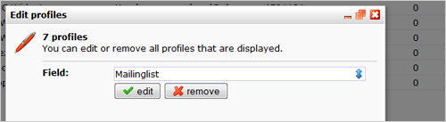
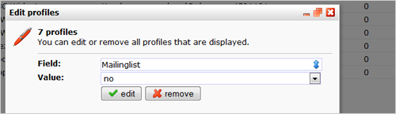

Het is mogelijk om alle profielen uit een database ineens te
verwijderen. Ook kan je alle profielen uit een selectie ineens
verwijderen. Let op, profielen die je hebt verwijderd kan je niet meer
terughalen. Er is geen - ik herhaal- géén Ctrl+Z.

### Alle profielen uit een database of selectie weggooien

-   Selecteer in het linkeroverzicht de database of selectie
-   Kies in het menu **Huidige weergave**de functie '**Meerdere
    (sub)profielen wijzigen / verwijderen...**'
-   Klik op '**verwijderen**'.

Na bevestiging van de actie zijn alle betrokken profielen definitief
verwijderd.

### Alle profielen uit een database of selectie ineens wijzigen

Het is mogelijk om de waarde in een profielveld voor meerdere profielen
te wijzigen

-   Selecteer in het linkeroverzicht de database of selectie
-   Kies in het menu **Huidige weergave** de functie '**Meerdere
    (sub)profielen wijzigen / verwijderen...**'
-   Selecteer het veld waarvan je de waarde wil wijzigen
-   Voer de nieuwe waarde in
-   Klik op **'Bewerken**'

