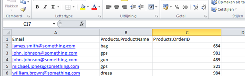

Het importbestand is een lijst met gegevens die je wilt importeren naar
je database en/of collectie in Copernica. Een importbestand maak je
bijvoorbeeld met Excel.

Het bestand is opgebouwd uit regels en kolommen.

-   Een regel (van links naar rechts) bevat telkens de gegevens van 1
    profiel (en eventueel een subprofiel, zie onder).
-   Een kolom (van boven naar beneden) bevat telkens dezelfde soort
    informatie over alle profielen die je wilt importeren. Bijvoorbeeld
    een kolom met alle e-mailadressen en een kolom met alle voornamen.
-   De eerste regel in het importbestand bevat de namen van de kolommen.
    De kolom met emailadressen noem je bijvoorbeeld *Email*.

Onderstaand een schermafbeelding van een correct opgemaakt importbestand
in Excel.

Importbestand met profielen en subprofielen
-------------------------------------------

Je kan je database uitbreiden met collecties. Subprofielen uit een
collectie behoren altijd tot één profiel. Bijvoorbeeld alle werknemers
(subprofielen) van een bedrijf (profiel). Gegevens van een subprofiel
plaats je daarom altijd op dezelfde regel als de gegevens van het
profiel.

-   Als je bij een profiel meerdere subprofielen wilt importeren, dan
    gebruik je per subprofiel een nieuwe regel. Dus ook als je
    subprofielen importeert naar meerdere collecties ineens.
-   Gebruik voor elke kolom met subprofiel gegevens een naam die begint
    met de naam van de collectie, gevolgd door de naam van het veld, van
    elkaar gescheiden met een punt (.).\
     Bijvoorbeeld: heet je collectie *Contactpersonen* en het veld
    *Voornaam*, gebruik dan *Contactpersonen.Voornaam* als kolomnaam.
-   Elke regel met subprofiel gegevens, bevat minstens 1 uniek gegeven
    van het profiel, zodat deze tijdens de import aan elkaar kunnen
    worden gekoppeld, en de afzonderlijke subprofielen onder hetzelfde
    profiel worden opgeslagen.

Wanneer het onderstaande bestand wordt geimporteerd, met het veld
*Email*als sleutelveld, dan zal bij john.johnson@something.com twee
subprofielen worden toegevoegd aan de collectie *Products*

### Bestand omzetten naar een tabgescheiden bestand

Het is niet mogelijk om een Excel bestand direct te uploaden naar de
Publisher. Je dient het bestand eerst om te zetten naar een
tabgescheiden *txt* of *csv* bestand.

Een tabgescheiden bestand maakt je met Excel.

-   Open het importbestand met Excel
-   Ga in Excel naar *Bestand \> Opslaan* als en kies *Tekst (tab is
    scheidingsteken) (\*.txt)*
-   Klik vervolgens op *Opslaan*

In plaats van een tab, kan je desgewenst ook een komma of puntkomma als
scheidingsteken gebruiken.
