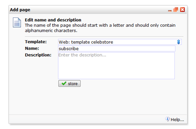
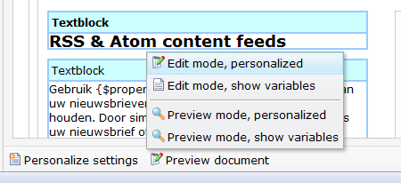

Om een nieuwe webpagina aan te maken selecteer je eerst de website
waaronder je de pagina wilt maken. Vervolgens kan je in het *Webpagina*
menu een nieuwe pagina aanmaken.

Er is geen limiet aan het aantal webpagina's dat je kan aanmaken.

Selecteer in het rechteroverzicht de website waaronder je de nieuwe
pagina wilt aanmaken

1.  In het *webpagina*menu en klik op *Nieuwe webpagina*
2.  Selecteer de template waarop je de pagina wilt baseren
3.  Voer een *naam* in voor de webpagina en optioneel een
    *beschrijving*\
     Let op, de webpagina wordt straks bereikbaar via deze naam. Dus als
    je de pagina *nieuwsbrief* noemt, dan wordt deze straks vanuit de
    browser bereikbaar via http://jouwdomein.com/*nieuwsbrief*
4.  Klik op *opslaan*
5.  De nieuwe pagina wordt direct geladen
6.  Klik onder de geopende pagina op *Bewerkmodus* om de pagina te
    bewerken

