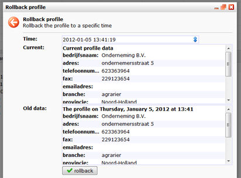

Als je per ongeluk drastische wijzigingen aan een (sub)profiel heeft
gemaakt en je wilt dit terugdraaien, dan kan je gebruik maken van de
functie '**(sub)profiel terughalen**'. Deze vind je bij het betreffende
profiel, achter het tabblad '**Geschiedenis'**.

het dialoogvenster om een profiel terug te zetten vind je in het
Geschiedenis tabblad van een profiel.

In het dialoogvenster zie je de gegevens van het huidige profiel en
daaronder de oude gegevens van een bepaalde datum. Vul een andere datum
of tijd in en kies **'vernieuwen'**om bij **Oude gegevens**een ander
overzicht op te roepen.

Deze functie is alleen beschikbaar per individueel (sub)profiel, niet
voor hele selecties/databases ineens.

-   Je kan zo ver terug in de tijd als het (sub)profiel oud is.
-   Je haalt altijd het gehele (sub)profiel terug, dus niet een deel van
    de oude gegevens.
-   Velden die nog niet bestonden in de oude gegevens worden genegeerd,
    zij behouden hun huidige waardes.
-   Velden die niet meer bestaan worden genegeerd en komen dus niet
    terug in uw database.

### **Ongedaan maken terughalen**

Het terughalen van gegevens wordt geregistreerd als een nieuwe
verandering. Dat betekent dat je eventueel ook de terughaalactie
ongedaan kan maken, door opnieuw gegevens terug te halen, maar dan van
het tijdstip voordat je de eerste keer gegevens terughaalde.

### Meerdere profielen terughalen

Deze actie kan helaas alleen worden uitgevoerd op individuele profielen.
Het is dus niet mogelijk alle profielen uit een database, selectie of
miniselectie ineens terug te halen.

Wij kunnen alleen data terugzetten. Wij kunnen helaas (nog) geen foute
stappen en verkeerde beslissingen in het leven van een profiel of
subprofiel terugdraaien.
