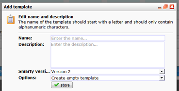

Webpagina's die je maakt in de software zijn altijd gebaseerd op een
template. Om een nieuwe template te maken, gebruik je de zogenoemde
functie in het **Template menu**onder **Websites**.

Het bouwen van templates voor webpagina's verschilt niet heel erg van
het bouwen van e-mailtemplates, echter heb je nu niet te maken met de
beperkingen van e-mail. Je kan dus gewoon gebruik maken van moderne
technieken, formulieren, flash, video, javascript et cetera.

**Net als met e-mailtemplates kan afbeeldingblokken, tekstblokken en
loopblokken invoegen.**

Een web template maken
----------------------

Je kan een nieuwe template maken, een bestaande template kopiëren of een
template importeren vanaf je computer.

-   **Een nieuwe webtemplate maken.**Kies in het template menu voor
    *Nieuwe template...* en maak een basistemplate met behulp van HTML
    code en content blokken.
-   **Een webtemplate importeren.** Maak eerst een nieuwe (lege)
    template aan. Kies vervolgens voor template importeren vanuit het
    *Template* menu. Localiseer het HTML bestand of het ZIP-bestand (met
    afbeeldingen) op je computer en upload deze naar de applicatie.
-   **Een e-mailtemplate gebruiken.** E-mailtemplates kunnen prima als
    basis dienen voor webpagina's. Maak onder websites een nieuwe
    template in kies in het dialoogvenster voor de optie*Webtemplate of
    e-mailtemplate kopiëren*. Een naar Websites gekopieerd
    e-mailtemplate kan zonder problemen worden bewerkt / aangepast. Dit
    heeft geen invloed op de originele e-mailtemplate.

Template broncode bewerken
--------------------------

De broncode van een template kan je in Copernica aanpassen.

Wanneer je het web document of template hebt geopend, dan kan je vanuit
het tabblad HTML-broncode de inhoud direct bewerken. Houd er wel
rekening mee dat de wijziging geldt voor alle webpagina's die op de
template zijn gebaseerd.
