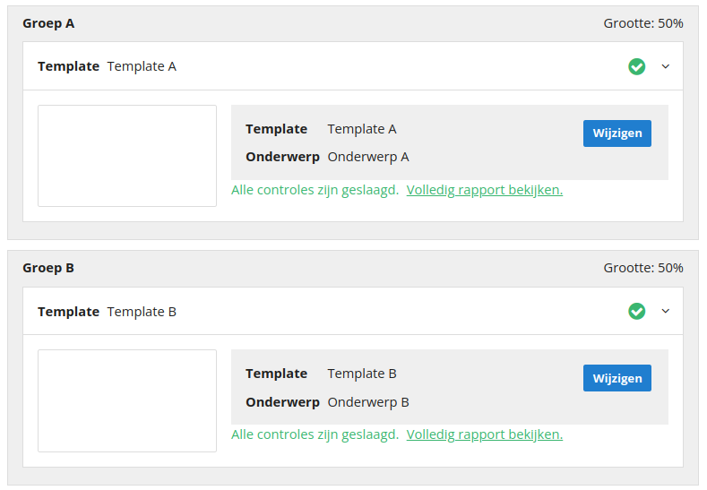

# Versturen van een A/B-tests of split-run

## Verschil A/B-test of split-run 
Met een A/B-test kan je twee templates of documenten met elkaar vergelijken. De doelgroep van je mailing wordt in twee gelijkmatige groepen gesplitst om zo te kijken welk template of document het beste presteert.

Het verschil tussen een A/B-test en een split-run is dat je met een split-run twee of meer mailings met elkaar kunt vergelijken die naar een beperkt deel van de verzendselectie worden verzonden. De beste mailing wordt vervolgens automatisch naar het resterende deel van de verzendselectie verzonden. Je kunt tot 5 verschillende groepen gebruiken.

## Versturen van een A/B test of split-run
Om een A/B test of split-run te versturen kies je binnen je [(mini)selectie](https://ms.copernica.com/#/profiles/) voor **Mailing versturen**. 
Vanuit een template of document maak je gebruik van de optie **Bulkmailing** onder de knop **Verzendopties** in de toolbar.

### Type mailing
Er zijn drie verschillende type mailings:
- Reguliere mailing
- A/B-test
- Split-run

**Reguliere mailing**  
Met een reguliere mailing kun je een template of document naar de gehele bestemming sturen.

**A/B-test**  
Met een A/B-test kun je twee templates of documenten met elkaar vergelijken. De bestemming wordt in twee groepen gesplitst om zo te kijken welk document of template het beste presteert.

Standaard staat er een verdeling van 50% (groep A) en 50% (groep B) ingesteld. Om dit percentage te wijzigen sleep je de slider tussen de twee groepen.

**Split-run**   
Met een split-run kun je twee of meer mailings met elkaar vergelijken die naar een beperkt deel van de verzendselectie worden verzonden. De best presterende mailing wordt vervolgens automatisch naar het resterende deel van de verzendselectie verzonden.

Bij een split-run staat de verdeling van de groepen standaard op 25% (groep A), 25% (groep B) en 50% (definitieve groep) ingesteld. Ook hier is het mogelijk om met de slider de grootte van de groepen aan te passen. 

Je kunt tot 5 verschillende groepen toevoegen aan je split-run.

### Groepen instellen
Bij een A/B-test of split-run krijg je de optie om per groep een template of document te kiezen. Deze groepen worden verzonden op het ingestelde tijdstip van de mailing.

### Definitieve groep instellen (split-run)
Split-runs bestaan naast minimaal twee groepen ook uit een definitieve groep. Op basis van de ingestelde vergelijking wordt naar deze groep het winnende template of document verzonden.  

De volgende vergelijksmogelijkheden zijn beschikbaar:
- De meeste impressies
- De meeste unieke impressies
- De meeste kliks
- De meeste unieke kliks
- Eigen javascript

#### Voorbeeld
In onderstaand voorbeeld ontvangt het resterende deel van de verzendselectie (50%) het template of document waarop in de afgelopen drie uur de meeste unieke impressies zijn geregistreerd.

## Statistieken
De statistieken van de losse groepen zijn terug te vinden in de [resultaten-module](https://ms.copernica.com/#/results/sentmailings).
