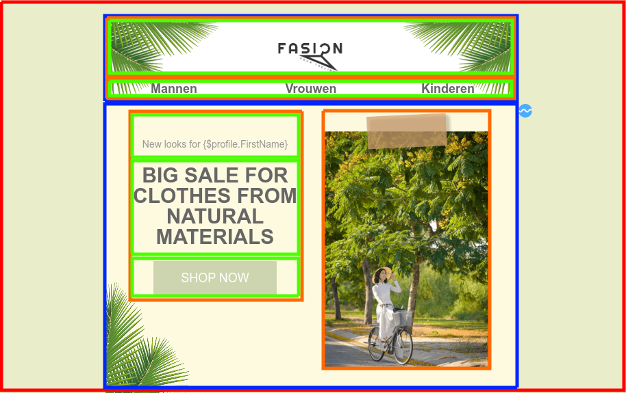

# Drag-and-drop templates

Met drag-and-drop templates ontwerp je snel en eenvoudig e-mails. Door te slepen met blokken geef je aan waar teksten, afbeeldingen en buttons moeten staan. Je maakt een drag-and-drop template aan door in de **[E-mail-editor](https://ms.copernica.com/#/design)** te kiezen voor _Aanmaken -> Drag-and-drop-template aanmaken_. 

Een Drag-and-drop-template kent vier verschillende elementen:  
  

  
**Lijn**:  
Ieder template heeft minimaal één lijn-element (rood blok). Binnen dit element kun je de overige elementen gebruiken. Wanneer je meerdere achtergrondkleuren over de gehele breedte van je template wilt gebruiken, kun je meerdere lijn-elementen toevoegen. Je kunt vervolgens per element aangeven wat de achtergrondkleur moet zijn.  
   
**Structuur & container**:  
Een structuur-element (blauw blok) bestaat uit één of meerdere containers (oranje blok). Het structuur-element is even breedt als de ingestelde breedte van het bericht. Bij het toevoegen kun je kiezen hoeveel containers er binnen dit element moeten vallen. Stel je wilt tekst over de gehele breedte plaatsen, dan maak je gebruik van een structuur-element met één container. Als je een afbeelding en tekst wilt, maak je gebruik van een structuur-element met twee containers. De breedte van iedere container is apart in te stellen.  

**Blok**:  
Binnen een container kun je gebruik maken van meerdere blokken, bijvoorbeeld om een afbeelding, tekst en button te plaatsen. Verderop in dit artikel worden de verschilende blok-opties besproken.

## Werking van de editor
De editor is onderverdeeld in twee delen, namelijk de instellingen en een voorbeeldweergave van je template. De instellingen zijn ook weer onderverdeeld in twee delen (uiterlijk en inhoud). 

## Uiterlijk
Hier kun je globaal de instellingen opgeven hoe je e-mail eruit komt te zien. Hierbij kun je denken aan de breedte, het lettertype, de achtergrondkleur of de regelafstand van je template. Ook kun je hier specifieke instellingen meegeven aan de mobiele weergave van je e-mail.

## Inhoud
Hier kun je de daadwerkelijke content toevoegen aan je e-mailtemplate.  

### Structuren
Zoals hierboven beschreven bepaal je onder _Structuren_ de structuur van je e-mail. Je bouwt een e-mail op door meerdere structuur-elementen onder elkaar te plaatsen. Deze elementen bestaan weer uit één of meerdere containers. Binnen deze containers kun je meerdere blokken toevoegen.

Als je bijvoorbeeld kiest voor een regel met twee containers, kan je links een of meerdere tekstveld(en) aanmaken en rechts een afbeelding plaatsen. Als je kiest voor een element met één container dan vult deze de gehele breedte van je e-mail.

Door op het structuur-element te klikken in je template, kun je specifieke instellingen opgeven. Hierbij kun je denken aan de breedte van iedere container binnen dit element of hoeveel padding er tussen beide containers zit.

### Blokken
Er zijn verschillende blok-opties voor je nieuwsbrief:

| Blokken               | Omschrijving                                                                                            |
|-----------------------|---------------------------------------------------------------------------------------------------------|
| Afbeelding            | Optie om een afbeelding toe te voegen                                                                   |
| Tekst                 | Optie om tekst toe te voegen                                                                            |
| Knop                  | Knop met een url naar externe locatie                                                                   |
| Plaatshouder          | Bevat witruimte van een bepaalde hoogte                                                                 |
| Video                 | Optie om een video toe te voegen                                                                        |
| Sociaal               | Optie om social media toe te voegen                                                                     |
| Banner                | Optie om een banner toe te voegen                                                                       |
| Menu                  | Optie om een menu toe te voegen                                                                         |
| Html                  | Optie om zelfgeschreven HTML (en CSS) toe te voegen                                                     |

Elk blok heeft eigen opties om de weergave van het specifieke blok aan te passen.

### Modules
Modules maken het mogelijk om elementen te hergebruiken in meerdere templates, waardoor je niet telkens dezelfde hoeft handelingen te verrichten. Modules kun je maken van zowel lijn-, stuctuur- als container-elementen. Zo kun je bijvoorbeeld je _header_ of _footer_ opslaan als module, waardoor je deze met één simpele handeling in al je templates kunt toevoegen.

Je maakt een module aan door met je muis over het element te gaan en te klikken op de drie puntjes. Hier vind je de optie '_opslaan als module_'. De opgeslagen modules vind je vervolgens onder **Modules**. Door over de opgeslagen module heen te gaan met je muis, kun je door op de drie puntjes te klikken, een naam, beschrijving en eventuele tags meegeven. Hierdoor wordt het mogelijk om te zoeken binnen je modules op deze specifieke waardes.
