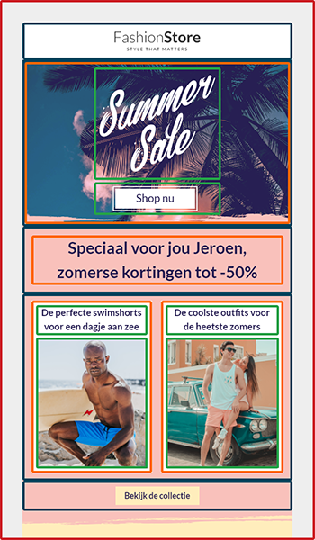

# Drag-and-drop-templates

Met drag-and-drop-templates ontwerp je snel en eenvoudig e-mails. Door te slepen met blokken geef je aan waar teksten, afbeeldingen en buttons moeten komen te staan. Je maakt een drag-and-drop-template aan door in de **['E-mail-editor'](https://ms.copernica.com/#/design)** te kiezen voor **'Aanmaken'**, **'Drag-and-drop-template aanmaken'**. 

Een Drag-and-drop-template kent vier verschillende elementen:  

  
**Lijn** 

Iedere template heeft minimaal één lijn-element (rood). Binnen dit element kun je de overige elementen gebruiken. Wanneer je meerdere achtergrondkleuren over de gehele breedte van je template wilt gebruiken kun je meerdere lijn-elementen toevoegen. Je kunt vervolgens per element de achtergrondkleur aangeven.  
   
**Structuur & container**  

Een structuur-element (blauw) bestaat uit één of meerdere containers (oranje). Het structuur-element heeft dezelfde breedte als de ingestelde breedte van je e-mail. Bij het toevoegen van structuur-elementen kun je kiezen hoeveel containers er binnen dit element gebruikt moeten worden. 

Stel dat je tekst over de gehele breedte wilt plaatsen. Je maakt hiervoor gebruik van een structuur-element met één container. Als je naast tekst ook een afbeelding wilt toevoegen maak je gebruik van een structuur-element met twee containers. De breedte van afzonderlijke containers is apart in te stellen.  

**Blok** 

Binnen een container kun je gebruikmaken van één of meerdere blokken (groen), bijvoorbeeld om een afbeelding, tekst en button te plaatsen. De verschillende blok-opties worden hieronder besproken.

## Werking van de editor
De editor is onderverdeeld in twee delen: (1) de instellingen en (2) een voorbeeldweergave van je template. De instellingen zijn op hun beurt onderverdeeld in twee delen (uiterlijk en inhoud). 

## Uiterlijk
Hier stel je globale instellingen in die bepalen hoe je e-mail eruit komt te zien. Denk bijvoorbeeld aan de breedte, het lettertype, de achtergrondkleur en de regelafstand van je template. Ook kun je hier specifieke instellingen meegeven die betrekking hebben tot de mobiele weergave van e-mails.

## Inhoud
Hier voeg je de daadwerkelijke content van je e-mailtemplate toe.  

### Structuren
Zoals hierboven beschreven stel je onder **'Structuren'** de structuur van je e-mail in. Je bouwt een e-mail op door meerdere structuur-elementen onder elkaar te plaatsen. Deze elementen bestaan uit één of meerdere containers. Binnen die containers kun je meerdere blokken toevoegen.

Wanneer je bijvoorbeeld kiest voor een regel met twee containers kan je links één of meerdere tekstveld(en) aanmaken en rechts een afbeelding plaatsen. Elementen met één container vullen de gehele breedte van je e-mail.

Je kunt specifieke instellingen meegeven door in je template op het structuur-element te klikken. Denk bijvoorbeeld aan de breedte van een container binnen een element of de padding tussen meerdere containers.

### Blokken
Er zijn verschillende blok-opties beschikbaar voor gebruik in je e-mails:

| Blokken               | Omschrijving                                                                                            |
|-----------------------|---------------------------------------------------------------------------------------------------------|
| Afbeelding            | Optie om een afbeelding toe te voegen                                                                   |
| Tekst                 | Optie om tekst toe te voegen                                                                            |
| Knop                  | Knop met een URL naar een externe locatie                                                                   |
| Plaatshouder          | Bevat witruimte van een specifieke hoogte                                                                 |
| Video                 | Optie om een video toe te voegen                                                                        |
| Sociaal               | Optie om social media toe te voegen                                                                     |
| Banner                | Optie om een banner toe te voegen                                                                       |
| Menu                  | Optie om een menu toe te voegen                                                                         |
| HTML                  | Optie om zelfgeschreven HTML en CSS toe te voegen                                                     |

Elk blok biedt zijn eigen opties om de weergave van het blok aan te passen.

### Modules
Modules maken het mogelijk om elementen te hergebruiken in meerdere templates. Daardoor hoef je dezelfde handelingen niet herhaaldelijk te verrichten. Modules kunnen gebruikmaken van lijn-, structuur- en container-elementen. Zo kun je bijvoorbeeld je header of footer opslaan als module zodat deze met één simpele handeling aan al je templates kunnen worden toegevoegd.

Je maakt een module aan door met je muis over het element te hoveren en te klikken op de drie puntjes. Hier vind je de optie **'Opslaan als module'**. De opgeslagen modules vind je vervolgens onder **'Modules'**. 

Je kunt een naam, beschrijving en tags toevoegen door over de opgeslagen module te hoveren en op de drie puntjes te klikken. Zo kun je binnen je module zoeken op specifieke waarden.
