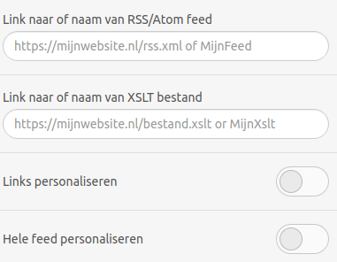

# Feedblok

Met het feedblok is het mogelijk om content dynamisch in je nieuwsbrief te laden. In het feedblok kun je gebruik maken van RSS- of Atom-feeds die je gemaakt hebt in Marketing Suite of van een feed die extern is samengesteld en gehost.

Het feedblok kent vier configuratie-opties:
- Link naar of naam van RSS-/Atom-feed
- Link naar of naam van XSLT-bestand
- Links personaliseren
- Hele feed personaliseren



## Feed inladen
De eerste optie in het feedblok is 'Link naar of naam van RSS-/Atom-feed'. Hier geef je de URL op waar de feed beschikbaar is, bijvoorbeeld: 
```
https://www.eendomein.nl/feed/feed.xml
```

Naast het inladen van een externe URL is het ook mogelijk om een feed toe te voegen die aangemaakt is onder 'Inhoud' binnen je Copernica-omgeving. In dit geval voer je enkel de naam van de feed in.

## Opmaak van de feed
Feeds worden opgebouwd door middel van XML. Deze broncode bevat en omschrijft de data. Om de feed goed zichtbaar te laten worden in e-mailclients dien je de data om te zetten naar HTML-broncode. Dit kun je doen met XSLT (eXtensible Stylesheet Language Transformations).

### In de praktijk
Als voorbeeld gebruiken we onderstaande XML-code voor het tonen van een tweetal schoenen:
```
<?xml version="1.0" encoding="UTF-8"?>
<rss xmlns:atom="http://www.w3.org/2005/Atom" version="2.0">
<channel>
	<title>My feed</title>
	<item>
		<title>Lacoste</title>
		<price>95.00</price>
		<size>44</size>
		<url>https://www.lacoste.com/nl/lacoste/heren/schoenen/sneakers/t-clip-sneakers-heren-van-leer-en-synthetisch-materiaal/42SMA0052.html?color=2Q9</url>
		<image>https://image1.lacoste.com/dw/image/v2/AAQM_PRD/on/demandware.static/Sites-NL-Site/Sites-master/nl/dw68405603/42SMA0052_2Q9_01.jpg?imwidth=915</image>
	</item>
	<item>
		<title>Converse</title>
		<price>94.99</price>
		<size>44</size>
		<url>https://www.converse.com/nl/nl/shop/p/chuck-70-classic-high-top-unisex-high-top-schoen/162050C.html</url>
		<image>https://www.converse.com/dw/image/v2/AALW_PRD/on/demandware.static/-/Sites-ConverseMaster/default/dw034dd192/images/a_107/162050C_A_107X1.jpg?sw=2000</image>
	</item>
</channel>
</rss>
```

Om deze feed om te zetten naar HTML kun je een XSLT-bestand aanmaken in de [XSLT-module](https://ms.copernica.com/#/xslt) binnen Marketing Suite.

Een voorbeeld hiervan is:
```
<xsl:stylesheet version="1.0" xmlns:xsl="http://www.w3.org/1999/XSL/Transform">

<xsl:template match="rss/channel">
        <!-- show the items -->
        <xsl:call-template name="item" />
</xsl:template>

<xsl:template name="item">
   <!-- loop through each of the items -->
   <xsl:for-each select="item">
   <table align="left">
      <tr>
         <td>
            <a href="{url}" target="_blank" style="display: block">
               
            </a>
         </td>
      </tr>
      <tr>
         <td align="center"> 
            <strong><xsl:value-of select="title" disable-output-escaping="yes" /></strong>
         </td>
      </tr>
      <tr>
         <td align="center"> 
            <strong>&euro; <xsl:value-of select="price" disable-output-escaping="yes" /></strong>
         </td>
      </tr>
   </table>            
</xsl:for-each>
</xsl:template>

</xsl:stylesheet>
```

Voor meer mogelijkheden met XSLT kun je onderstaande tutorials volgen:
- [W3Schools](https://www.w3schools.com/xml/xsl_intro.asp)
- [Tutorialspoint](https://www.tutorialspoint.com/xslt/)

## Personaliseren van de feed
Binnen het feedblok heb je twee mogelijkheden om je feed te personaliseren, namelijk:
- Links personaliseren
- Hele feed personaliseren

### Links personaliseren
Als je enkel personalisatie gebruikt binnen het 'href'-gedeelte van een link (`<a href='dit gedeelte'>...</a>`) dien je deze optie aan te zetten.

In onderstaand voorbeeld wordt de waarde van het veld 'user' uit het profiel opgenomen in de link:
```
<?xml version="1.0" encoding="UTF-8"?>
<rss xmlns:atom="http://www.w3.org/2005/Atom" version="2.0">
<channel>
	<title>My feed</title>
	<item>
      <title>Copernica</title>
      <link>https://www.copernica.com/user/{$profile.user}</link>
   </item>
</channel>
</rss>
```

### Hele feed personaliseren
Als je volledig gebruik wilt maken van personalisatie kun je deze optie aanzetten. Hierbij is het mogelijk om waardes uit het profiel samen te voegen met waardes uit de feed.

In onderstaand voorbeeld wordt in de link-parameter het veld 'user' uit het profiel opgenomen in de link en het veld 'email' in de beschrijving ('description'):
```
<?xml version="1.0" encoding="UTF-8"?>
<rss xmlns:atom="http://www.w3.org/2005/Atom" version="2.0">
<channel>
<title>My feed</title>
   <item>
      <title>Copernica</title>
      <link>https://www.copernica.com/user/{$profile.user}</link>
      <description>This is a description for {$profile.email}</description>
   </item>
</channel>
</rss>
```

**Belangrijk:** bij personalisatie in feeds is het belangrijk om te weten in welke volgorde dit proces wordt uitgevoerd. De XSLT wordt eerst geparset en daarna wordt de personalisatie pas toegepast. 

Dit betekent dat je geen condities in je XSLT aan kunt maken op basis van één van de databasevelden. Op dat moment weet de XSLT namelijk nog niet wat de waarde van dat veld gaat worden.
