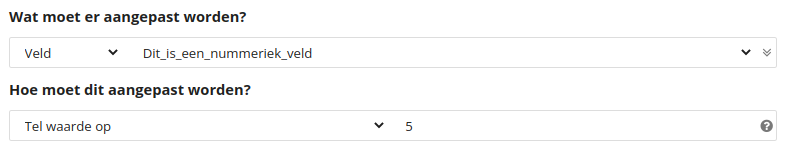

# Opvolgacties

Copernica geeft je de mogelijkheid om opvolgacties toe te voegen aan templates of documenten. Daarmee voer je automatisch acties uit op basis van condities. Zo kun je bijvoorbeeld automatisch een e-mail versturen zodra een gebruiker op een link klikt of leadscoring toepassen bij het registreren van een open. Er zijn vrijwel geen limieten.

## Twee verschillende systemen

Je kunt een opvolgactie instellen in je [template of document](https://ms.copernica.com/#/design/) door in de toolbar te klikken op **'Opvolgacties'**. Vervolgens heb je de keuze tussen **'Opvolgactie aanmaken'** of **'Actie aanmaken'**. De opties verschillen in het achterliggende systeem. 

De optie **'Opvolgactie aanmaken'** maakt gebruik van onze krachtige Follow-up-Manager. Het is echter mogelijk dat je hierbij enkele functies (die je gewend bent uit Publisher) mist. Om die reden kun je ook gebruikmaken van **'Actie aanmaken'**.

## Opvolgactie aanmaken

### Trigger

Een opvolgactie wordt altijd uitgevoerd als gevolg van één of meerdere triggers. Er zijn verschillende standaard triggers beschikbaar in alle soorten opvolgacties:
* Uitschrijving
* Link-klik
* E-mail verzonden
* E-mailaflevering
* Eerste e-mailimpressie
* E-mailfout

Daarnaast hebben databases en collecties specifieke triggers:

#### Database
* Profiel aangemaakt
* Profiel bewerkt

#### Collectie
* Subprofiel aangemaakt
* Subprofiel bewerkt
* Subprofiel verwijderd

### Blokken

Zodra je de trigger hebt ingesteld kun je in de Follow-up-Manager blokken toevoegen aan je opvolgactie. 

We maken onderscheid tussen drie blokken: (1) tussenblokken, (2) actieblokken en (3) geavanceerde blokken. Een tussenblok geeft de condities aan op basis waarvan het actieblok wordt uitgevoerd. 

De beschikbare blokken zijn:

| Blok                              | Type                                                                                                    |
|-----------------------------------|---------------------------------------------------------------------------------------------------------|
| Subprofielen checken van profiel  | Tussenblok                                                                                              |
| Geklikte link checken             | Tussenblok                                                                                              |
| (sub)profiel checken              | Tussenblok                                                                                              |
| E-mailing checken                 | Tussenblok                                                                                              |
| Fout checken                      | Tussenblok                                                                                              |
| Inschrijving checken              | Tussenblok                                                                                              |
| Wachttijd                         | Tussenblok                                                                                              |
| Profiel aanmaken                  | Actieblok                                                                                               |
| Subprofiel aanmaken               | Actieblok                                                                                               |
| Verzend e-mail                    | Actieblok                                                                                               |
| Verzend SMS                       | Actieblok                                                                                               |
| (sub)profiel aanpassen            | Actieblok                                                                                               |
| (sub)profiel verwijderen          | Actieblok                                                                                               |
| (sub)profiel uitschrijven         | Actieblok                                                                                               |
| JavaScript-evaluatie              | Geavanceerd                                                                                             |
| JavaScript-uitvoering             | Geavanceerd                                                                                             |
| Zoek in alle profielen            | Geavanceerd                                                                                             |
| Zoek in alle subprofielen         | Geavanceerd                                                                                             |

### Voorbeeld

Stel dat je een profielveld wilt aanpassen na het versturen van een mailing, maar je wilt deze aanpassing alleen doorvoeren voor profielen waarvan het veld **'Mailing'** staat op **'Aangemeld'**. 

Om dit te doen, selecteer je de **'E-mailaflevering'**-trigger. Vervolgens sleep je in de Follow-up-Manager een tussenblok van het type **'(sub)profiel checken'** onder **'Start van de opvolgactie'**. Je maakt een connectie tussen de twee blokken door op het bolletje onder het bovenste blok te klikken en deze naar het bolletje van het onderste blok te slepen. Hiermee koppel je het blok aan de opvolgactie. Vervolgens geef je aan dat het veld **'Mailing'** gelijk moet zijn aan **'Aangemeld'**.

Voor de daadwerkelijke actie, de profielwijziging, voeg je het blok **'(sub)profiel aanpassen'** toe. Ook hier maak je een connectie tussen de twee blokken. Standaard wordt een *match*-link gemaakt, wat betekent dat zodra de waarde van het '(sub)profielen checken'-blok overeenkomt met het profiel, het volgende blok wordt uitgevoerd. Door op *match* te klikken, kun je dit wijzigen naar *'Geen match'*. In het blok '(sub)profiel aanpassen' geef je aan welke gegevens je wilt laten wijzigen.

### JavaScript-blokken in de geavanceerde modus

Je kunt JavaScript-blokken toevoegen door onderin de Follow-up-Manager te klikken op **'Geavanceerde modus'**. Hier stel je controles in die plaatsvinden zodra opvolgacties worden geëvalueerd of uitgevoerd.

Bekijk [hier](./email-editor-followups-advanced-javascript) het artikel over geavanceerde JavaScript.

_**Let op**: Wanneer je een opvolgactie voorziet van een wachttijd kan het zo zijn dat het profiel bij de evaluatie (het moment waarop de opvolgactie wordt aangeroepen) wel aan de gestelde condities voldoet, maar op het moment van uitvoering niet meer._

### Rekenen met waardes binnen nummerieke velden

In het blok **Bestemming aanpassen** is het mogelijk om te rekenen met waardes binnen nummerieke velden.  
Je kunt bij deze optie kiezen voor de volgende opties:
- Tel waarde op
- Trek waarde af
- Vermenigvuldig met waarde
- Deel door waarde

_**Let op**: Dit werkt enkel als je bij de opvolgactie zelf onder __'Doel instellen'__ een vaste database voor de opvolgactie hebt gekozen._

## Actie aanmaken

_**Let op**: De optie __'Actie aanmaken'__ is alleen toepasbaar op HTML-templates en -documenten._

Het aanmaken van opvolgacties op basis van het Publisher-systeem vindt plaats in vier stappen:

1) **Naam**  

Je voorziet je opvolgactie van een naam. Deze is zichtbaar in het overzicht van opvolgacties binnen je template of document.

2) **Wachttijd**  

Je geeft de wachttijd aan tussen de activatie van de trigger en de uitvoering van de opvolgactie. Je kunt bijvoorbeeld een wachttijd instellen op basis van een vast tijdsbestek (bijvoorbeeld na 2 uur) of een [variabele wachttijd instellen](./advanced-javascript-conditions) door middel van JavaScript. De opvolgactie kan ook direct worden uitgevoerd.

3) **Aanleiding**

Je stelt de aanleiding (trigger) in op basis waarvan de opvolgactie wordt uitgevoerd. Daarbij kun je extra condities instellen die betrekking hebben op velden en interesses. Condities worden geëvalueerd zodra de opvolgactie getriggerd wordt. 

Er zijn vier aanleidingen beschikbaar:

* De verzending van een document
* De registratie van een impressie
* De registratie van een klik
* De registratie van een foutmelding
    
4) **Actie**  

Je stelt de opvolgactie in die je uit wilt voeren. De onderstaande acties zijn beschikbaar:

* Een opgemaakt document per e-mail versturen;
* Een drag-and-drop-template per e-mail versturen;
* Een opgemaakt SMS-document versturen;
* Een tekstueel e-mailbericht versturen;
* Een SMS-bericht versturen;
* Contact opnemen met de geadresseerde;
* Een nieuw subprofiel aanmaken;
* Gegevens van het (sub)profiel wijzigen;
* Gegevens van de geadresseerde verwijderen.

Ook acties kunnen van condities worden voorzien. Dat doe je bijvoorbeeld wanneer je gebruikmaakt van een wachttijd. In dat geval kun je een conditie instellen die controleert of een klant nog ingeschreven staat voor de nieuwsbrief op het moment dat de opvolgactie wordt uitgevoerd.

### Geavanceerde JavaScript-condities voor HTML-templates of -documenten

Eenvoudige condities die relateren aan een aanleiding of actie zijn in te stellen door in de interface een veld te selecteren en deze te vergelijken met een specifieke waarde. 

Je kunt echter ook [geavanceerde JavaScript-condities](./advanced-javascript-conditions) instellen door gebruik te maken van de **'Geavanceerde modus'**. Daarbij dient er true (de opvolgactie moet worden uitgevoerd) of false (de opvolgactie moet niet worden uitgevoerd) uit je script te komen.

## Extra variabelen

Als je een opvolgactie maakt waarmee je een nieuwe mailing verstuurt, dan kun je in de template of in het document
van de opvolgmail variabelen gebruiken met informatie over de opvolgactie. Deze informatie is opgeslagen in {$mailing.trigger}. 
Dit omvat onder andere het tijdstip waarop de opvolgactie is geactiveerd. 
Ook kun je uitlezen welk profiel of subprofiel de opvolgactie heeft veroorzaakt. De volgende variabelen
zijn beschibaar:

- {$mailing.trigger.triggertime}
- {$mailing.trigger.triggertimestamp}
- {$mailing.trigger.profile}
- {$mailing.trigger.subprofile}

Sommige opvolgacties hebben een vertraging, zoals acties als "verstuur een dag na de klik een opvolgmail".
Daarom is er ook een verschil tussen de trigger-tijd en de uitvoer-tijd. De "time" variabelen bevatten 
de tijd in "YYYY-MM-DD hh:mm:ss" notatie (dus bijvoorbeeld "1969-07-20 21:17:00") en de "timestamp" 
variabelen bevatten het tijdstip als UNIX timestamp in seconden.

De variabele {$mailing.trigger.profile} bevat informatie over het profiel dat de opvolgactie heeft veroorzaakt.
Dit is meestal hetzelfde profiel als waar je de opvolgmailing naar toe verstuurt: de waarde van
{$profile.voornaam} is dan dus gelijk aan die van {$mailing.trigger.profile.voornaam}. Maar als je een opvolgmail
stuurt naar een zelf opgegeven e-mailadres of naar een selectie, dan wijkt dit af. Bij een zelf opgegeven
e-mailadres is de {$profile} variabele leeg (er is namelijk geen profiel waar de mail naar toe wordt verzonden)
en bij een selectie bevat de {$profile} variabele de informatie van het profiel uit de selectie.
Met {$mailing.trigger.profile.VELDNAAM} kun je dan alsnog de informatie van het oorspronkelijke profiel gebruiken.

Dit geldt ook voor {$mailing.trigger.subprofile}. Maar de {$mailing.trigger.subprofile} variabele wordt ook wel
gebruikt voor opvolgacties op basis van een nieuw of aangepast subprofiel, bijvoorbeeld als subprofielen worden
gebruikt om bestellingen in op te slaan. Bijvoorbeeld de actie "verstuur twee dagen nadat er een nieuw subprofiel
(dus de bestelling) is aangemaakt een review mail naar het profiel". In dit geval is het profiel de bestemming van
de e-mail en het subprofiel de trigger. De opvolgactie is namelijk gestart door een nieuw of aangepast subprofiel.
De informatie over de bestelling staat dan in velden als {$mailing.trigger.subprofile.VELDNAAM}.

### Publisher specifieke variabelen

Naast bovenstaande extra variabelen, zijn in Publisher-opvolgacties ook de volgende Publisher specifieke variabelen mogelijk:

| Variabele                   | Uitleg                                                                                                  |
|-----------------------------|---------------------------------------------------------------------------------------------------------|
| {$mailing.sendtime}         | Tijdstip waarop de mailing is verzonden.                                                                |
| {$mailing.executetime}      | Tijdstip waarop de opvolgactie is uitgevoerd                                                            |
| {$mailing.executetimestamp} | Tijdstempel waarop de opvolgactie is uitgevoerd                                                         |
