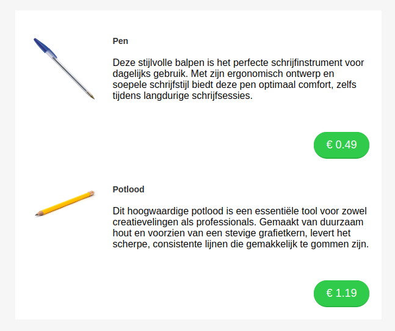
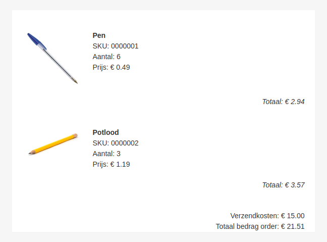

# Magento
De Copernica-integratie met Magento is specifiek ontwikkeld voor Magento 2.0 en hoger. 
Na het koppelen van een Magento-webshop in de [web-module](https://ms.copernica.com/#/web/), 
krijg je direct toegang via tot alle klant-, bestel-, product- en winkelwagengegevens in je 
drag-and-drop-templates via Smarty-variabelen.  

## Integratie identifier

De variabelen om gegevens uit je Magento-webshop op te halen, beginnen altijd met een integratie-identifier. 
Deze identifier verwijst naar de naam die de webshop heeft binnen de lijst van integraties, en stelt je in 
staat om gegevens uit meerdere webshops te halen door ze allemaal een andere identifier te geven. Bij het 
invoeren van de integratie in de [web-module](https://ms.copernica.com/#/web/) heb je deze identifier moeten 
invoeren. Veel gebruikers kiezen als identifier de naam van de webshop ("mijnwebshop") of gewoon "magento". 
Als je "mijnwebshop" als identifier hebt ingevoerd, gebruik je: {$mijnwebshop.variabele}.

## Welke velden zijn er precies beschikbaar?

De gegevens die je ophaalt, worden vanuit de API van Magento ingeladen in je mailing. De velden die de API teruggeeft, zijn allemaal rechtstreeks beschikbaar als Smarty-variabele, bijvoorbeeld {$identifier.product.$sku.name} en {$identifier.product.$sku.price}. 

Enkele veelvoorkomende Smarty-variabelen zijn:
- **{$identifier.customer.$customerID}**: haal klantgegevens op aan de hand van het ID
- **{$identifier.order.$orderID}**: haal een bestelling op aan de hand van het ID
- **{$identifier.order.$orderID.customer}**: haal klantgegevens op voor deze bestelling
- **{$identifier.order.$orderID.items[]}**: haal alle items op uit deze bestelling
- **{$identifier.order.$orderID.items[].product}**: haal het product op uit deze bestelling
- **{$identifier.product.$sku}**: haal een product op aan de hand van de SKU (Stock Keeping Unit)
- **{$identifier.product.$sku.image}**: haal de afbeelding van het product op
- **{$identifier.product.$sku.url}**: haal de afbeelding van het product op
- **{$identifier.product.$sku.price.currency}**: haal enkel de currency van het product op
- **{$identifier.product.$sku.price.value}**: haal enkel de waarde van het product op
- **{$identifier.cart.$cartID}**: haal een winkelwagen op aan de hand van het ID
- **{$identifier.cart.$cartID.customer}**: haal klantgegevens op voor deze winkelwagen
- **{$identifier.cart.$cartID.items[]}**: haal alle items op uit het winkelwagenitem
- **{$identifier.cart.$cartID.items[].product}**: haal productgegevens op uit het winkelwagenitem

Voor een actueel overzicht van beschikbare velden kun je de documentatie van de Magento-API raadplegen:
- [order](https://adobe-commerce.redoc.ly/2.4.7-admin/tag/ordersid#operation/GetV1OrdersId)
- [cart](https://adobe-commerce.redoc.ly/2.4.7-admin/tag/cartscartId#operation/GetV1CartsCartId)
- [product](https://adobe-commerce.redoc.ly/2.4.7-admin/tag/productssku#operation/GetV1ProductsSku)
- [customer](https://adobe-commerce.redoc.ly/2.4.7-admin/tag/customerscustomerId#operation/GetV1CustomersCustomerId)

## Variabelen met meerdere elementen

Er zijn verschillende variabelen waarin meerdere rijen met gegevens kunnen zitten, bijvoorbeeld als je alle producten uit je webshop wilt ophalen. 
Hieronder vind je een lijst met variabelen die binnen een foreach-statement kunnen worden gebruikt:

* **{$identifier.products}**: kan worden gebruikt om over alle producten in de webshop te itereren
* **{$identifier.orders}**: kan worden gebruikt om over alle bestellingen in de webshop te itereren
* **{$identifier.carts}**: kan worden gebruikt om over alle winkelwagens in de webshop te itereren

En, zoals je hierboven al zag, zijn er ook variabelen om alle items van een order of alle items van een winkelwagen op te halen.

**Voorbeeld om alle beschikbare producten te tonen:**
```text
{foreach from=$identifier.products item="product"}
    {$product.name}
{/foreach}
```

Overiges, dit zijn voor de meeste webshops nogal veel producten, dus erg zinvol is bovenstaande code vaak niet. Het wordt
al een stuk handiger als je wat *modifiers* gebruikt om te zoeken naar specifieke producten or bestellingen.

## Modifiers

Normaal gesproken gebruik je modifiers om teksten te filteren, bijvoorbeeld om hoofdletters om te zetten naar kleine letters, of om
HTML code te escapen. Modifiers kunnen echter ook worden ingezet om lijsten te filteren en te sorteren. Hiervoor hebben we de 
volgende modifiers:

* **filter**: hiermee haal je enkel elementen ophalen die voldoen aan een specifieke waarde
* **orderby**: hiermee geef je aan in welke volgorde je de elementen wilt ophalen
* **limit**: hiermee geef je aan hoeveel elementen opgehaald moeten worden

### Filters
Je kunt voor Magento filters toepassen om alleen elementen op te halen die voldoen aan specifieke voorwaarden. 
Beschikbare filters zijn:
* **price**: filter op prijs
* **sku**: filter op SKU

Je kunt de volgende variaties van filters gebruiken:
* `filter:"price":">":15` - haalt alleen producten op waarvan de prijs groter is dan 15
* `filter:"sku":"test"` - als de operator wordt weggelaten, gaan we uit van een 'is gelijk aan'-vergelijking
* `filter:"sku"` - als ook de waarde is weggelaten, kijken we of er in ieder geval een waarde aanwezig is

**Voorbeeld:**
```text
{foreach from=$identifier.products|filter:"price":"<":15 item="product"}
    {$product.name}
{/foreach}
```
Dit toont alle producten uit de webshop waarvan de prijs lager is dan 15.

### Orderby
Met de orderby modifier kun je de volgorde bepalen waarin de elementen worden opgehaald. 
Je kunt zowel oplopend als aflopend sorteren op een specifiek veld, bijvoorbeeld prijs.

* `orderby:"price"` - sorteert op prijs, standaard in oplopende richting    
* `orderby:"price":"desc"` - sorteert aflopend op prijs

**Voorbeeld:**
```text
{foreach from=$identifier.products|orderby:"price":"desc" item="product"}
    {$product.name}
{/foreach}
```

### Limit 
Met de limit modifier kun je aangeven hoeveel elementen moeten worden opgehaald.

**Voorbeeld:**
```text
{foreach from=$identifier.products|limit:5 item="product"}
    {$product.name}
{/foreach}
```

### Combinatie van modifiers
Je kunt verschillende modifiers combineren om specifieke resultaten te krijgen, bijvoorbeeld:

```text
{foreach from=$identifier.products|filter:"price":"<":15|orderby:"price"|limit:5 item="product"}
    {$product.name}
{/foreach}
```

Met deze Smarty-code worden de eerste 5 producten opgehaald waarvan de prijs lager is dan 15, gesorteerd op prijs.

## Voorbeeld 1 - Tonen van de 2 meest recent toegevoegde producten

In dit voorbeeld leer je hoe je de twee nieuwste producten uit je webshop kunt laden in je e-mailtemplate.



### Stap 1 - Structuurelementen toevoegen
Begin met het toevoegen van drie structuren aan je e-mailtemplate. Gebruik hiervoor de volgende container-opties:
- Bovenste structuur: 1 container
- Middelste structuur: 2 containers, waarbij de linker container een breedte heeft van 120
- Onderste structuur: 1 container

### Stap 2 - Foreach-statement toevoegen
Voeg in de bovenste structuur een tekstblok toe met het volgende Smarty foreach-statement:
```
{foreach from=$identifier.products|orderby:"id":"desc"|limit:2 item="product"}
```
Dit statement zorgt ervoor dat de twee meest recent toegevoegde producten worden opgehaald, gesorteerd op ID. Vervang 'identifier' door de integratie-identifier die je hebt opgegeven bij het aanmaken van je integratie.

In de onderste structuur voeg je een tekstblok toe om het foreach-statement af te sluiten:
```
{/foreach}
```

### Stap 3 - Blokken en Smarty-code toevoegen
In de middelste structuur heb je nu twee containers, waarbij de linker container een breedte heeft van 120.

#### Linker container
Voeg een afbeeldingsblok toe in de linker container. Voor het afbeeldingspad in je afbeeldingsblok gebruik je:
```
{$product.image}
```

Voor de link in je afbeeldingsblok gebruik je:
```
{$product.url}
```

#### Rechter container
Voeg drie elementen toe in de rechter container, onder elkaar:
- tekstblok
- tekstblok
- knop

In het eerste tekstblok plaats je:
```
{$product.name}
```

Deze waarde maak je dikgedrukt.

In het tweede tekstblok plaats je:
```
{$product.short_description|unescape}
```
De Smarty modifier `|unescape` zorgt ervoor dat HTML in de tekst wordt omgezet naar leesbare code in je template.

Voor de knop gebruik je als link:
```
{$product.url}
```

en als knoplabel:
```
€ {$product.price.value}
```

### Stap 4 - Controle
Je blok ziet er nu als volgt uit:


In de voorvertoning kun je nu de weergave van de e-mail zien. Je kunt de opmaak van de blokken naar wens aanpassen.

## Voorbeeld 2 - Tonen van informatie van bestelling 

In dit voorbeeld leer je hoe je de informatie van een bestelling uit je webshop kunt inladen in je e-mailtemplate.



### Stap 1 - Structuurelementen toevoegen
Begin met het toevoegen van vijf structuren aan je e-mailtemplate. Gebruik hiervoor de volgende container-opties:
- Eerste structuur: 1 container
- Tweede structuur: 2 containers, waarbij de linker container een breedte heeft van 120
- Derde structuur: 1 container
- Vierde structuur: 1 container
- Vijfde structuur: 1 container

### Stap 2 - Foreach-statement toevoegen
Voeg in het eerste structuurelement een tekstblok toe met het volgende Smarty foreach-statement:
```
{foreach from=$identifier.order.$orderID.items item=order}
```
Vervang 'identifier' door de integratie-identifier die je hebt opgegeven bij het aanmaken van je integratie. 
De variabele $orderID vervang je met de order ID van de bestelling. Bij het invoeren van een vast ordernummer 
is het dollarteken niet nodig: `{foreach from=$identifier.order.00001.items item=order}`.

In het vierde structuurelement voeg je een tekstblok toe om het foreach-statement af te sluiten:
```
{/foreach}
```

### Stap 3 - Tonen van informatie per product
In het tweede structuurelement heb je nu twee containers, waarbij de linker container een breedte heeft van 120.

#### Linker container
Voeg een afbeeldingsblok toe in de linker container. Voor het afbeeldingspad in je afbeeldingsblok gebruik je:
```
{$order.product.image}
```

Voor de link in je afbeeldingsblok gebruik je:
```
{$order.product.url}
```

#### Rechter container
Voeg een tekstblok toe aan de rechter container. Hierin plaats je:

```
{$order.product.name}
​SKU: {$order.product.sku}
Aantal: {$order.qty_ordered}
Prijs: € {$order.price_incl_tax|number_format:2}
```

De waarde {$order.product.name} maak je dikgedrukt.

### Stap 4 - Tonen van totaal prijs per product 
Om de totale waarde van een regel uit de bestelling te tonen, voeg je in het derde structuurelement een tekstblok toe met de volgende tekst:
```
Totaal: € {$order.row_total_incl_tax|number_format:2}
```

Deze tekst lijn je rechts uit.

### Stap 5 - Tonen van informatie gehele bestelling
In het laatste structuurelement voeg je een tekstblok toe.
Hierin plaats je:
```
Verzendkosten: € {$identifier.order.$orderID.base_shipping_incl_tax|number_format:2}
Totaal bedrag order: € {$identifier.order.orderID.base_grand_total|number_format:2}
```

Vervang 'identifier' door de integratie-identifier die je hebt opgegeven bij het aanmaken van je integratie. 
De variabele $orderID vervang je met de order ID van de bestelling. Bij het invoeren van een vast ordernummer 
is het dollarteken niet nodig: `{foreach from=$identifier.order.00001.items item=order}`.

Lijn deze tekst rechts uit.

### Stap 6 - Controle
Je blok ziet er nu als volgt uit:


In de voorvertoning kun je nu de weergave van de e-mail zien. Je kunt de opmaak van de blokken naar wens aanpassen.
