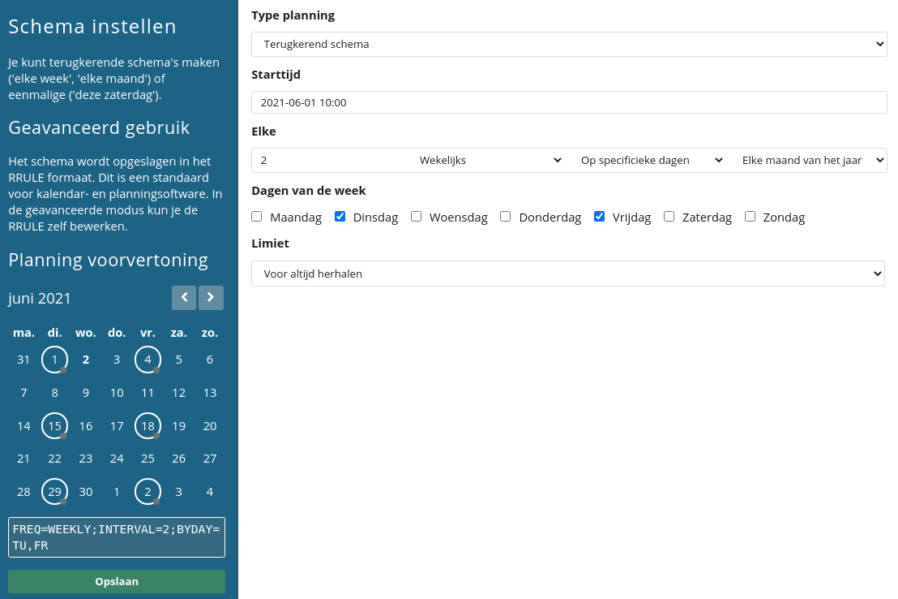

# Een bulkmailing versturen
Het tegelijkertijd mailen van meerdere relaties wordt een bulkmailing genoemd. Je kunt een bulkmailing inplannen of direct versturen via de optie **_Mailing versturen_**. Je vindt deze in de toolbar bij **'[Profielen](https://ms.copernica.com/#/profiles)'** en **'[HTML-templates](https://ms.copernica.com/#/design)'**.

Het versturen van een bulkmailing verloopt in drie stappen: 

1. Selecteer het template of document dat je wilt versturen;
2. Selecteer de bestemming van je e-mail; 
3. Geef aan wanneer de e-mail verzonden moet worden.

## Template of document instellen

Bij het verzenden van een bulkmailing selecteer je eerst het template of document dat je wilt versturen. Wanneer je deze correct hebt ingesteld ga je verder naar de volgende stap.

## Bestemming instellen
Vervolgens selecteer je de bestemming waarnaar je de mailing wilt versturen. Dat kan een database, collectie of (mini)selectie zijn. 

Bij het selecteren van een bestemming kun je inzien hoeveel profielen de bestemming bevat en hoeveel daarvan uniek zijn. Wanneer de doelgroep dubbele profielen bevat wordt de e-mail verzonden naar het profiel met het laagste ID. Dat profiel kent namelijk de langste geschiedenis.

Om een bestemming te kunnen mailen dient er een [intentie](./database-intentions) aanwezig te zijn. Hiermee bevestig je dat de doelgroep gebruikt mag worden als bestemming voor bulkmailings. Zo voorkom je dat mailings verstuurd worden aan de verkeerde doelgroep (bijvoorbeeld inactieve profielen of bounces). Wanneer er voor de geselecteerde bestemming geen intentie staat ingesteld wordt er een melding getoond. De intentie kan dan alsnog worden toegekend.

## Tijdstip instellen
De volgende stap is het instellen van het tijdstip waarop de bulkmailing wordt verzonden. Het verzendmoment staat standaard ingesteld op directe verzending.

Bij het instellen van een verzendmoment heb je de keuze uit drie opties:

1. **Eenmalig**: Een tijdstip waarop de mailing eenmalig wordt verzonden. Je kunt hierbij kiezen om de mailing direct te versturen of deze in te plannen voor verzending op een later moment.
2. **Terugkerend schema**: Een terugkerend schema waarop de mailing wordt verstuurd. Hiermee kun je de mailing bijvoorbeeld dagelijks versturen, wekelijks inroosteren op woensdagen of om de week versturen op dinsdag en vrijdag. Bij **Planning voorvertoning** aan de linkerzijde worden de dagen omcirkeld waarop de mailing wordt verzonden.
3. **Geavanceerde RRule**: [RRULE-strings](https://www.copernica.com/nl/blog/post/slim-mailings-herhalen-met-rrules) maken het mogelijk om mailings in te roosteren op basis van krachtige herhaalpatronen. Denk bijvoorbeeld aan het verzenden van bulkmailings op elke tweede dinsdag van de maand.  

## Labels instellen
Drag-and-drop-templates bieden de mogelijkheid om mailings van labels (tags) te voorzien. Deze maken het mogelijk om statistieken van verzonden mailings te filteren. 

_Voorbeeld:_ Je verstuurt meerdere campagnes rondom Black Friday. Tegelijkertijd lopen ook je reguliere mailings door. Door een 'BlackFriday'-tag mee te geven aan Black Friday-mailings analyseer je eenvoudig de resultaten van seizoensgebonden e-mailcampagnes.

## Opties instellen
Bij het verzenden van een bulkmailing heb je ook de mogelijkheid om de onderstaande opties in te stellen:

* **Aantal berichten per minuut limiteren**: Biedt de mogelijkheid om verzending uit te spreiden over een specifiek tijdsbestek. De laagst mogelijke afleversnelheid is 100 berichten per minuut.  
* **Content type**: Templates en documenten kunnen een HTML-, AMP- of tekstversie bevatten. Deze optie maakt het mogelijk om alleen de opgemaakte versie (HTML en eventueel AMP) of tekstversie te gebruiken. Ook kun je gebruik maken van beide versies.
* **Maximale duur**: De maximale duur beperkt de looptijd van de mailing. Mailings worden niet langer verzonden zodra de maximale duur verstreken is, bijvoorbeeld in het geval van tijdelijke acties.
* **Statistieken**: Je hebt hier de mogelijkheid om impressies, kliks, fouten of klachten met betrekking tot mailings niet te registreren. Dergelijke gegevens zijn dan ook niet inzichtelijk in de statistieken van de verzonden mailing.

## Mailing versturen

Wanneer je de bovenstaande stappen succesvol hebt doorlopen vind je aan de linkerzijde de button **Mailing versturen**. Je verstuurt de mailing door op de knop te klikken. 

**_Let op:_** Wanneer je een mailing direct verstuurt is het niet mogelijk om de mailing te annuleren zodra je op de verzendknop hebt geklikt. In plaats daarvan raden we je aan om de mailing in te roosteren voor verzending op een later tijdstip.
