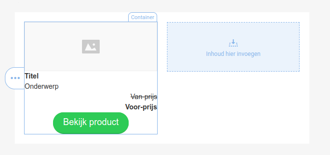
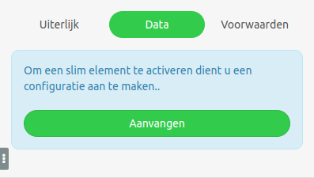
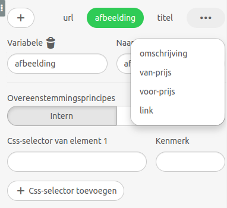
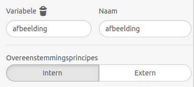

# Slimme elementen

*Let op: dit artikel is voor de geavanceerde gebruiker. Je hebt HTML/CSS-kennis nodig.*  

Bij het opmaken van een nieuwsbrief maak je vaak gebruik van dezelfde handelingen. Stel je hebt een webshop en je wilt een e-mail sturen ter promotie van 5 artikelen, dan moet je voor ieder product de afbeelding, productnaam, prijs en link toevoegen. Een aantal van deze elementen, zoals de link, worden vaak meerdere keren gebruikt. Deze vind je bijvoorbeeld terug achter de titel, de afbeelding en de bestelknop. Als je de volgende dag 5 nieuwe artikelen wilt sturen, moet je deze handelingen opnieuw doen. Om dit te vereenvoudigen heeft de drag-and-drop-editor de functie 'Slimme elementen'. 

## Wat is een slim element
Een slim element is een lijn, structuur of container waarin alle basisblokken zijn toegevoegd, zoals een afbeeldingsblok, tekstblok en een knop, maar met de optie om de data als variabele op te halen vanaf een externe locatie.

Je stelt hierbij eenmalig de volgorde en de eigenschappen van eerder genoemde blokken in en kunt vervolgens met één druk op de knop de content vanaf de externe locatie op de juiste plek inladen.

## Hoe werken slimme elementen?
In onderstaand voorbeeld gaan we producten ophalen vanuit de website van [Dekbed Discounter](https://www.dekbed-discounter.nl/), maar je kan hier ook iedere andere URL voor gebruiken.

### Stap 1 - Maak een standaardstructuur voor je slimme element
Je maakt een standaardstructuur zoals je deze wilt gebruiken in de nieuwsbrief. In dit geval gebruik je een structuur waarbij je twee producten naast elkaar wilt gaan tonen. Voor ieder product willen je het volgende tonen:
- afbeelding
- titel
- omschrijving
- van-prijs
- voor-prijs
- knop met link om te bestellen

Deze blokken plaats je binnen in één container en voorzie je van de gewenste opmaak.
Je template ziet er nu bijvoorbeeld als volgt uit:  
  

### Stap 2 - CSS-classes toevoegen
De content binnen het slimme elementen wordt op de juiste plek geplaatst op basis van CSS-classes. Het is van belang dat op de plek waar je de content wilt tonen een duidelijke class-naam wordt meegegeven in de broncode van je e-mailtemplate. Hiervoor selecteer je de gehele container en klik je op *Code bekijken* in de e-mail-editor (links bovenin, onder 'configuratie').

In deze broncode geef je aan ieder blok een extra class mee zodat het systeem weet waar de content geplaatst moet worden.  
Gebruik hiervoor de volgende class-namen:
- **slim_afbeelding** voeg deze CSS-class toe op het IMG-attribuut die je wilt aanpassen.
- **slim_titel** aangezien de titel vetgedrukt moet worden, plaats je de class op het `<strong>`-attribuut. Hierdoor blijft de opmaak behouden bij het inladen van de nieuwe content.
- **slim_omschrijving** voeg een `<span>`-attribuut toe met deze CSS-class binnen het paragraaf-attribuut. Hierdoor blijft de opmaak behouden bij het inladen van de nieuwe content.
- **slim_van_prijs** voeg een `<span>`-attribuut toe met deze CSS-class binnen het paragraaf-attribuut. Hierdoor blijft de opmaak behouden bij het inladen van de nieuwe content.
- **slim_voor_prijs** voeg een `<span>`-attribuut toe met deze CSS-class binnen het paragraaf-attribuut. Hierdoor blijft de opmaak behouden bij het inladen van de nieuwe content.
- **slim_link** voeg deze CSS-class toe op het A-attribuut die je wilt aanpassen.

Dit zal er ongeveer zo uit zien:  
[!CSS-classes toevoegen](../images/nl/slimme_elementen2.png)

### Stap 3 - Activeren van slimme elementen
Selecteer de container waar alle blokken in staan en ga naar het tabblad 'Data' bij de container-opties. Hier kun je de optie aanzetten om gebruik te maken van slimme elementen.  


### Stap 4 - Variabelen aanmaken
Na het activeren van het slimme element zie je onder 'Configuratie' al één variabele staan, namelijk 'url'. Gebruik het plus-icoon om een nieuwe variabele toe te voegen. Als opties krijg je enkele voorgedefinieerde variabelen. Kies onderaan voor de optie 'Variabele *var*'. De 'Variabele' en 'Naam' geven we beide de waarde 'afbeelding'. De overige instellingen komen later in dit artikel aan bod.

Ditzelfde doe je voor de overige variabelen:
- titel
- omschrijving
- van-prijs
- voor-prijs
- link 

De configuratie ziet er nu zo uit:  


### Stap 5 - CSS-selector instellen
Bij de aangemaakte variabelen heb je twee *Overeenstemmingsprincipes*:
- **Intern** Hier geef je aan waar de opgevraagde data van de externe locatie geplaatst moet worden binnen je template door middel van CSS-selectoren en kenmerken.   
- **Extern** Hier geef je aan vanuit welke CSS-selector en kenmerk de waardes moeten worden opgehaald vanaf de externe locatie. Daarnaast kun je hier de verkregen waardes aanpassen door middel van reguliere expressies.  

  

Bij de configuratie van het slimme element geef je nu per variabelen de interne en externe CSS-selectors aan. 

Voor de variabele _afbeelding_ voeg je bij **Intern** de CSS-selector `.slim_afbeelding` en het kenmerk `src` toe. Je wilt namelijk de `src` aanpassen van het attribuut met de class `slim_afbeelding`.

Bij **Extern** moet je kijken naar de pagina waar je de content van wilt gaan inladen. In dit geval [deze pagina](https://www.dekbed-discounter.nl/satijnstreep-lichtblauw-dekbedovertrek.html). Om in te zien welke CSS-class de afbeelding heeft, kun je met je rechtermuis-knop de pagina inspecteren. In dit geval heeft het IMG-attribuut zelf geen class, maar het bovenliggende DIV-attribuut wel:
```
<div class="swiper-slide clickable swiper-slide-active" style="width: 575px; margin-right: 10px;">		

```

In de *externe* CSS-selector voeg je `swiper-slide-active img` toe en als kenmerk `src`. Je wilt namelijk van het IMG-attribuut binnen de `swiper-slide-active`-class de `src` ophalen.

### Stap 6 - Overige CSS-selectors instellen
Voor de overige elementen doen we hetzelfde als stap 5.  
Hieronder een tabel met de gebruikte waardes:

| Variabel     | Overeenstemmingsprincipe | CSS-selector                | Kenmerk          |
|--------------|--------------------------|-----------------------------|------------------|
| titel        | intern                   | .slim_titel                 |                  |
| titel        | extern                   | .desktop-title              |                  |
| omschrijving | intern                   | .slim_omschrijving          |                  |
| omschrijving | extern                   | .product-summary            |                  |
| van-prijs    | intern                   | .slim_van_prijs             |                  |
| van-prijs    | extern                   | .desktop-product-price--old |                  |
| voor-prijs   | intern                   | .slim_voor_prijs            |                  |
| voor-prijs   | extern                   | .desktop-product-price--new |                  |
| link         | intern                   | .slim_link                  | href             |
| link         | extern                   | .review-form-wrapper form   | data-product-url |

### Link toevoegen
Nu we dit hebben ingesteld, kun je onder zowel **Configuratie** als **Uiterlijk** in de slimme-container een link opgeven. In dit geval gebruik je onderstaande URL: 
[https://www.coolblue.nl/product/856352/samsung-lu28r550uqrxen.html](https://www.coolblue.nl/product/856352/samsung-lu28r550uqrxen.html)

Door op het download-icoon te klikken worden de gegevens in je blokken ingeladen vanuit de externe URL.

## Afkorten van waardes
Op dit moment is de tekst bij de omschrijving vrij lang. Om dit aan te passen kunnen we gebruik maken van *modifiers*. Hiervoor ga je naar je slimme-container, kies je voor 'Data' en open je het configuratie-tabblad. Bij de variabele *omschrijving* voeg je onder *extern* een *modifier* toe. 

Bij *Modifier 1* plaats je `(.{0,150})(.{0,})` en bij *Vervanging* de waarde $1.
De waarde `150` kun je aanpassen naar ieder gewenst aantal karakters die je wilt tonen.

Om vervolgens nog wat achter deze tekst te plaatsen, bijvoorbeeld drie punten, voeg je nog een *modifier* toe. Hier voeg je `(^(.*)$)` toe. Bij 'vervanging' voeg je `$1...` toe. 

De tekst wordt nu afgekapt na 150 karakters en aan het einde worden drie punten toegevoegd. Meer informatie hierover vind je in [dit artikel](https://support.stripo.email/en/articles/6179720-how-to-use-fields-modifier-format-and-separator-helpers-for-smart-elements).
