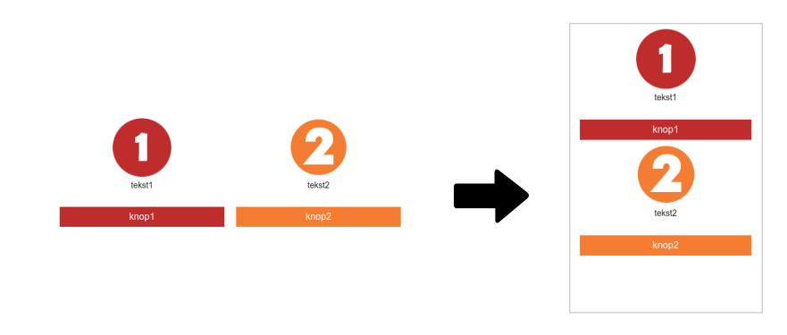

# E-mailings Marketing Suite
Binnen de Marketing Suite zijn twee manieren om e-mailtemplates te maken,
namelijk met de drag-and-drop editor en met de HTML editor. Met de
drag-and-drop editor maak je in een handomdraai hoogwaardige e-mails. Met deze
eenvoudige editor kun je elementen slepen en zo aangeven waar afbeeldingen,
tekst en buttons moeten worden geplaatst. Hiervoor lever je wel wat vrijheid in
ten opzichte van de HTML editor. In dit artikel worden de verschillen tussen
beiden editors behandeld.

## Drag-and-drop editor
Als je graag snel en makkelijk campagnes wil maken dan is de drag en drop
editor perfect voor jou. Kies voor een **blank responsive template** of een
kies een van de vooraf gemaakte templates.

Links staan alle blokken die gebruikt kunnen worden in de Marketing Suite, elke
blok heeft tabs waarin instellingen van het blok aangepast kunnen worden. Deze
tabs bevinden zich in de editor aan de rechterkant.

Het eerste tabje gaat specifiek over het blok zelf, bij een tekstblok kan hier
tekst ingevoerd worden, bij een afbeelding blok wordt hier de afbeelding
ingevoerd, etc.

In de tweede tab kan de styling van het blok aangepast worden. Denk hierbij aan
padding, margin of font types.

In de derde tab kan een automatische opvolgactie toegevoegd worden. Dit kan
alleen als er een link in het blok aanwezig is, de actie wordt namelijk
geactiveerd als erop geklikt wordt. Voor meer informatie over automatische
actie klik [hier](./follow-up-manager-ms.md).

In de vierde tab kan de zichtbaarheid van een blok aangepast worden. Er kan
aangegeven worden of een blok in de mail of web client getoond moet worden en
of een blok op mobiel of desktop getoond mag worden. Verder is het ook mogelijk
om je eigen conditie te geven voor het tonen van het blok. Hiervoor wordt er
data uit het profiel gehaald en wordt gecontroleerd of het blok getoond mag
worden. Bijvoorbeeld **$profile.gender == "Man"**.

De laatste tab wordt gebruikt voor de achtergrond kleur. In deze editor kan de
achtergrondkleur van een blok, een kolom, de hele rij van een kolom, de content
in het midden of de hele template aangepast worden.

### Blokken
Zoals hierboven genoemd zijn er verschillende content blokken, deze worden hier
kort beschreven.

| Blokken               | Omschrijving                                                                              |
|-----------------------|-------------------------------------------------------------------------------------------|
| Kolommen              | Geeft structuur aan mailing door deze bijvoorbeeld te verdelen in 2,3 of 4 kolommen       |
| Kop                   | Bevat een titel                                                                           |
| Knop                  | Knop met een url naar de webomgeving                                                      |
| Lijn                  | Een lijn die in verschillende stijlen en diktes gebruikt kan worden                       |
| Afbeelding            | Bevat een afbeelding met een url naar webomgeving                                         |
| Witruimte             | Bevat witruimte van een bepaalde hoogte                                                   |
| Tekst-HTML            | Bevat zelfgeschreven HTML of tekst via de teksteditor                                     |
| Tekst-Geen Opmaak     | Bevat tekst waar geen opmaak meegegeven kan worden, vergelijkbaar met tekstversie         |
| Hyperlink-link        | Bevat een opgegeven url                                                                   |
| Hyperlink-uitschrijven| Bevat [{$unsubscribe}](./emailings-ms-unsubscribe), hiermee schrijven klanten zich uit    |
| Hyperlink-webversie   | Bevat [{$webversion}](./emailings-ms-webversion), link ,naar de webversie                 |
| Video                 | Bevat een Youtube of Vimeo video                                                          |
| Volg ons              | Bevat knoppen naar verschillende sociale media                                            |
| Delen                 | Bevat bericht om te delen via sociale media                                               |

### Kolommen
Het kolommen blok wordt gebruikt om structuur binnen het template aan te
brengen. Er kan gekozen worden voor verschillende groottes en hoeveelheden
kolommen. Om te zorgen dat blokken goed onder elkaar tonen in zowel de desktop
als mobiele versie dienen de blokken goed in de kolommen geplaatst te worden.
De kolommen worden van links naar rechts onder elkaar gezet zoals hieronder:



### Responsive
Templates die worden aangemaakt (en gebruikt) met de drag-and-drop editor zijn
automatisch responsive. Onder de motorkap zijn de gecreëerde templates namelijk
JSON bestanden. Door onze geavanceerde Responsive Email service, worden alle
JSON templates automatisch responsive gemaakt. Dit betekent dat de e-mails,
ongeacht op welk type apparaat, altijd goed worden weergegeven.

### JSON
Een verschil met de Publisher en de HTML editor is dat de drag en drop editor
JSON gebruikt. JSON is niet een programmeertaal maar een data format. In JSON
wordt aangegeven hoe de mail er ongeveer uit dient te zien. Voordat de mail
verstuurd wordt, wordt alle JSON omgezet in naar responsive HTML. In de
drag en drop editor is het mogelijk om de JSON aan te passen naar jouw wensen.
Om de JSON aan te passen klik je op **Template > Bekijk broncode**. Links staat
de JSON van email en rechts is een preview van de email te zien. De inhoud van
de mail dient aangepast worden in het het content gedeelte van een mail, dit
ziet er vaak als volgt uit

```txt
{
"content": {
  "margin": {
    "top": 5,
    "bottom": 5
  },
  "blocks": [
    {
      "type": "html",
      "content": "<p>Dit is een tekstblok.&nbsp;</p>\n",
      "margin": {
        "top": 5,
        "right": 0,
        "bottom": 5,
        "left": 0
      },
      "padding": 0,
      "font": {
        "family": "Arial, Helvetica, sans-serif",
        "size": "14px"
      }
    }
  ]
}
```

Hierin kunnen bijvoorbeeld blokken worden aangepast, maar als je volledige
vrijheid wilt hebben over het template dan is de volgende editor misschien meer
geschikt voor jouw.

## HTML editor
Om een HTML template aan te maken in de Marketing Suite kies je een
**Blanco HTML**. Links kan de HTML geschreven worden, aan de rechterkant wordt
een preview getoond.

De CSS wordt in deze editor automatisch inline gezet. Behalve natuurlijk
mediaqueries of pseudo-elementen.

## Diff tool
Het kan natuurlijk altijd voorkomen dat je per ongeluk je tabblad of scherm
afsluit. In de meeste gevallen ben je dan je werk kwijt. In de Marketing Suite
wordt alles voor je opgeslagen en kun je nagaan wat er is veranderd op het
moment dat het scherm werd afgesloten.

## Mappen
Het is fijn om structuur te houden binnen je templates, daarom is het mogelijk
om mappen aan te maken voor je templates. Om een map aan te maken ga je naar
**Email designer** > klik bovenin op het **mapje met het plusteken**. Geef de
map een naam en sleep vervolgens de templates naar de net aangemaakte map.
