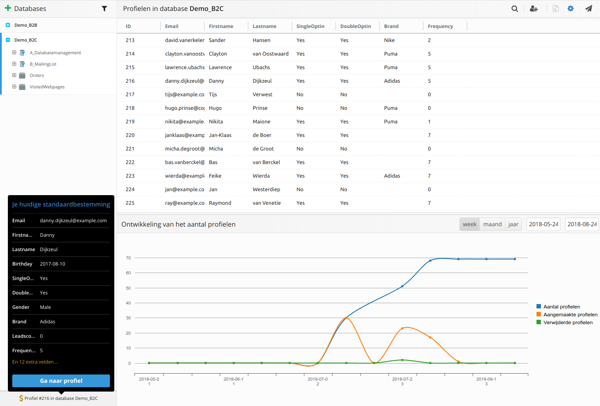

# Testen
Binnen de Marketing Suite zijn er verschillende test om te zorgen dat jouw mail goed in de inbox aankomt. Deze worden in dit artikel behandeld. 

## Spam check
Het is mogelijk om, voordat je de e-mails verstuurt, na te gaan of je e-mail daadwerkelijk in de inbox van de ontvanger belandt. Je kunt dit doen door op het **gereedschap** knopje te drukken en vervolgens naar de spam check te navigeren. Aan de hand van een aantal checks wordt nagegaan hoe spamgevoelig je e-mail is. Hier wordt bijvoorbeeld gecontroleerd of er geen kapotte links zijn of er een tekstversie is of raadpleeg SpamAssassin.  Hoewel e-mailclients binnenkomende e-mails verschillende waarderen van elkaar, is het handig om wellicht toch de verbeteringen door te voeren.

## Preview
Om te controleren hoe de mailing op desktop, tablet en mobile eruit ziet, ga je naar de **Template voorvertoning**. Deze is te vinden onder **Gereedschap** in het menu. In deze voorvertoning worden de 3 varianten van de mail getoond, deze wordt nog niet gepersonaliseerd. Zie je een blok dat niet naar wens toont op mobile pas deze dan aan of maak een nieuw blok speciaal voor mobile. De [zichtbaarheid](./emailings-ms-templates) kan aangepast worden per blok waarmee je mail er nog beter uit kan zien op alle apparaten. 

## Standaardbestemming
In de Marketing Suite wordt een profiel uit de database gebruikt als test profiel. Hier zullen ook de testmails naartoe gaan en deze worden gepersonaliseerd op dit profiel. Dit profiel kan ingesteld worden in de database. Klik links op **Database en Profielen** ga vervolgens naar de database waarin het profiel staat waarmee je wilt testen. Klik dit profiel, klik onderin op **eigenschappen** en klik op de grote op de knop **standaardbestemming**. Je hebt nu een standaardbestemming ingesteld. Links Onderin staat de huidige standaardbestemming, klik hierop om naar de huidige standaardbestemming te gaan.

## Test mails
Met een testmail kan controleren of de mail eruit ziet zoals jij wilt en kan je tevens de personalisatie testen. De testmail wordt verstuurd en gepersonaliseerd naar de standaardbestemming. Ga naar **Gereedschap** en klik op **Testmail versturen**. Klik in dit venster op de je standaardbestemming om de mail gepersonaliseerd te versturen of geef zelf een e-mailadres op als dit niet van belang is. Testmails komen niet terug in de mailings statistieken. Wil je een testmail sturen naar meerdere mensen, kies dan voor een [bulkmail](./emailings-ms-sending) versturen naar een [testselectie](./database-selections-introduction#aanmaken-of-wijzigen-(mini)selectie-publisher). 

## Inboxplacement
Naast de reguliere e-mailstatistieken kun je in Copernica ook inzicht vergaren in je prestaties door een inbox placement test doen. Hierbij wordt getest bij welke providers een mailing in de inbox terecht komt en waar de deliverability extra aandacht verdient. Copernica biedt deze functionaliteit aan in samenwerking met [250ok](https://250ok.com/email-deliverability/seedlist-based-inbox-monitoring-right-way/). De test is te vinden onder **gereedschap > tests**. De resultaten zijn te zien in **inbox-placement** , deze staat links in het menu. 

Let wel dat er voor een inbox placement test kosten in rekening worden gebracht.

## Litmus-tests
Je wil natuurlijk weten hoe jouw mail in elke cliënt getoond wordt. Dit kan getest worden met de Litmus test. Deze laat zien hoe de mail er in elke cliënt uit komt te zien. De test is te vinden onder **gereedschap > tests**. De resultaten zijn te zien in **inbox-placement** , deze staat links in het menu. 

Let wel dat er voor een litmus test kosten in rekening worden gebracht.

